# Agent Skills: Knowledge Graph

This document provides a macroscopic view of the entire skill repository. Use this map to navigate the intersecting domains of software engineering covered in this project.

## The Omni-Architecture Graph

```mermaid
%%{init: {"theme": "default", "flowchart": {"useMaxWidth": false}}}%%
flowchart LR
    subgraph Core ["1. Core Engineering"]
        A["Git Mastery"]
        B["System Design & DDD"]
        C["Fundamental Physics/Math"]
    end
    
    subgraph Frontend ["2. Client-Side"]
        D["Advanced Frontend (RSC, Micro-FE)"]
        E["Mobile Internals (Flutter, RN)"]
        F["Graphics (WebGPU, Raytracing)"]
    end
    
    subgraph Backend ["3. Server-Side & Data"]
        G["Database Architecture (Postgres, Sharding)"]
        H["Data Engineering (Kafka, Data Lakes)"]
        I["Low-Level & HFT (eBPF, DPDK, Disruptor)"]
    end
    
    subgraph Infra ["4. Infrastructure & Sec"]
        J["DevOps (CI/CD, ArgoCD)"]
        K["Kubernetes & Docker"]
        L["Observability (OTel, Prometheus)"]
        M["Adversarial AI & Quantum Crypto"]
    end
    
    Core --> Frontend
    Core --> Backend
    Backend <--> Infra
    Frontend <--> Backend
    
    style Core fill:#f9f,stroke:#333,stroke-width:2px
    style Infra fill:#bbf,stroke:#333,stroke-width:2px
```

