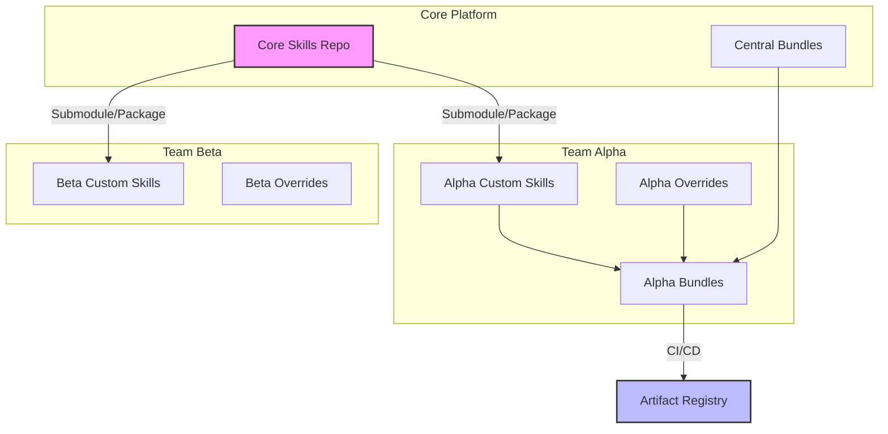
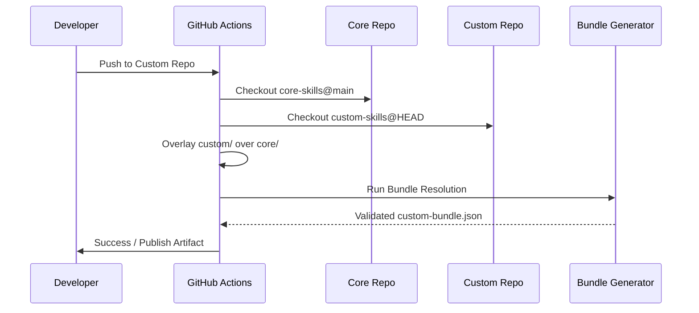

# Enterprise Guide

Welcome to the definitive guide for deploying, scaling, and managing the agent skill ecosystem at an enterprise level. This guide provides strategic frameworks, architectural patterns, and advanced team coordination workflows designed for Staff and Principal Engineers responsible for federated AI agent architectures.

## Strategic Framework: The Skill Maturity Model

Before diving into architectural decisions, assess your organization's position on the Skill Maturity Model:

1. **Ad-Hoc (Level 1):** Individual developers clone and modify skills locally. High fragmentation.
2. **Centralized (Level 2):** A single monolithic repository for all skills. Bottlenecks at the PR review stage.
3. **Federated (Level 3):** Shared core skills with dedicated team overrides. Automated CI/CD validation.
4. **Autonomous (Level 4):** Dynamic bundle resolution, auto-generating compliance reports, and fully automated GitOps deployments.

> [!TIP]
> **Best Practice:** Do not jump straight to Level 4. Establish a robust Level 2 architecture before introducing federation.

---

## High-Level Architecture

The following diagram illustrates a mature, federated skill architecture supporting multiple autonomous teams while maintaining centralized governance.



---

## Multi-Team Deployment

For organizations with multiple teams, choosing the right deployment model is critical for velocity and stability. Each team can maintain a fork or a subdirectory depending on the chosen model.

### Option A: Monorepo with Team Directories (Recommended for < 500 Engineers)

```bash
agent-skills/
  skills/           # Standard core skills (shared)
  teams/            # Team-specific directories
    team-alpha/
      skills/       # Alpha's proprietary skills
      overrides/    # Alpha's overrides of core skills
    team-beta/
      skills/
  bundles/
    team-alpha.json # Resolves core + alpha
    team-beta.json
```

**Trade-offs:** 
- *Pros:* Atomic commits across teams, unified CI/CD, simplified dependency management.
- *Cons:* Repository size can grow exponentially; strict `CODEOWNERS` policies are required.

> [!IMPORTANT]
> **Best Practice:** Enforce strict `CODEOWNERS` so that `teams/team-alpha/` is auto-approved by Team Alpha, but changes to `skills/` require Core Platform team approval.

### Option B: Polyrepo with Git Submodules (Recommended for Highly Isolated Environments)

```bash
git submodule add https://github.com/j4flmao/agent-skills core-skills
git submodule add https://github.com/team-alpha/skills-override team-skills
```

**Trade-offs:**
- *Pros:* Strict access control (useful for highly classified or compartmentalized skills).
- *Cons:* "Submodule hell" during updates; complex CI/CD orchestration.

---

## Custom Skill Isolation

To add proprietary skills without modifying the upstream repo, you need a robust isolation strategy.

1. Create a separate Git repository for proprietary skills.
2. Maintain a custom `bundle-definitions.json` that references both standard and proprietary skills.
3. Set up a CI job that merges both repos into a monorepo at clone time.

### Automated Merge Workflow



> [!WARNING]
> Ensure that your overlay script correctly handles file conflicts. A common best practice is to strictly disallow custom repos from overwriting core files directly, enforcing the use of the `overrides/` directory pattern instead.

---

## CI/CD Integration

Integrate this skill suite into your CI/CD pipeline for automated code generation, strict validation, and security compliance. A premium pipeline goes beyond simple linting.

```yaml
# .github/workflows/skill-validation.yml
name: Enterprise Skill Validation
on: [push, pull_request]

jobs:
  validate-structure:
    runs-on: ubuntu-latest
    steps:
      - uses: actions/checkout@v4
      - name: Validate SKILL.md Frontmatter & Schema
        run: |
          # Use advanced schema validation rather than basic grep
          npm install -g markdown-spellcheck yaml-validator
          for f in $(find skills -name SKILL.md); do
            # Ensure YAML frontmatter exists and is strictly valid
            sed -n '1,/---/p' $f | yaml-validator || exit 1
          done
      
      - name: Check Broken References & Dead Links
        run: |
          for f in $(find skills -name SKILL.md); do
            dir=$(dirname $f)
            grep -oP 'references/[\w-]+\.md' $f | while IFS= read -r ref; do
              if [ ! -f "$dir/$ref" ]; then
                echo "::error file=$f::BROKEN REFERENCE: $f -> $ref"
                exit 1
              fi
            done
          done

  security-scan:
    runs-on: ubuntu-latest
    steps:
      - uses: actions/checkout@v4
      - name: Detect Hardcoded Secrets
        uses: trufflesecurity/trufflehog@main
        with:
          path: ./
          base: ${{ github.event.repository.default_branch }}
          head: HEAD
```

---

## Compliance Considerations

When operating in regulated environments, your agent skills must be treated as production code. The agent's generated artifacts will only be as compliant as the instructions it follows.

| Regulation | Impact & Required Action | Architectural Control |
|------------|--------------------------|------------------------|
| **GDPR** | Review mobile/web skills for data collection patterns (crash reporting, analytics). Enforce "Data Minimization" instructions. | Add automated regex scanning in CI for restricted data field names. |
| **SOC 2** | Ensure security skills follow access control and audit trail requirements. Any infrastructure-as-code skills must explicitly require audit logging. | Maintain a tamper-evident log of all `bundle-definitions.json` changes. |
| **HIPAA** | Backend auth-patterns must enforce PHI (Protected Health Information) protection, data at rest encryption, and secure transit. | Flag any skill tagged `healthcare` for mandatory manual review by the SecOps team. |
| **PCI-DSS** | Payment-related skills (in-app-purchase, gateways) must follow cardholder data rules (e.g., never logging PANs). | Inject mandatory pre-commit hooks for payment gateway integrations. |

> [!CAUTION]
> Agents executing compliance-sensitive skills MUST operate in a sandboxed environment with restricted network egress.

---

## Scaling Across Teams

As your organization grows to hundreds of developers and thousands of agent interactions, you must optimize for context window size and cognitive load.

- **100+ Skills:** Use bundle definitions to scope per team — no team loads all 105 skills. Massive contexts degrade LLM reasoning. Create precise, role-specific bundles (e.g., `frontend-auth-bundle`).
- **Multiple Agents:** Each agent config points to its own bundle, reducing context size. Route tasks to specialized sub-agents rather than a monolithic "do-everything" agent.
- **Versioning:** Tag releases with strict Semantic Versioning (SemVer). Teams pin to specific versions via git tags. Breakages in core skills should bump the major version.
- **Deprecation:** Mark deprecated skills in their frontmatter (`status: deprecated`); provide a precise migration path in the `CHANGELOG`. Build a CI script that warns teams using deprecated skills.

### Advanced Team Coordination Workflows

1. **The Skill Guild:** Form a cross-functional "Guild" of Senior Engineers who meet bi-weekly to review core skill proposals and enforce quality standards.
2. **InnerSource Contribution:** Treat the core skills repository as an open-source project within your company. Anyone can open a PR, but only Guild members can merge.
3. **Automated Handoffs:** Design skills that explicitly output artifacts formatted for the next team in the pipeline (e.g., a Design agent outputs JSON that the Frontend agent consumes).

---

## Advanced Troubleshooting

### Bundle Resolution Failures
*Symptom:* CI fails with `Duplicate skill ID found`.
*Resolution:* This occurs when a team override does not correctly shadow the core skill. Ensure `bundle-definitions.json` uses the `override` flag and that the team namespace is explicitly declared.

### Context Window Exhaustion
*Symptom:* Agents start hallucinating or ignoring instructions at the bottom of `SKILL.md`.
*Resolution:* Your bundle is too large. Implement **Semantic Bundle Loading**—dynamically load reference files only when the agent specifically requests them, rather than front-loading them all.

### Diverging Team Overrides
*Symptom:* Team Alpha's overrides have deviated so far from Core that they can no longer consume upstream updates.
*Resolution:* Conduct quarterly "Skill Reconciliation" sprints. Identify common patterns in overrides and promote them to Core.

---

## Related

- `docs/team-guide.md` — Adding, maintaining, and reviewing skills
- `docs/management-guide.md` — Managing the human elements and workflows
- `docs/product-guide.md` — Product strategy and execution
- `docs/quickstart.md` — Getting started for new developers
