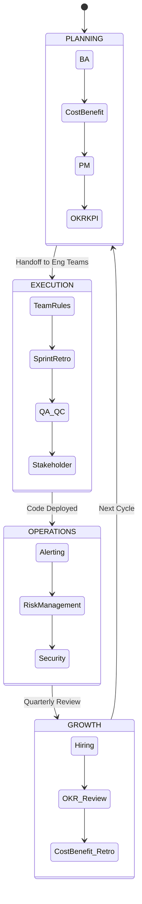

# Management Skills Guide

Welcome to the Management Skills Guide. This premium manual defines 14 critical skills covering engineering management, project management, quality assurance, security operations, stakeholder communication, and team operations. It is designed for Staff Engineers, Engineering Managers, and Technical Leads to orchestrate complex, multi-disciplinary engineering organizations.

## Strategic Framework: The Cynefin Approach to Management

To effectively manage engineering teams, apply the Cynefin framework to your decision-making processes. Categorize your current challenge before selecting the appropriate management skills:

1. **Clear/Simple:** Standardized processes. *Use QA, QC, and Alerting.*
2. **Complicated:** Requires expert analysis. *Use Cost-Benefit, Pentesting, and BA.*
3. **Complex:** Unpredictable, emergent outcomes. *Use OKR/KPI, PM, and Sprint Retro.*
4. **Chaotic:** Crisis management. *Use Security Incident Response and Risk Management.*

---

## Skill Map

Our management skills are rigorously structured to address every facet of engineering leadership.

| Skill | Directory | Focus & Expected Artifacts |
|-------|-----------|----------------------------|
| Alerting | `skills/management/alerting/` | On-call, escalation, policies, notification. *Artifacts: PagerDuty schedules, Escalation matrices.* |
| BA (Business Analysis) | `skills/management/ba/` | Requirements, specifications, user stories. *Artifacts: PRDs, User Story maps.* |
| Cost-Benefit | `skills/management/cost-benefit/` | ROI, TCO, build vs buy, cost estimation. *Artifacts: TCO models, Vendor analysis reports.* |
| Hiring | `skills/management/hiring/` | JD writing, interview process, evaluation. *Artifacts: Interview rubrics, Take-home assignments.* |
| OKR & KPI | `skills/management/okr-kpi/` | Goal setting, tracking, alignment, reviews. *Artifacts: OKR cascading trees, Metric dashboards.* |
| Pentesting | `skills/management/pentesting/` | Scope, methodology, reports, remediation. *Artifacts: Vulnerability reports, Threat models.* |
| PM (Project Management) | `skills/management/pm/` | Planning, estimation, risk, tracking. *Artifacts: Gantt charts, Sprint backlogs, Burndown charts.* |
| QA | `skills/management/qa/` | Test strategy, test plans, manual testing. *Artifacts: Test matrices, Automation coverage reports.* |
| QC | `skills/management/qc/` | Quality control, inspections, checklists. *Artifacts: Launch checklists, Code review guidelines.* |
| Risk Management | `skills/management/risk-management/` | Identification, assessment, mitigation. *Artifacts: Risk registers, Mitigation strategies.* |
| Security | `skills/management/security/` | Policy, training, audits, incident management. *Artifacts: SOC2 policies, Incident post-mortems.* |
| Sprint Retro | `skills/management/sprint-retro/` | Retrospectives, action items, improvement. *Artifacts: Action item trackers, Process tweaks.* |
| Stakeholder | `skills/management/stakeholder/` | Communication, reporting, expectation. *Artifacts: Weekly status reports, Exec summaries.* |
| Team Rules | `skills/management/team-rules/` | Working agreements, code of conduct, norms. *Artifacts: Team charters, Core hours definitions.* |

---

## Decision Framework

Use this advanced decision tree to dynamically route management challenges to the correct skill domains.

```mermaid
graph TD
    Start[Identify Management Need] --> Plan[Need to plan work?]
    Start --> Exec[Need to execute work?]
    Start --> Qual[Need to ensure quality?]
    Start --> Peop[Need to manage people?]
    Start --> Oper[Need to run operations?]

    Plan --> PM[PM: Project plan, milestones]
    Plan --> BA[BA: Requirements, specs]
    Plan --> CB[Cost-Benefit: Business case, ROI]

    Exec --> TR[Team Rules: Working agreements]
    Exec --> OKR[OKR/KPI: Goals & metrics]
    Exec --> Retro[Sprint Retro: Continuous improvement]

    Qual --> QA[QA: Test strategy]
    Qual --> QC[QC: Inspections, checklists]
    Qual --> Pen[Pentesting: Security testing]

    Peop --> Hire[Hiring: Recruitment process]
    Peop --> Stake[Stakeholder: Comm plan]
    Peop --> Risk[Risk Management: Issue mitigation]

    Oper --> Alert[Alerting: On-call, incident response]
    Oper --> Sec[Security: Policy, audits]

    style Start fill:#f9d0c4,stroke:#333,stroke-width:2px
```

---

## Management Lifecycle

The engineering management lifecycle is a continuous loop of planning, execution, operations, and growth.

---

## Advanced Team Coordination Workflows

### The Incident Response Orchestration
When a Sev-1 incident occurs, seamless coordination is required:
1. **Trigger:** `Alerting` skill pages the on-call engineer.
2. **Containment:** `Security` skill protocols are invoked to isolate the breach.
3. **Communication:** `Stakeholder` skill templates are used to email executives every 30 minutes.
4. **Resolution & Learning:** `Sprint Retro` and `Risk Management` skills are used to run a blameless post-mortem and update the Risk Register.

### Cross-Functional Sprint Planning
1. **Inputs:** `BA` provides prioritized stories; `OKR/KPI` provides the quarter's targets.
2. **Negotiation:** `PM` works with Engineering Leads to estimate effort.
3. **Alignment:** `Stakeholder` skill generates a summary of committed features for the Sales and Marketing teams.

> [!TIP]
> **Best Practice:** Never decouple `Stakeholder` communication from `PM` execution. Automated status reports should be generated directly from JIRA/Linear using the Stakeholder agent skill.

---

## Advanced Troubleshooting

### Misaligned KPIs and "Watermelon Metrics"
*Symptom:* Metrics look green (good) on the dashboard, but the business is failing (red on the inside).
*Resolution:* Invoke the `OKR & KPI` skill to perform a metric audit. Shift from output metrics (e.g., "lines of code deployed") to outcome metrics (e.g., "customer retention rate").

### Scope Creep and Velocity Drop
*Symptom:* Sprints continually fail to deliver committed points; stakeholders bypass PMs to request features.
*Resolution:* Reinforce `Team Rules` regarding the intake process. Use `Cost-Benefit` analyses to force stakeholders to quantify the value of emergency interruptions.

### Burnout and On-Call Fatigue
*Symptom:* High turnover in the engineering team; alerting noise is too high.
*Resolution:* Tune the `Alerting` skill to enforce strict Signal-to-Noise ratio requirements. Implement "Follow the Sun" models if possible, and adjust `Hiring` pipelines to backfill critical roles proactively.

---

## Skills List

For detailed implementations, consult the individual skill definitions:

- `skills/management/alerting/SKILL.md`
- `skills/management/ba/SKILL.md`
- `skills/management/cost-benefit/SKILL.md`
- `skills/management/hiring/SKILL.md`
- `skills/management/okr-kpi/SKILL.md`
- `skills/management/pentesting/SKILL.md`
- `skills/management/pm/SKILL.md`
- `skills/management/qa/SKILL.md`
- `skills/management/qc/SKILL.md`
- `skills/management/risk-management/SKILL.md`
- `skills/management/security/SKILL.md`
- `skills/management/sprint-retro/SKILL.md`
- `skills/management/stakeholder/SKILL.md`
- `skills/management/team-rules/SKILL.md`
