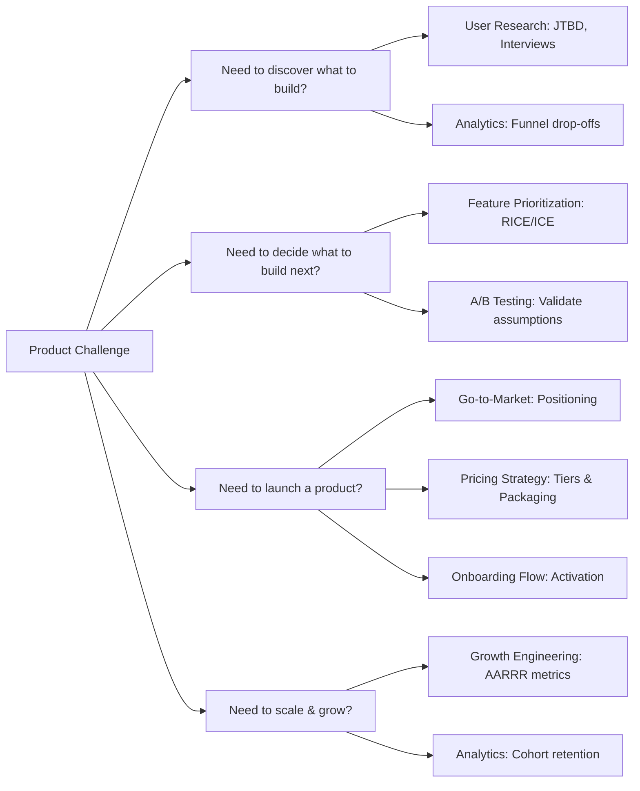
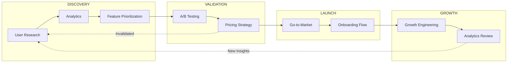

# Product Skills Guide

Welcome to the Product Skills Guide. This extensive manual covers 8 critical skills spanning the modern product development lifecycle: experimentation, analytics, user research, growth engineering, pricing, go-to-market, onboarding, and feature prioritization. It is engineered for Product Managers, Growth Engineers, and Staff-level technical leads building high-impact products.

## Strategic Framework: Dual-Track Agile & Continuous Discovery

Modern product teams do not build in a vacuum. We employ **Dual-Track Agile**:
- **Track 1: Discovery (The "What"):** Constantly interviewing users, running prototypes, and sizing opportunities.
- **Track 2: Delivery (The "How"):** Writing code, deploying infrastructure, and ensuring quality.

The skills in this guide primarily bridge the gap between these tracks, ensuring that Engineering is building the *right* thing, not just building things *right*.

---

## Skill Map

| Skill | Directory | Focus & Key Metrics |
|-------|-----------|---------------------|
| A/B Testing | `skills/product/ab-testing/` | Experiment design, variants, statistics. *Metrics: Statistical Significance, Minimum Detectable Effect.* |
| Analytics | `skills/product/analytics/` | Event tracking, funnel, cohort, retention. *Metrics: DAU/MAU, Churn Rate, Session Length.* |
| Feature Prioritization | `skills/product/feature-prioritization/` | RICE, ICE, MoSCoW, value vs effort. *Metrics: Opportunity Score, WSJF.* |
| Go-to-Market | `skills/product/go-to-market/` | Launch strategy, positioning, channels. *Metrics: CAC, Launch reach, Conversion.* |
| Growth Engineering | `skills/product/growth-engineering/` | Acquisition, activation, retention. *Metrics: K-factor (Virality), LTV.* |
| Onboarding Flow | `skills/product/onboarding-flow/` | User activation, funnel optimization. *Metrics: Time-to-Value (TTV), Activation Rate.* |
| Pricing Strategy | `skills/product/pricing-strategy/` | Model, tiers, packaging, willingness-to-pay. *Metrics: ARPU, Expansion MRR.* |
| User Research | `skills/product/user-research/` | Interviews, surveys, usability, JTBD. *Metrics: CSAT, NPS, Task Success Rate.* |

---

## Decision Framework

Use this framework to navigate ambiguity and decide which product skill to apply based on your current phase.

---

## Product Lifecycle Workflow

This flowchart visualizes the highly iterative nature of product development, highlighting feedback loops and cross-functional synchronization points.

---

## Advanced Team Coordination Workflows

### The Product-Engineering Handoff (Discovery to Delivery)
1. **Validation:** The Product team uses `User Research` and `A/B Testing` (using no-code/low-code prototypes) to validate a feature.
2. **Prioritization:** The feature is scored using the `Feature Prioritization` skill (e.g., RICE framework).
3. **Engineering Sync:** Product presents the validated PRD to Engineering. Analytics tracking requirements are embedded directly into the technical spec using the `Analytics` skill.

### Go-To-Market Alignment (Product + Marketing + Sales)
1. **Positioning:** Product defines the core value props.
2. **Pricing:** The `Pricing Strategy` skill is used to define tier gates in the codebase.
3. **Launch Orchestration:** The `Go-to-Market` skill ensures Engineering scales the infrastructure for launch day, while Marketing prepares campaigns.

> [!IMPORTANT]
> **Best Practice:** Never ship a feature without defining its success metrics first. Engineering must implement the `Analytics` telemetry as part of the Definition of Done (DoD).

---

## Advanced Troubleshooting

### "The Flat Retention Curve"
*Symptom:* Users sign up, but DAU/MAU ratios remain flat. Churn is high in the first 7 days.
*Resolution:* This is an activation problem. Deploy the `Onboarding Flow` skill to instrument the "Aha! Moment." Reduce Time-to-Value (TTV) by deferring non-essential setup steps. Use `Growth Engineering` to implement lifecycle email drip campaigns.

### "Analysis Paralysis in Prioritization"
*Symptom:* The backlog has 500 items, and stakeholders cannot agree on what to build next.
*Resolution:* Enforce strict, emotionless scoring using the `Feature Prioritization` skill. Require stakeholders to provide data (from `Analytics` or `User Research`) to defend the 'Impact' and 'Reach' scores in the RICE framework.

### "Failed A/B Tests or Inconclusive Results"
*Symptom:* Experiments run for weeks but do not reach statistical significance.
*Resolution:* Re-evaluate your Minimum Detectable Effect (MDE) and sample size. You may be testing changes that are too subtle. Use `User Research` to find higher-conviction, bolder swings before running another test.

---

## Skills List

For detailed implementation and prompts, consult the individual skills:

- `skills/product/ab-testing/SKILL.md`
- `skills/product/analytics/SKILL.md`
- `skills/product/feature-prioritization/SKILL.md`
- `skills/product/go-to-market/SKILL.md`
- `skills/product/growth-engineering/SKILL.md`
- `skills/product/onboarding-flow/SKILL.md`
- `skills/product/pricing-strategy/SKILL.md`
- `skills/product/user-research/SKILL.md`
