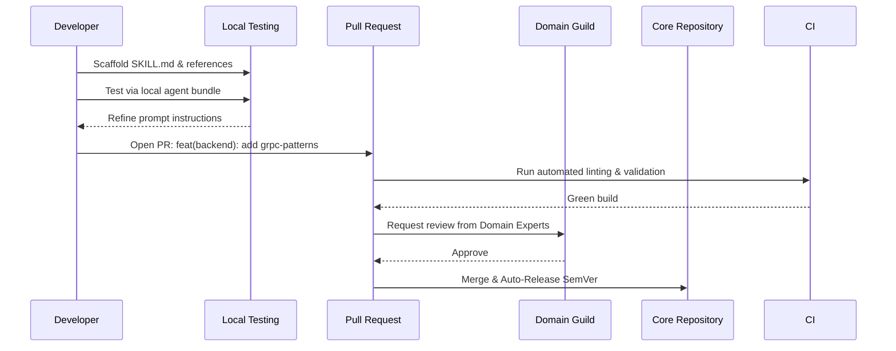
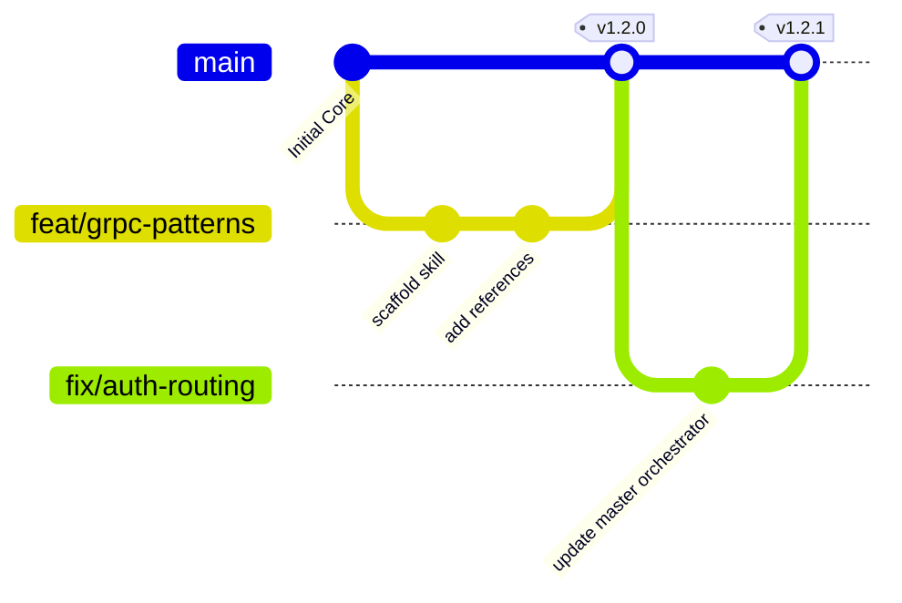

# Team Guide

Welcome to the Team Guide. This document provides the authoritative standards, workflows, and governance models for adding, maintaining, and customizing agent skills. It is written for Senior Engineers, Code Owners, and Platform Guilds responsible for maintaining the integrity of the agent ecosystem.

## Strategic Framework: Federated Governance (Guilds & Chapters)

To scale skill development without creating a massive bottleneck for the Core Platform team, we utilize a **Guild and Chapter model**:
- **Chapters:** Teams of engineers localized to a specific business unit (e.g., "Payments Backend"). They create custom skills in their overrides.
- **Guilds:** Cross-functional groups of domain experts (e.g., the "Frontend Guild"). They review and promote high-quality chapter skills into the Core platform.

---

## The Skill Addition Lifecycle

Adding a new skill is not just dropping a markdown file; it is a software engineering lifecycle.



### Step-by-Step Instructions

1. **Choose the right area:** `core/`, `planning/`, `backend/`, `frontend/`, `mobile/`, `dev-loop/`, `devops/`, `management/`.
2. **Create the files:** Create `skills/{area}/{name}/SKILL.md` following `docs/skill-template.md`.
3. **Curate References:** Add 3-4 high-density reference files in `skills/{area}/{name}/references/`. Quality over quantity.
4. **Routing:** Add routing entry in `skills/core/master-orchestrator/SKILL.md`.
5. **Agent Configuration:** Update agent configs if the skill should appear in quick maps:
   - `.claude/rules/routing.md`
   - `.codex/rules/routing.md`
   - `.opencode/AGENTS.md`
   - `.gemini/INSTRUCTIONS.md`
6. **Bundle Registration:** Add to relevant bundles in `bundles/bundle-definitions.json`.
7. **Documentation:** Update `README.md` skill table and counts.

> [!WARNING]
> Do not add more than 5 reference files per skill unless absolutely necessary. Excessive references dilute the LLM's attention mechanism and degrade performance.

---

## Naming Conventions

Strict naming conventions allow our automated tools to parse, bundle, and lint the ecosystem.

### Skill Names
- **Format:** Lowercase kebab-case: `database-patterns`, `mobile-deployment`.
- **Prefixing:** Always prefix the area for clarity and to prevent namespace collisions across domains: `frontend-tailwind-css`, `backend-grpc-patterns`.

### Directory Structure
```text
skills/{area}/{skill-name}/
  SKILL.md
  references/
    {topic}.md       # e.g., architecture.md
    {topic}.json     # e.g., config-schema.json
```

### Bundle Names
- **Prefix:** Prefix bundle type: `fullstack-{backend}-{frontend}`.
- **Suffix:** Use `-only` for single-area bundles to clearly denote scope.

---

## Trunk-Based Git Workflow

We utilize Trunk-Based Development with Semantic Release.



**Branch naming conventions:**  
- `feat/{skill-name}` — for new skills or major additions.
- `fix/{skill-name}` — for bug fixes in prompt instructions.
- `docs/{skill-name}` — for updating reference material only.

**Commit format (Conventional Commits):**  
`{type}({area}): {description}`  
*Example:* `feat(backend): add grpc-patterns skill`

> [!TIP]
> **Best Practice:** Keep PRs small. Do not introduce 5 skills in one PR. One skill per PR ensures thorough review of the prompt engineering and context window implications.

---

## Advanced Code Review Checklist

Code reviews for agent skills require a different mindset than standard code reviews. You are reviewing *instructions for an LLM*, not a deterministic compiler.

### Automated Checks (CI/CD)
- [ ] Frontmatter YAML is syntactically valid.
- [ ] No dead links in reference pointers.
- [ ] UTF-8 NO BOM encoding enforced.
- [ ] Directory name matches the skill name prefix.

### Manual Checks (Human Reviewer)
- [ ] **Prompt Clarity:** Are the instructions unambiguous? Avoid double negatives and overly complex conditional logic in the prompt.
- [ ] **Compression:** Is the compression rule present in the Response Format section to save output tokens?
- [ ] **Handoffs:** Does the skill clearly define how to hand off artifacts to the next agent?
- [ ] **Ecosystem Integration:** Are the routing entries in the master-orchestrator updated correctly?
- [ ] **Bundle Cohesion:** Does the skill logically fit into the bundles it was added to?

---

## Customizing Skills for Your Stack

Enterprise teams often need to fork standard skills to inject proprietary architecture rules.

### Advanced Override Mechanisms
1. **Directory Shadowing:** Create a directory `skills/{area}/{team-name}/` with overridden `SKILL.md` files. The master-orchestrator checks for team-specific overrides before falling back to the standard skill.
2. **Custom Bundles:** Create custom bundles in `bundles/bundle-definitions.json` that include only the skills your team uses.
3. **JSON Schema Merging (Advanced):** For complex config overrides, CI scripts can perform deep merges of a team's `override.json` into the core `SKILL.md` at build time.

### Troubleshooting Overrides

**Merge Conflicts in Bundles**
*Symptom:* Git conflicts constantly occur in `bundle-definitions.json`.
*Resolution:* Modularize the JSON. Maintain separate `team-alpha-bundle.json` files rather than a single monolithic definitions file.

**Diverging Team Overrides**
*Symptom:* Team Alpha's frontend skill hasn't received Core platform updates in 6 months.
*Resolution:* Implement automated "drift detection" in CI that warns teams when their override is > 10 commits behind the Core repository's base skill.
