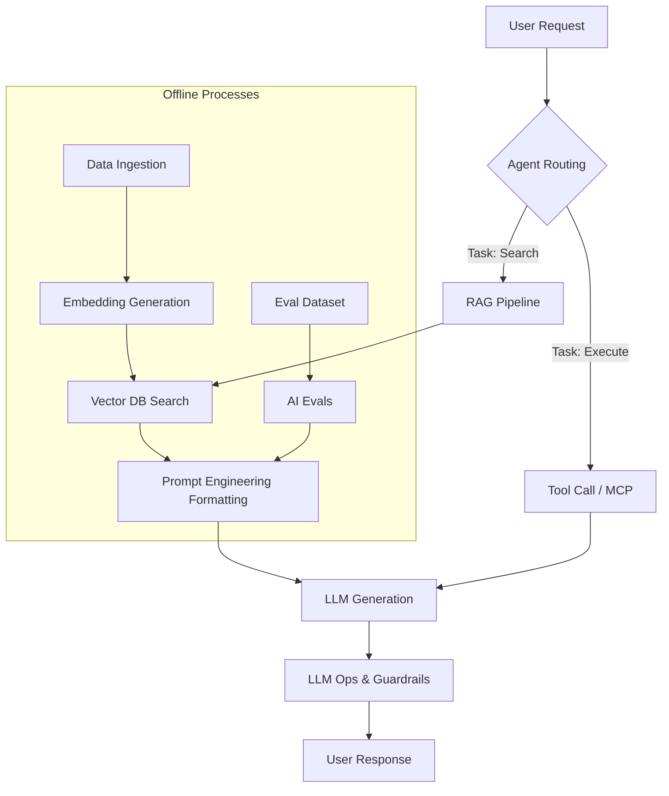

# AI/ML Skills Guide

## Overview
The AI/ML skill set covers the end-to-end lifecycle of AI-powered features: prompt engineering, RAG patterns, vector databases, LLM operations, AI agents, and evaluation. These skills are designed to compose together for complex AI workflows.

## AI Architecture Pipeline



## Skill Map

| Skill | When to Use | Compose With |
|---|---|---|
| `ai/prompt-engineering` | Crafting system prompts, few-shot examples, output formatting | rag-patterns, llm-ops |
| `ai/rag-patterns` | Building retrieval-augmented generation pipelines | vector-databases, prompt-engineering |
| `ai/vector-databases` | Chunking, embedding, indexing, and similarity search | rag-patterns, ai-evals |
| `ai/llm-ops` | Model selection, cost tracking, latency optimization, guardrails | all AI skills |
| `ai/ai-agents` | Multi-step agentic workflows, tool use, memory, orchestration | rag-patterns, prompt-engineering |
| `ai/ai-evals` | Test datasets, metrics, regression testing, human evaluation | all AI skills |

## Decision Tree

```
Goal: Add AI to a feature?
├── Simple Q&A or classification → prompt-engineering
├── Answer over custom data → RAG (rag-patterns + vector-databases)
├── Multi-step autonomous workflow → ai-agents (+ RAG if external data)
├── Production deployment → llm-ops (+ evals)
└── Quality assurance → ai-evals
```

> [!IMPORTANT]
> **Production Best Practice**: Do not use LLMs for tasks that can be solved deterministically with regex or standard API calls. LLMs introduce latency, cost, and non-determinism. Use AI only when semantic understanding is required.

## Composition Patterns

### RAG Application Advanced Workflow
1. **Ingestion**: Documents are ingested, cleaned, and chunked (using semantic chunking boundaries).
2. **Embedding**: `ai/vector-databases` embed the chunks via text-embedding-ada-002 or open-source equivalents.
3. **Retrieval Strategy**: `rag-patterns` executes hybrid search (semantic + keyword/BM25) and applies a cross-encoder for re-ranking.
4. **Generation**: `prompt-engineering` receives the top-K chunks and synthesizes the final answer.
5. **Evaluation**: `ai-evals` measures faithfulness and relevancy of the answer to ensure hallucination rates are below threshold.

## ML Skills Overview

The `ml/` category covers classical machine learning, deep learning, and MLOps.

| Skill | When to Use | Compose With |
|---|---|---|
| `ml/experiment-tracking` | Logging params, metrics, artifacts; model registry versioning | ml/classical-ml, ml/deep-learning, ml/model-evaluation |
| `ml/feature-engineering` | Encoding, scaling, feature selection / extraction | ml/classical-ml, ml/feature-store |
| `ml/feature-store` | Online/offline feature serving, point-in-time joins | ml/feature-engineering, ml/model-serving |
| `ml/classical-ml` | scikit-learn / XGBoost / LightGBM pipelines | ml/feature-engineering, ml/hyperparameter-tuning, ml/model-evaluation |
| `ml/deep-learning` | PyTorch / TensorFlow neural networks (CNN, RNN, Transformer) | ml/experiment-tracking, ml/hyperparameter-tuning, ml/model-serving |
| `ml/model-serving` | TorchServe, BentoML, Ray Serve, KServe deployment | ml/experiment-tracking, ml/feature-store, ml/pipeline |

## How AI and ML Fit Together

In practice, AI and ML skills often compose across categories:
- **ML embeddings → AI RAG**: train an embedding model (ml/deep-learning), index vectors (ai/vector-databases), build RAG (ai/rag-patterns)
- **ML predictions → AI agent**: serve a classifier (ml/model-serving), then route decisions via ai/ai-agents
- **AI evals feed ML tuning**: eval results (ai/ai-evals) identify failure modes → improve feature engineering (ml/feature-engineering) or retrain (ml/hyperparameter-tuning)
- **AI guardrails + ML serving**: ai/ai-safety (content moderation) before ml/model-serving (production inference)

> [!TIP]
> **Cost Optimization**: Cache frequently asked queries at the edge. A significant portion of RAG queries are repeated. Implementing an exact match or high-confidence semantic cache avoids hitting the LLM API completely.

## Advanced Troubleshooting
- **RAG Hallucinations**: Often caused by poor retrieval. If the context isn't in the top-K, the LLM will guess. Debug by examining the raw retrieved chunks before generation. Implement a re-ranker model.
- **Agent Loops**: Autonomous agents may get stuck in repeating thought-action loops. Implement strict loop breakers (max iterations) and inject stochastic variance or failure hints when loops are detected.

## Skills List
- `skills/ai/prompt-engineering/SKILL.md`
- `skills/ai/rag-patterns/SKILL.md`
- `skills/ai/vector-databases/SKILL.md`
- `skills/ai/llm-ops/SKILL.md`
- `skills/ai/ai-agents/SKILL.md`
- `skills/ai/ai-evals/SKILL.md`
- `skills/ai/ai-cost-optimization/SKILL.md`
- `skills/ai/ai-testing/SKILL.md`
- `skills/ai/ai-safety/SKILL.md`
- `skills/ai/ai-observability/SKILL.md`
- `skills/ai/embeddings/SKILL.md`
- `skills/ai/multimodal/SKILL.md`
- `skills/ai/langchain-patterns/SKILL.md`
- `skills/ai/mcp-patterns/SKILL.md`
- `skills/ai/model-training/SKILL.md`
- `skills/ml/experiment-tracking/SKILL.md`
- `skills/ml/feature-engineering/SKILL.md`
- `skills/ml/feature-store/SKILL.md`
- `skills/ml/classical-ml/SKILL.md`
- `skills/ml/deep-learning/SKILL.md`
- `skills/ml/model-serving/SKILL.md`
