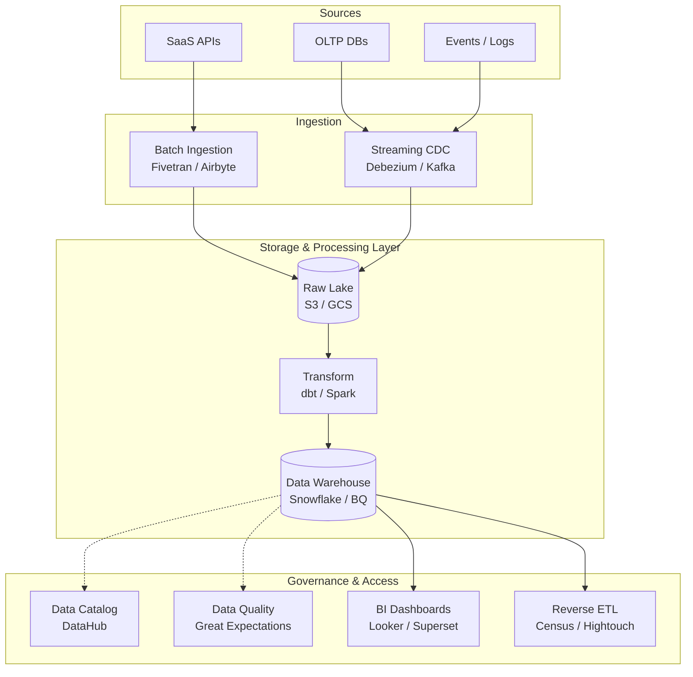

# Data Skills Guide

34 skills covering the complete data lifecycle: ingestion, storage, compute, orchestration, governance, quality, security, cost optimization, lineage, testing, clean room, reverse ETL, formats, and feature stores.

## Skills Overview

### Data Platform Foundation
| Skill | Directory | Focus |
|-------|-----------|-------|
| ETL Pipeline | `skills/data/etl-pipeline/` | Extract, transform, load workflows with Airflow, dbt, custom pipelines |
| Data Warehouse | `skills/data/data-warehouse/` | Dimensional modeling, Snowflake, BigQuery, Redshift schema design |
| Streaming | `skills/data/streaming/` | Real-time data with Kafka, Flink, Kinesis, stream processing |
| Data Quality | `skills/data/data-quality/` | Great Expectations, data contracts, validation, monitoring |
| BI Tools | `skills/data/bi-tools/` | Dashboards, Metabase, Superset, Looker, reporting |
| Data Platform | `skills/data/data-platform/` | Lake/lakehouse/mesh architecture, cataloging, versioning, virtualization |

### DevOps & Infrastructure for Data
| Skill | Directory | Focus |
|-------|-----------|-------|
| DataOps | `skills/devops/dataops/` | Data CI/CD, dbt slim CI, data testing, contract validation |
| Kubernetes for Data | `skills/devops/kubernetes-for-data/` | Spark/Airflow/Kafka on K8s, GPU, node pools, storage |

## End-to-End Data Platform Architecture



## Decision Flow

```
Need to move data?
  ├─ Batch, scheduled, transform-heavy        → ETL Pipeline
  ├─ Real-time, sub-second latency            → Streaming
  ├─ CDC from databases                       → Streaming + CDC Patterns
  └─ One-time migration                       → ETL Pipeline

Need to store data?
  ├─ Raw object storage, flexible schema      → Data Platform (Lake)
  ├─ Lake + ACID + BI                         → Data Platform (Lakehouse)
  ├─ Analytical queries, large volumes        → Data Warehouse

Need to compute?
  ├─ ETL, ML training                         → Distributed Compute (Spark)
  ├─ Interactive SQL                          → Distributed Compute (Trino/Presto)
  └─ Streaming                                → Streaming (Flink)
```

> [!IMPORTANT]
> **Production Best Practice**: Always store a copy of the raw, untransformed data in the Data Lake. If your transformation logic changes or a bug is discovered in your dbt models, you must be able to replay the raw data from the beginning of time.

## Step-by-Step Workflow: Creating a Data Product

1. **Contract Definition**: Define the schema, SLA, and semantics of the data product in a YAML Data Contract.
2. **Ingestion**: Setup Fivetran or a Kafka connector to bring raw source data into the landing zone (S3/GCS).
3. **Transformation**: Write `dbt` models to clean, denormalize, and aggregate the data.
4. **Testing (DataOps)**: In CI, run `dbt test` against a slim, zero-copy clone of the data warehouse to verify no uniqueness or not-null constraints are violated.
5. **Quality Gates**: Deploy to production. Run `Great Expectations` to ensure statistical anomalies (e.g., volume drops) alert the data team before the dashboard updates.
6. **Publishing**: The dataset is registered in `DataHub` and tagged with the appropriate domain owner.

## Advanced Troubleshooting

- **dbt Model Slowdowns**: If a warehouse transformation suddenly spikes in compute time, check for unintended cartesian joins (fan-outs). Use `EXPLAIN` plans and ensure cluster keys or partition keys align with the `WHERE` clauses.
- **Kafka Consumer Lag**: When streaming ingestion falls behind, you either have a processing bottleneck or an uneven partition distribution. Ensure message keys are evenly distributed. If the processing is slow, scale up the number of consumer group instances to match the partition count.
- **Data Freshness Alarms**: If Airflow DAGs start missing their SLAs, visualize the critical path. Often, a single upstream sensor or API rate limit is bottlenecking the entire DAG execution.

> [!TIP]
> **Cost Optimization Strategy**: For BigQuery or Snowflake, implement a strict partition expiration policy on raw/staging tables. Additionally, analyze query logs monthly to identify expensive, unoptimized queries generated by BI tools and materialize their results into pre-aggregated views.

## Complete Data Stack Reference

```
INGESTION ─────────────────────────────────────────────────────
  Batch ETL           → ETL Pipeline, DataOps
  Streaming/CDC       → Streaming, CDC Patterns
  Data Replication    → Data Replication

STORAGE ───────────────────────────────────────────────────────
  Object Store        → Data Platform (S3/ADLS/GCS)
  Open Table Formats  → Data Platform (Delta/Iceberg/Hudi)
  Data Warehouse      → Data Warehouse

COMPUTE ───────────────────────────────────────────────────────
  Distributed Compute → Data Platform, Kubernetes for Data
  Batch Processing    → ETL Pipeline, Distributed Compute

ORCHESTRATION ────────────────────────────────────────────────
  Workflow Orchestration → Workflow Orchestration, ETL Pipeline
  Data Pipeline CI/CD    → DataOps, MLOps

GOVERNANCE ──────────────────────────────────────────────────
  Data Catalog        → Data Catalog
  Data Contracts      → Data Contracts

QUALITY & OBSERVABILITY ───────────────────────────────────
  Data Quality        → Data Quality
  Data Observability  → Data Observability

SECURITY ────────────────────────────────────────────────────
  Data Encryption     → Data Security
  Access Control      → Data Security

ACCESS ──────────────────────────────────────────────────────
  BI / Dashboards     → BI Tools
  Data API            → Data API
```

## When to Use Each

**ETL Pipeline**: Data needs transformation, multiple sources, scheduled batch processing, backfill capability.

**Data Warehouse**: Analytical reporting, business intelligence, historical trends, SQL-based exploration.

**Streaming**: Real-time dashboards, event-driven pipelines, monitoring/alerting, low-latency requirements.

**Data Quality**: Trust is critical, data drives decisions, regulatory compliance, ML data pipelines.

**BI Tools**: Stakeholder dashboards, ad-hoc analysis, embedded analytics, self-service reporting.

**Data Platform**: Greenfield data architecture, lake/lakehouse/mesh design, multi-engine environments.

**DataOps**: CI/CD for data pipelines, dbt versioning, environment promotion, data contract enforcement.

**Kubernetes for Data**: Spark/Airflow/Kafka on K8s, GPU training, cost-effective elastic compute.
