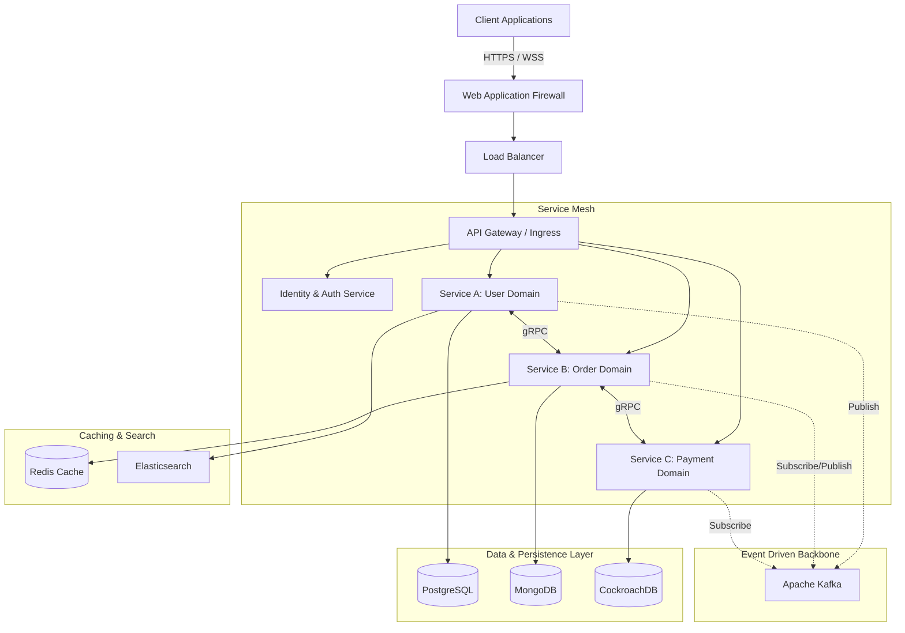
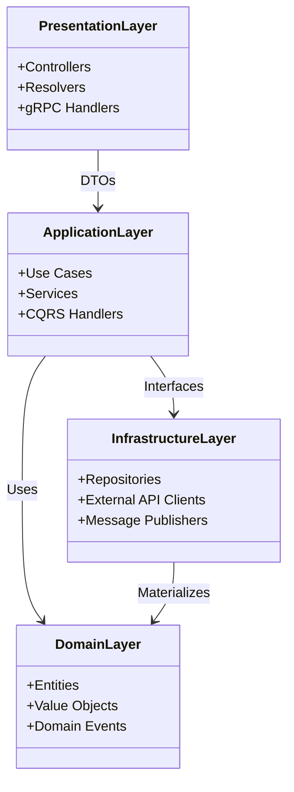

# Backend Skills Guide

> **A Comprehensive Reference for Principal & Senior Backend Engineers**
> 
> 50+ skills covering the complete backend development lifecycle: architecture, patterns, API design, data access, messaging, security, testing, and observability across 12+ language ecosystems. This guide serves as a living taxonomy and technical reference for building scalable, resilient, and secure backend systems.

## System Architecture Overview

When designing at scale, a layered, distributed approach is often necessary. The following diagram illustrates a typical highly-available backend topology:



> [!TIP]
> **Embrace Eventual Consistency**: As you move toward event-driven architectures, design your services to handle eventual consistency inherently. Use Saga patterns (choreography or orchestration) to manage distributed transactions.

## Skill Map

### Language Ecosystems

Selecting the right language ecosystem dictates your constraints and operational overhead. 

| Stack | Architecture | Patterns | Extra |
|-------|-------------|----------|-------|
| **Node.js** | `backend/nodejs/architecture/` | `backend/nodejs/patterns/` | express/, prisma/, drizzle/ |
| **NestJS** | `backend/nestjs/architecture/` | `backend/nestjs/patterns/` | — |
| **Go** | `backend/go/architecture/` | `backend/go/patterns/` | — |
| **Rust** | `backend/rust/architecture/` | `backend/rust/patterns/` | — |
| **Python (FastAPI)** | `backend/python/fastapi/` | — | django/ |
| **Java (Spring Boot)** | `backend/spring-boot/architecture/` | `backend/spring-boot/patterns/` | — |
| **C# (.NET)** | `backend/dotnet/architecture/` | `backend/dotnet/patterns/` | — |
| **PHP** | `backend/php/laravel/` | — | pure/, zend/ |
| **Ruby (Rails)** | `backend/ruby/rails/` | — | — |
| **Elysia** | `backend/elysia/architecture/` | `backend/elysia/patterns/` | — |
| **Elixir** | `backend/elixir/` | — | — |
| **Deno** | `backend/deno/` | — | — |
| **Bun** | `backend/bun/` | — | — |

> [!NOTE]
> **Ecosystem Over Syntax**: When evaluating a stack for an enterprise deployment, prioritize the maturity of the ecosystem (libraries, driver support, observability tools) over pure syntactic preference or theoretical performance.

### Universal Patterns (26 skills)

| Pattern | Skill | Focus |
|---------|-------|-------|
| API Design | `backend/universal/api-design/` | REST/GraphQL conventions, versioning |
| API Gateway | `backend/universal/api-gateway/` | Kong, Envoy, Traefik, rate limiting |
| API Response | `backend/universal/api-response/` | Envelope format, error codes, pagination |
| Auth Patterns | `backend/universal/auth-patterns/` | JWT, OAuth 2.0, session, MFA |
| Authorization | `backend/universal/authorization/` | RBAC, ABAC, ReBAC, policy engines, JIT elevation |
| Background Jobs | `backend/universal/background-jobs/` | Queues, cron, workers |
| Caching | `backend/universal/caching/` | Redis, CDN, in-memory, cache invalidation |
| Clean Architecture | `backend/universal/clean-architecture/` | Ports & adapters, dependency rule |
| Data Streaming | `backend/universal/data-streaming/` | Kafka, Kinesis, event sourcing |
| Database Patterns | `backend/universal/database-patterns/` | Migration, query optimization, connection mgmt |
| Design Patterns | `backend/universal/design-patterns/` | GoF patterns, idiomatic implementations |
| Event Driven | `backend/universal/event-driven/` | Event bus, pub/sub, saga choreography |
| Feature Flags | `backend/universal/feature-flags/` | LaunchDarkly, Unleash, gradual rollout |
| File Storage | `backend/universal/file-storage/` | S3, local, CDN, signed URLs |
| GraphQL Patterns | `backend/universal/graphql-patterns/` | Schema design, resolvers, DataLoader |
| gRPC Patterns | `backend/universal/grpc-patterns/` | Protobuf, streaming, interceptors |
| Internationalization | `backend/universal/internationalization/` | i18n, locale, RTL |
| Load Testing | `backend/universal/load-testing/` | k6, Artillery, Locust, benchmarks |
| Message Queue | `backend/universal/message-queue/` | RabbitMQ, SQS, Redis pub/sub |
| Microservices | `backend/universal/microservices/` | Decomposition, comms, data ownership |
| OOP Principles | `backend/universal/oop-principles/` | SOLID, composition, polymorphism |
| Rate Limiting | `backend/universal/rate-limiting/` | Token bucket, sliding window, distributed |
| Search Patterns | `backend/universal/search-patterns/` | Elasticsearch, Meilisearch, Typesense |
| Structured Logging | `backend/universal/structured-logging/` | Winston, Pino, structured context |
| Testing | `backend/universal/testing/` | Unit, integration, e2e, mocking |
| WebSocket Patterns | `backend/universal/websocket-patterns/` | WS, Socket.IO, SSE, real-time |
| Firebase | `backend/universal/firebase/` | Firestore, Auth, Storage, Cloud Functions, Hosting |
| Supabase | `backend/universal/supabase/` | PostgreSQL, RLS, Auth, Realtime, Edge Functions, pgvector |

## Decision Framework

### Choose Your Stack

```
Need maximum ecosystem?
  ├─ Node.js — largest package ecosystem, TypeScript end-to-end, async I/O optimized
  ├─ Python — best for AI/ML, data-heavy backends, rapid prototyping
  └─ Java/Spring Boot — enterprise, compliance-heavy, large teams, JVM maturity

Need maximum performance?
  ├─ Rust — zero-cost abstractions, no GC, systems-level memory safety
  ├─ Go — fast compilation, goroutines for heavy concurrency, simple deployment
  └─ Zig — emerging, C ABI compatible, predictable performance

Need rapid development?
  ├─ NestJS — opinionated, decorators, DI container, angular-like familiarity
  ├─ Rails — convention over configuration, mature ActiveRecord, rich tooling
  └─ Laravel — elegant syntax, rich ecosystem, robust queues

Need type safety?
  ├─ Rust — strongest type system, ownership model preventing data races
  ├─ TypeScript (Node.js) — gradual typing, huge ecosystem, generic inference
  └─ Go — simple but effective typing, structural interfaces
```

### Choose Your Pattern

```
Problem: I need to expose data
  ├─ REST API → api-design + api-response (standard B2B/B2C integration)
  ├─ GraphQL → graphql-patterns (complex, nested client requirements)
  ├─ gRPC → grpc-patterns (internal inter-service low-latency comms)
  └─ WebSocket → websocket-patterns (real-time pushes)

Problem: I need to coordinate services
  ├─ Synchronous → api-gateway + rate-limiting
  ├─ Asynchronous → message-queue + event-driven
  ├─ Saga → event-driven + database-patterns
  └─ Event sourcing → data-streaming + event-driven

Problem: I need to store data
  ├─ Relational → database-patterns + backend/{stack} (ACID)
  ├─ Document → database-patterns + NoSQL (Schema flexibility)
  ├─ Cache → caching (High read throughput, low latency)
  └─ File → file-storage (BLOBs, media)

Problem: I need to secure my backend
  ├─ Auth → auth-patterns (Identity verification)
  ├─ API security → security/api-security (WAF, rate limits, injection prevention)
  ├─ Secrets → security/secrets-management (Vault, KMS)
  └─ Data → security/data-security (Encryption at rest/in transit)
```

## Architecture Layers

Modern backends are typically structured to isolate concerns, promoting testability and modularity. 



## Step-by-Step Workflows

### Workflow: Designing a High-Throughput Microservice
1. **Define the Domain Boundary**: Identify the specific sub-domain using Domain-Driven Design (DDD). What bounded context does this service own?
2. **Select the Storage Strategy**: Choose a database that fits the read/write profile. (e.g., ScyllaDB for heavy writes, PostgreSQL for complex relationships).
3. **API Definition First**: Use OpenAPI or Protobuf to define the contract before writing code. Share this with client teams immediately.
4. **Implement Port & Adapters**: Write the core business logic independent of frameworks. Inject dependencies.
5. **Configure Telemetry**: Implement structured logging, distributed tracing (OpenTelemetry), and RED metrics (Rate, Errors, Duration).
6. **Stress Testing**: Run k6 or Locust to find the breaking point. Adjust connection pools and timeout settings.
7. **Deploy via Canary**: Roll out to 5% of traffic, monitor the Apdex score and error rates before expanding to 100%.

> [!WARNING]
> **Avoid Shared Databases Between Services**: Sharing a database breaks service autonomy. If Service A and Service B read the same tables, they are tightly coupled. Use event-driven data duplication or an API gateway pattern instead.

## Advanced Troubleshooting

### 1. Connection Pool Exhaustion
**Symptom**: Spikes in latency; logs show `Timeout waiting for connection from pool` or `Too many clients`.
**Root Cause**: Long-running queries blocking connections, or application scaling out too rapidly without PgBouncer/Proxy.
**Resolution**:
- Implement maximum execution time limits on queries.
- Use a multiplexing proxy (PgBouncer for Postgres, ProxySQL for MySQL).
- Monitor active vs. idle connections and adjust the minimum/maximum pool sizes.

### 2. Cascading Failures
**Symptom**: Service A goes down, causing Service B to exhaust its threads waiting for A, which then causes Service C to fail.
**Root Cause**: Synchronous calls without protective measures.
**Resolution**:
- Implement the **Circuit Breaker** pattern to fail fast when a downstream service is struggling.
- Use bulkheads (limiting concurrent threads per downstream service).
- Ensure strict timeout policies (e.g., P99 + 20% buffer).

### 3. Split-Brain in Caching
**Symptom**: Inconsistent data served to clients; users see old data intermittently.
**Root Cause**: Network partition in a distributed cache cluster (e.g., Redis Cluster) or improper cache invalidation logic across multiple instances.
**Resolution**:
- Utilize a robust consensus protocol for leader election.
- Use a single-source-of-truth strategy with proper read-through/write-through mechanics or Debezium for CDC (Change Data Capture) driven invalidation.

## By Common Scenarios

### Building a REST API
1. `backend/{stack}/architecture/` — project structure
2. `backend/universal/api-design/` — endpoint conventions
3. `backend/universal/api-response/` — response envelope
4. `backend/universal/auth-patterns/` — authentication
5. `backend/universal/database-patterns/` — data access
6. `backend/universal/caching/` — performance
7. `backend/universal/structured-logging/` — observability
8. `backend/{stack}/patterns/` — stack-specific idioms

### Building a Microservices System
1. `backend/universal/microservices/` — decomposition
2. `backend/universal/message-queue/` — async communication
3. `backend/universal/api-gateway/` — entry point
4. `backend/universal/event-driven/` — event choreography
5. `backend/universal/data-streaming/` — event sourcing
6. `backend/devops/observability/` — monitoring
7. `backend/universal/rate-limiting/` — protection

> [!IMPORTANT]
> **Idempotency is Mandatory**: In distributed systems, messages will be delivered more than once. Ensure all critical endpoints (especially payments and state mutations) accept an `Idempotency-Key` header and handle retries gracefully without duplicating side-effects.

### Adding Real-Time Features
1. `backend/universal/websocket-patterns/` — WS/SSE
2. `backend/universal/data-streaming/` — event streams
3. `backend/universal/caching/` — real-time cache

## Reference: All Backend Skills

### Per-Stack Skills
- `skills/backend/nodejs/architecture/SKILL.md`
- `skills/backend/nodejs/patterns/SKILL.md`
- `skills/backend/nodejs/express/SKILL.md`
- `skills/backend/nodejs/prisma/SKILL.md`
- `skills/backend/nestjs/architecture/SKILL.md`
- `skills/backend/nestjs/patterns/SKILL.md`
- `skills/backend/go/architecture/SKILL.md`
- `skills/backend/go/patterns/SKILL.md`
- `skills/backend/rust/architecture/SKILL.md`
- `skills/backend/rust/patterns/SKILL.md`
- `skills/backend/python/fastapi/SKILL.md`
- `skills/backend/python/django/SKILL.md`
- `skills/backend/spring-boot/architecture/SKILL.md`
- `skills/backend/spring-boot/patterns/SKILL.md`
- `skills/backend/dotnet/architecture/SKILL.md`
- `skills/backend/dotnet/patterns/SKILL.md`
- `skills/backend/elysia/architecture/SKILL.md`
- `skills/backend/elysia/patterns/SKILL.md`
- `skills/backend/php/laravel/SKILL.md`
- `skills/backend/php/pure/SKILL.md`
- `skills/backend/php/zend/SKILL.md`
- `skills/backend/ruby/rails/SKILL.md`
- `skills/backend/elixir/SKILL.md`
- `skills/backend/deno/SKILL.md`
- `skills/backend/bun/SKILL.md`

### Universal Skills
- `skills/backend/universal/api-design/SKILL.md`
- `skills/backend/universal/api-gateway/SKILL.md`
- `skills/backend/universal/api-response/SKILL.md`
- `skills/backend/universal/auth-patterns/SKILL.md`
- `skills/backend/universal/authorization/SKILL.md`
- `skills/backend/universal/background-jobs/SKILL.md`
- `skills/backend/universal/caching/SKILL.md`
- `skills/backend/universal/clean-architecture/SKILL.md`
- `skills/backend/universal/data-streaming/SKILL.md`
- `skills/backend/universal/database-patterns/SKILL.md`
- `skills/backend/universal/design-patterns/SKILL.md`
- `skills/backend/universal/event-driven/SKILL.md`
- `skills/backend/universal/feature-flags/SKILL.md`
- `skills/backend/universal/file-storage/SKILL.md`
- `skills/backend/universal/graphql-patterns/SKILL.md`
- `skills/backend/universal/grpc-patterns/SKILL.md`
- `skills/backend/universal/internationalization/SKILL.md`
- `skills/backend/universal/load-testing/SKILL.md`
- `skills/backend/universal/message-queue/SKILL.md`
- `skills/backend/universal/microservices/SKILL.md`
- `skills/backend/universal/oop-principles/SKILL.md`
- `skills/backend/universal/rate-limiting/SKILL.md`
- `skills/backend/universal/search-patterns/SKILL.md`
- `skills/backend/universal/structured-logging/SKILL.md`
- `skills/backend/universal/testing/SKILL.md`
- `skills/backend/universal/websocket-patterns/SKILL.md`
