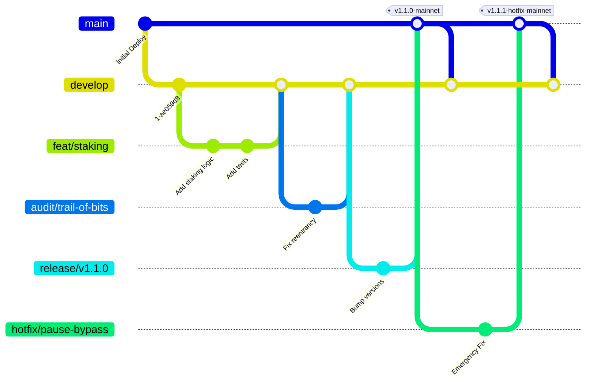

# Git Branching Strategy for Blockchain Projects

> **A Comprehensive Reference for Principal Smart Contract Engineers**
>
> This branching strategy is tailored specifically for blockchain and smart contract development where code immutability, rigorous audit trails, and deployment safety are non-negotiable. Standard trunk-based or GitHub Flow branching is insufficient because contract deployments are irreversible and audits require cryptographically verified, fixed code snapshots.

## Branch Naming Convention

| Branch Prefix | Purpose | Base Branch | Lifetime |
|---|---|---|---|
| `main` | Production-ready, audited, deployed on mainnet | - | Permanent |
| `develop` / `demo` | Testnet deployment, integration testing | `main` | Permanent |
| `feat/*` | New features | `develop` | Short-lived |
| `fix/*` | Bug fixes (non-security) | `develop` | Short-lived |
| `audit/*` | Security audit remediation | `develop` | Medium-lived |
| `release/v*.*.*` | Release candidates | `develop` | Temporary |
| `hotfix/*` | Emergency production fix | `main` | Short-lived (merge + delete) |
| `chore/*` | Build, CI, dependencies, tooling | `develop` | Short-lived |
| `docs/*` | Documentation only | `develop` | Short-lived |

Examples:
- `feat/staking-rewards-v2`
- `fix/overflow-in-reward-calculation`
- `audit/trail-of-bits-findings`
- `release/v1.0.0-rc1`
- `hotfix/emergency-pause-bypass`

## Branch Flow Diagram

The following git graph illustrates the lifecycle of a smart contract release, including a feature merge, an audit phase, a release candidate, and an emergency hotfix.



> [!WARNING]
> **Audit Snapshots**: Never merge new features into a `develop` branch while an audit is active if the audit is based on the HEAD of `develop`. Instead, freeze `develop` and only allow `audit/*` branches to merge into it until the audit report is finalized.

## Contract Versioning

### Rules
1. Every contract deployment gets a semantic version.
2. Git tag format: `[ContractName]-v[MAJOR].[MINOR].[PATCH]-[network]`
3. The deployment registry maps `contract address → git commit → semantic version`.

### Version Bumping

| Change | Example | Bump |
|---|---|---|
| Initial deployment | First version | v1.0.0 |
| New feature (non-breaking) | Add staking reward cap | Minor (v1.1.0) |
| Bug fix (no storage change) | Fix rounding error | Patch (v1.0.1) |
| Breaking storage layout | Add new state variable mid-struct | Major (v2.0.0) |
| Emergency fix | Reentrancy fix | Patch (v1.0.1-hotfix1) |

> [!IMPORTANT]
> **Storage Layout Breaking Changes**: In upgradeable contracts (UUPS/Transparent), changing the storage layout improperly can brick the contract. A Major version bump indicates that migration scripts or a complete redeployment (rather than just an implementation upgrade) might be required. Always use `forge inspect MyContract storageLayout` or `@openzeppelin/upgrades-core` to validate storage.

### Deployment Registry Entry

```json
{
  "TokenV1": {
    "currentVersion": "v1.1.0",
    "deployments": [
      {
        "version": "v1.0.0",
        "address": "0x...",
        "chainId": 1,
        "gitCommit": "a1b2c3d",
        "gitTag": "TokenV1-v1.0.0-mainnet",
        "timestamp": "2026-01-15T10:00:00Z",
        "auditReport": "https://..."
      }
    ]
  }
}
```

## CI/CD Pipeline per Branch

### `feature/*` and `fix/*`

| Trigger | Actions |
|---|---|
| Push to branch | Unit tests + lint + build |
| PR opened | All above + coverage + Slither |
| PR updated | Re-run all checks |

### `develop`

| Trigger | Actions |
|---|---|
| Push to develop | Full test suite + coverage + Slither |
| After push | Auto-deploy to testnet via ephemeral keys |
| On failure | Block merge until fixed |

### `release/*`

| Trigger | Actions |
|---|---|
| Push to release | Full suite + fuzz + invariant tests |
| After push | Deploy to staging via test multisig |
| Required | All audit checks must pass |

### `main`

| Trigger | Actions |
|---|---|
| Push to main | All checks + multisig deploy payload generation |
| After deploy | Verify on explorer + tag release |
| Monitoring | Tenderly + Forta sentinels activated |

### `hotfix/*`

| Trigger | Actions |
|---|---|
| Push to hotfix | Min tests + Slither + immediate deploy payload |
| Post-deploy | Create git tag with `-hotfix1` suffix |
| Post-mortem | Write incident report within 24h |

## Branch Protection Rules

### `main`
- Require pull request before merging
- Require 2 approvals (3 for security-sensitive files)
- Dismiss stale approvals when new commits are pushed
- Require status checks: test, lint, slither, coverage, invariant tests
- Restrict push access to lead devs + CI bot

## Step-by-Step Workflows

### Workflow: Handling an Emergency Hotfix
1. **Incident Declared**: The protocol is paused via the Pauser Multisig on mainnet.
2. **Branch Creation**: Cut a `hotfix/xxx` branch directly from `main` (the currently deployed state).
3. **Write the Fix & Test**: Write the fix. Write a test case that explicitly reproduces the exploit and proves the fix works.
4. **Deploy to Fork**: Run the fix against a mainnet fork using Anvil or Hardhat to ensure no unexpected state reversions.
5. **Review**: Bypass standard approval numbers if critical, but require at least one other Senior Smart Contract Engineer to review.
6. **Payload Generation**: Generate the multisig payload. Signers execute.
7. **Backporting**: Open a PR to merge the `hotfix/xxx` branch back into `develop` so the fix is not lost in future releases.

## Advanced Troubleshooting

### Merge Conflicts on Upgrades
**Symptom**: `develop` and `main` have diverged significantly during a prolonged audit, causing massive merge conflicts.
**Root Cause**: Feature development continued on `develop` without freezing, modifying contracts currently under audit.
**Resolution**: 
- Utilize `git rebase` carefully, but verify the storage layout of the audited code vs the rebased code.
- If storage slots shift during the merge, you must pad the storage or use Diamond Storage / ERC-7201 namespaces to prevent collisions.
