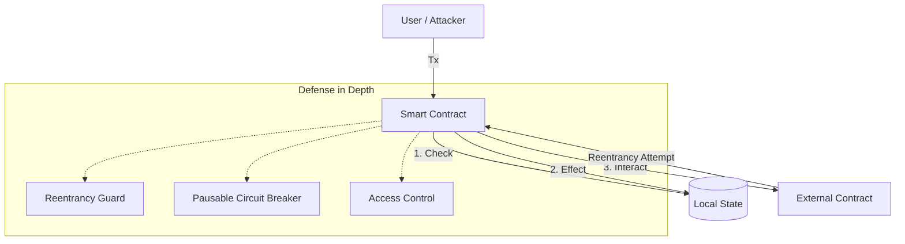

# Blockchain / Smart Contract Coding Standards

> **A Comprehensive Reference for Principal Smart Contract Engineers**
>
> These coding standards apply to all smart contract development across Solidity, Rust (Anchor/Solana), and Move (Sui/Aptos). Every PR must conform to these standards before merging. This guide emphasizes gas optimization, security patterns, and robust invariant testing.

## System Architecture: Security First

When writing smart contracts, view the system as adversarial. Every external call is a potential attack vector.



> [!CAUTION]
> **Checks-Effects-Interactions (CEI)**: This is the golden rule of smart contract security. Always update your state (Effects) *before* calling an external contract (Interactions). If you do not follow this, you are vulnerable to Reentrancy attacks, regardless of whether you use a `nonReentrant` modifier.

## Solidity Conventions

### Versioning

```solidity
// Use ^0.8.x with minimum 0.8.20 for native transient storage (EIP-1153)
pragma solidity ^0.8.20;
```

- Prefer `^0.8.x` over fixed version in libraries/interfaces.
- Pin exact version (e.g., `0.8.24`) in production deployments via CI lockfiles.
- No experimental pragmas.

### NatSpec

Every public and external function MUST have full NatSpec:

```solidity
/// @notice Transfers tokens to a recipient
/// @dev Uses unchecked math for balance updates to save gas since totals are bounded
/// @param to Recipient address
/// @param amount Amount of tokens to transfer
/// @return success True if transfer succeeded
/// @custom:risk External call to hook if receiver is a contract
function transfer(address to, uint256 amount) external returns (bool success);
```

### Variable Naming & Storage Packing

```solidity
// Storage packing: Group smaller types together so they fit in a single 32-byte slot
struct UserData {
    uint128 balance;    // 16 bytes
    uint64 lastClaim;   // 8 bytes
    uint64 nonce;       // 8 bytes - fits perfectly into 1 slot (32 bytes)
}

// Private state: _leadingUnderscore
mapping(address => UserData) private _userData;

// Immutable: IMMUTABLE_NAME
address public immutable OWNER;

// Constant: CONSTANT_NAME
uint256 public constant MAX_SUPPLY = 1_000_000 ether;
```

> [!TIP]
> **Storage is Expensive**: Writing to a new storage slot costs 20,000 gas. Modifying an existing one costs 2,900 gas. Pack your variables, and cache storage reads into memory variables if you access them more than once in a function.

### Custom Errors

Always use custom errors over `require(..., string)` to save deployment gas and provide rich debugging context:

```solidity
// Good
error InsufficientBalance(address account, uint256 available, uint256 required);

function withdraw(uint256 amount) external {
    uint256 currentBalance = _balances[msg.sender];
    if (amount > currentBalance) {
        revert InsufficientBalance(msg.sender, currentBalance, amount);
    }
    // ...
}
```

### Prohibited Patterns

| Pattern | Why | Replacement |
|---|---|---|
| `tx.origin` | Phishing vulnerability | `msg.sender` |
| `address.transfer()` | 2300 gas limit may fail | `call{value: amount}` |
| `block.timestamp` for randomness | Miner manipulation | Chainlink VRF |
| `blockhash(block.number)` | Always 0 | Use `block.prevrandao` (post-merge) |
| `selfdestruct` | EVM removal planned (EIP-6780) | Design without it |
| `delegatecall` to untrusted | Storage corruption | Use strictly defined proxies |

## Rust (Anchor / Solana) Conventions

### Project Structure

```text
programs/
  my_program/
    src/
      lib.rs          # Entrypoint + module declarations
      instructions/   # One file per instruction
      states/         # Account structs
      errors/         # Custom error codes
```

> [!IMPORTANT]
> **Account Validation**: Solana pushes security to the developer via Account validation. Always use Anchor's `#[account(has_one = owner)]` and strictly check the `owner` of any account passed in to ensure it belongs to your program or the expected system program.

## Testing Standards

### File Structure

```text
test/
  unit/             # Mirrors src/
  integration/      # Cross-contract interactions
  fuzz/             # Parameter fuzzing
  invariant/        # Protocol invariants (stateful fuzzing)
```

### Coverage Targets

| Metric | Target |
|---|---|
| Line coverage | >= 90% |
| Branch coverage | >= 80% |
| Fuzz parameter combos| >= 10000 runs per function |
| Invariant runs | >= 1000 per invariant |

### Workflow: Writing an Invariant Test (Foundry)
1. **Define the Invariant**: "The sum of all user balances must strictly equal the total supply of the token."
2. **Create the Handler**: Build a Handler contract that exposes bounded functions (e.g., `mint`, `transfer`, `burn`).
3. **Target the Handler**: Use `targetContract(address(handler))` in the setup.
4. **Write the Assertion**:
```solidity
function invariant_TotalSupplyEqualsBalances() public {
    uint256 sum = handler.reduceBalances();
    assertEq(sum, token.totalSupply());
}
```
5. **Run**: `forge test --match-path test/invariant/*.t.sol`

## Advanced Troubleshooting

### 1. Gas Out Of Gas (OOG) on Mainnet, but passes in tests
**Symptom**: Transactions revert with OOG on mainnet.
**Root Cause**: Iterating over unbounded arrays. Tests usually run with small data sets, hiding the OOG vector.
**Resolution**: 
- Never use unbound arrays. Use mappings or implement pagination.
- If arrays are necessary, cap their maximum length via a constant.

### 2. Slither Reports "Reentrancy" Despite ReentrancyGuard
**Symptom**: CI fails because Slither flags a function protected by `nonReentrant`.
**Root Cause**: Slither traces the external call and sees state changes after it. `nonReentrant` only protects against reentering *that specific contract*. Cross-contract reentrancy (read-only reentrancy) is still possible if other view functions expose intermediate state.
**Resolution**:
- Enforce strict Checks-Effects-Interactions.
- Ensure view functions that expose critical price/balance metrics cannot be manipulated mid-transaction.
