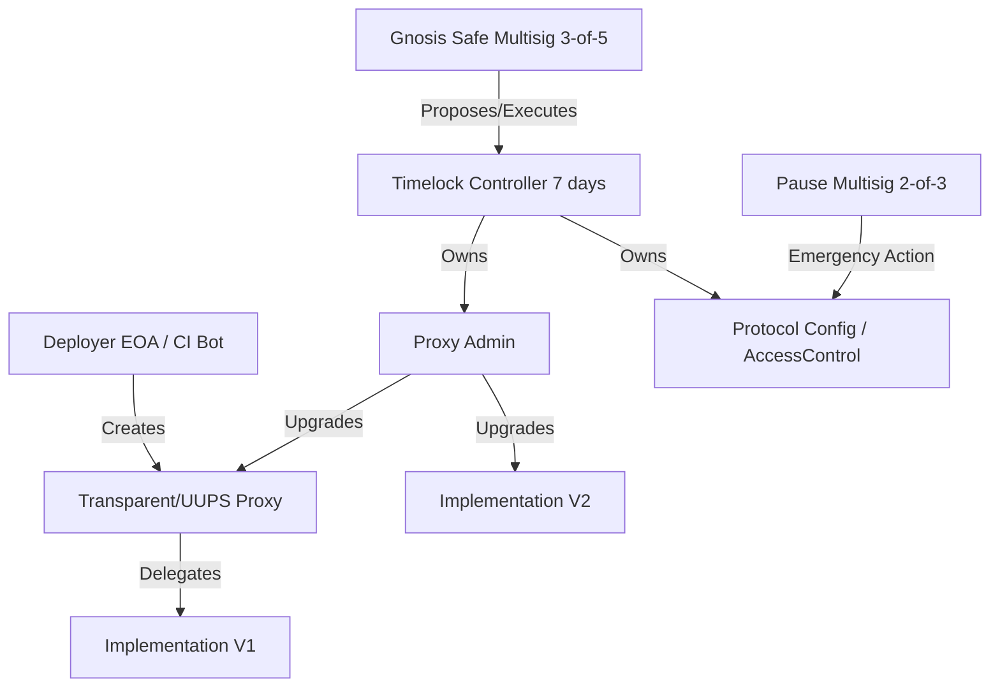

# Smart Contract Deployment Standard Operating Procedure

> **A Comprehensive Reference for Principal Smart Contract Engineers**
>
> This SOP covers all smart contract deployments across devnet, testnet, staging, and mainnet environments. It details multisig orchestration, timelock queueing, upgradeability mechanics, and verifiable builds.

## System Architecture: Deployment Topology

Deploying smart contracts securely involves layers of administration and operational security (OpSec). The following model outlines a standard secure production topology:



> [!WARNING]
> **Compromised Deployer Keys**: A CI bot's private key used for deployment should NEVER be the owner or admin of the protocol on Mainnet. The CI bot deploys the implementation, and immediately transfers ownership of the ProxyAdmin to the multisig/timelock.

## Pre-Deployment Checklist

### Code Readiness
- [ ] Contracts compiled with correct Solidity version.
- [ ] Solidity optimizer settings match production intent: runs >= 200, enabled = true.
- [ ] All unit tests pass: `forge test`.
- [ ] Integration tests pass against forked mainnet: `forge test --fork-url $RPC_URL`.
- [ ] External audit completed.
- [ ] Gas snapshot generated and compared to baseline.

### Operational Readiness
- [ ] Deployment configuration file prepared: `deploy/config/<network>.yaml`
- [ ] Multisig signers confirmed available for signing window (mainnet).
- [ ] Upgrades: storage layout checked via `forge inspect MyContract storageLayout`.
- [ ] Timelock delay configured (minimum 7 days).

## Deployment Flow by Environment

### 1. Devnet
Validation:
- [ ] Contracts deployed and addresses logged
- [ ] Constructor args correct
- [ ] Basic state reads work

### 2. Testnet
Validation:
- [ ] Contract verified on explorer automatically via Etherscan API.
- [ ] Integration tests pass against deployed contracts.

### 3. Staging (Live Rehearsal)
Staging deploys through a test multisig to the testnet fork.
- [ ] Generate deployment transaction payload (`forge script ... --json`)
- [ ] Submit to test Safe
- [ ] Collect signatures (3-of-5)
- [ ] Execute via Safe

### 4. Mainnet

```bash
# 1. Generate deployment calldata (offline)
forge script script/Deploy.s.sol:DeployScript \
  --rpc-url mainnet \
  --json \
  --sig "run()" > mainnet_deploy.json

# 2. Create Safe transaction (via Safe CLI or TxBuilder)
safe-tx create \
  --safe $MAINNET_SAFE \
  --to $DEPLOYER_CONTRACT \
  --data $(cat mainnet_deploy.json | jq -r '.transaction.data') \
  --value 0

# 3. Sign with hardware wallets (Ledger/Trezor)
# 4. Execute after threshold met
# 5. Verify on Etherscan
```

> [!TIP]
> **Deterministic Deployments**: Use `CREATE2` via a factory (like Nick's method or OpenZeppelin's `Create2` utility) to ensure the contract address is identical across all chains (Mainnet, Arbitrum, Optimism). This drastically simplifies cross-chain UI integrations.

## Step-by-Step Workflows

### Workflow: Executing a Protocol Upgrade
1. **Develop and Audit**: Write the V2 implementation. Prove it does not corrupt the V1 storage layout. Get it audited.
2. **Deploy V2 Implementation**: Use CI to deploy the V2 logic contract. *This has no state and is harmless.*
3. **Verify Implementation**: Verify the V2 source code on Etherscan so the community can inspect it.
4. **Propose Upgrade**: Create a transaction on the Multisig calling `Timelock.schedule(ProxyAdmin, 0, "upgrade(address,address)", proxy, v2Impl)`.
5. **Wait the Timelock**: The 7-day timelock elapses. The community is notified.
6. **Execute Upgrade**: The Multisig executes the transaction in the Timelock. The Proxy now points to V2.

## Advanced Troubleshooting

### 1. Verification Fails on Etherscan
**Symptom**: `forge verify-contract` fails with "Bytecode does not match".
**Root Cause**: The compiler version, optimizer runs, EVM version, or constructor arguments used during verification differ slightly from the deployment.
**Resolution**:
- Ensure the `foundry.toml` exactly matches the environment used for deployment.
- Pass the ABI-encoded constructor arguments correctly using `$(cast abi-encode "constructor(address)" $OWNER)`.
- Sometimes metadata hashes differ. Try using `--via-ir` or check the `--metadata` flag.

### 2. Gas Spikes During Mainnet Deployment
**Symptom**: Deployment transaction hangs in the mempool or gets dropped.
**Root Cause**: Network base fee spiked, and the `maxFeePerGas` was set too low.
**Resolution**:
- Never use legacy `gasPrice` transactions. Always use EIP-1559 (`maxFeePerGas` and `maxPriorityFeePerGas`).
- If stuck, use the same deployer nonce to submit a replacement transaction (cancel or speed-up) with a `maxPriorityFeePerGas` at least 10% higher.

## Emergency Procedures

| Action | Multisig Threshold | Timelock |
|---|---|---|
| Pause Protocol | 2-of-5 (Ops Multisig) | Bypass (Immediate) |
| Unpause Protocol | 3-of-5 (Main Multisig)| 0 delay |
| Upgrade Logic | 3-of-5 | 7 days |
| Change Ownership| 5-of-8 | 14 days |

### Emergency Pause
```bash
# Call pause via SafeTx
safe-tx create \
  --safe $MULTISIG \
  --to $CONTRACT_ADDRESS \
  --data "0x8456cb59" # keccak("pause()")
```
