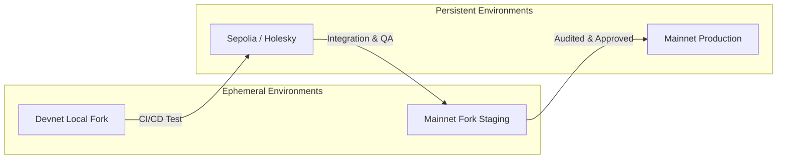

# Blockchain Environment Configuration Guide

> **A Comprehensive Reference for Principal Blockchain Engineers**
>
> This document defines the standardized environment configuration for blockchain project deployment across all stages: devnet, testnet, staging, and mainnet. It ensures consistency across teams, tools, and CI/CD pipelines while enforcing strict segregation of duties and secret management.

## Environment Progression Architecture



> [!WARNING]
> **Never Mix Keys**: The private keys or mnemonic used to deploy to Devnet/Testnet must NEVER be the same as the ones used for Mainnet. If a mnemonic is ever typed into a `.env` file on a developer's laptop, consider it fully compromised for Mainnet use.

## Environment Matrix

### Devnet (Local Development)

| Property | Value |
|---|---|
| Tool | Anvil (Foundry), Hardhat node |
| Chain ID | Ephemeral (31337) |
| Pre-funded | 10+ accounts with 10000 ETH each |
| Mock tokens | Deploy mock ERC20 (MOCK_USDC, MOCK_WETH) |
| Verification | None |
| Gas | Free or minimal (1 wei) |
| Block time | Instant (0s) or time-adjustable via `evm_increaseTime` |

**Workflow: Spinning up a robust Devnet**
1. Export your RPC URL: `export ALCHEMY_MAINNET=...`
2. Run Anvil pinning a specific block so tests are deterministic: `anvil --fork-url $ALCHEMY_MAINNET --fork-block-number 19500000`
3. If testing TWAPs (Time-Weighted Average Prices), run Anvil with auto-mining disabled and step blocks manually using `anvil_mine`.

### Testnet

| Chain | Name | Chain ID | RPC Provider | Explorer |
|---|---|---|---|---|
| Ethereum | Sepolia | 11155111 | Infura/Alchemy | sepolia.etherscan.io |
| Ethereum | Holesky | 17000 | Infura/Alchemy | holesky.etherscan.io |
| Arbitrum | Sepolia | 421614 | Infura/Alchemy | sepolia.arbiscan.io |
| Optimism | Sepolia | 11155420 | Alchemy/QuickNode | sepolia-optimism.etherscan.io |
| Base | Sepolia | 84532 | Alchemy/Coinbase | sepolia.basescan.org |

### Staging (Mainnet Fork)

Staging is a local or cloud-hosted fork of mainnet but with production-like infrastructure surrounding it.

| Component | Configuration |
|---|---|
| RPC | Dedicated Alchemy/QuickNode endpoint (not shared) |
| Oracles | Mainnet oracle feeds |
| Multisig | Mainnet Safe addresses (impersonated via `vm.prank`) |
| Relayer | Local Gelato/OpenZeppelin Defender mock |

### Mainnet

| Property | Requirement |
|---|---|
| RPC | Paid tier with Failover (Alchemy primary, Infura fallback) |
| Wallet | Multisig (Gnosis Safe, 3/5 or 5/8) |
| Signer | Hardware wallet (Ledger/Trezor) |
| Proxy | ProxyAdmin owned by multisig & timelock |
| Timelock | 7-day delay on all upgrades |

## Advanced RPC Configuration & Load Balancing

For mainnet, a single RPC provider is a single point of failure.

> [!TIP]
> **Use an RPC Multiplexer**: In production backend services that index or submit transactions to mainnet, use a multiplexer like `drpc` or a custom proxy that falls back across Alchemy, Infura, and QuickNode.

### Fallback Configuration Example (viem/ethers)

```typescript
// viem example
import { createPublicClient, fallback, http } from 'viem'
import { mainnet } from 'viem/chains'

const client = createPublicClient({
  chain: mainnet,
  transport: fallback([
    http('https://eth-mainnet.g.alchemy.com/v2/...'),
    http('https://mainnet.infura.io/v3/...'),
    http('https://rpc.ankr.com/eth')
  ], { rank: true })
})
```

## Chain ID Reference

| Network | Chain ID | Hex |
|---|---|---|
| Ethereum Mainnet | 1 | 0x1 |
| Sepolia | 11155111 | 0xaa36a7 |
| Holesky | 17000 | 0x4268 |
| Arbitrum One | 42161 | 0xa4b1 |
| Optimism | 10 | 0xa |
| Base | 8453 | 0x2105 |
| Polygon Mainnet | 137 | 0x89 |
| Solana Mainnet | 101 | - |

## CI/CD Secret Management

All secrets must be stored securely.

| Variable | Scope | Storage Mechanism |
|---|---|---|
| `ALCHEMY_API_KEY` | All networks | GitHub Secrets / AWS Parameter Store |
| `ETHERSCAN_API_KEY` | Testnet/Mainnet | GitHub Secrets |
| `DEPLOYER_PRIVATE_KEY`| Devnet/Testnet | GitHub Secrets (Restricted to Test environment) |
| `MAINNET_DEPLOYER_PK` | Mainnet | Strictly HashiCorp Vault or AWS KMS (Not in GitHub) |

## Advanced Troubleshooting

### 1. Chain ID Mismatch on Testnets
**Symptom**: Transactions fail with "invalid sender" or "chain ID mismatch".
**Root Cause**: The wallet signed the transaction for a different Chain ID than what the RPC node expects (e.g., using a localhost Chain ID on Sepolia).
**Resolution**: Verify `block.chainid` dynamically in your deploy scripts instead of hardcoding.

### 2. Rate Limiting on RPC Nodes
**Symptom**: CI fails randomly during tests with `429 Too Many Requests`.
**Root Cause**: Free tier RPCs limit requests per second. A large test suite using `--fork-url` easily exceeds 30 RPS.
**Resolution**:
- Use a paid Alchemy/Infura tier.
- Cache the RPC responses locally by using Foundry's `--no-storage-caching false` or Anvil's state saving.
