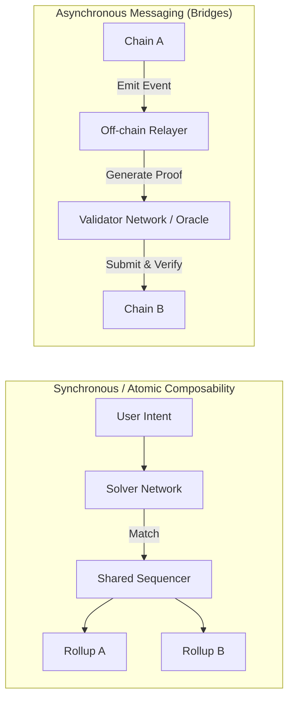

# Blockchain Interoperability Landscape

> **A Comprehensive Reference for Principal Blockchain Engineers**
>
> An architectural guide to cross-chain communication, bridging models, and atomic composability across isolated state machines.

## Interoperability Architectures

Modern interoperability is divided into asynchronous message passing (bridges) and synchronous execution (shared sequencers/intents).

> [!WARNING]
> **Bridge Trust Assumptions**: Never blindly trust arbitrary cross-chain messages. If a bridge validator network is compromised (e.g., Ronin, Wormhole incidents), an attacker can mint infinite bridged assets. Always implement strict rate limits and anomaly detection in your application's receiving contract.

## Bridge Architecture Types

| Type | Verification Mechanism | Trust Model | Latency | Examples |
|------|-------------|-------------|---------|----------|
| External Validator | Multi-sig / MPC | N-of-M validators | Minutes | Wormhole, Axelar |
| Optimistic | Fraud proof | 1 honest watcher | Hours (dispute window) | Nomad, Across |
| ZK / Light Client | Validity proof (SNARK) | Math (1 honest prover) | Minutes | zkBridge, IBC, CCIP |
| Liquidity Network | Atomic swap / HTLC | Liquidity providers | Seconds | Stargate, Hop |
| Native / Canonical | L1 validator | L1 security | Minutes | Arbitrum Bridge |

## Protocol Deep Dives

### IBC (Inter-Blockchain Communication)
- **Architecture**: A gold standard for trust-minimized bridging. Uses light clients embedded in the destination chain to verify the consensus state of the source chain.
- **Security**: If the source chain's consensus is secure, the bridge is secure.
- **Limitation**: Highly complex to implement on chains without deterministic finality (like Ethereum PoW, though PoS makes this easier) or without cheap signature verification.

### LayerZero V2
- **Architecture**: Decouples verification from execution. V2 introduces Decentralized Verifier Networks (DVNs) replacing the V1 Oracle.
- **Workflow**: DVN verifies the block payload, Executors deliver the payload.
- **Security**: Applications can configure *exactly* which DVNs they trust (e.g., Require Chainlink DVN + Google DVN + EigenLayer AVS DVN). 

### Chainlink CCIP (Cross-Chain Interoperability Protocol)
- **Architecture**: Employs an independent Active Risk Management (ARM) network that monitors the primary oracle network.
- **Workflow**: Commitment phase (message locked) -> ARM validation -> Execution phase.
- **Programmable Token Transfers (PTT)**: Send tokens and execute logic in a single transaction securely.

## Workflow: Integrating Cross-Chain Messaging Safely

1. **Isolate State**: Do not let a malicious message from Chain B corrupt the state of users on Chain A.
2. **Implement Rate Limiting**: Limit the maximum TVL that can flow out of your contract per hour.
3. **Use Multiple Bridges**: For massive TVL, do not rely on one bridge. Use a 2-of-3 multisig bridging architecture (e.g., require Wormhole AND LayerZero to attest to the same message before minting).
4. **Pause Functionality**: Always include an emergency pause circuit breaker that a watchtower bot can trigger automatically upon detecting a state anomaly.

## Standardization Landscape

| Standard | Type | Status | Description |
|----------|------|--------|-------------|
| EIP-7683 | Cross-chain intents | Draft | Standardized intent format |
| ERC-7281 | xERC-20 | Final | Burn/mint for bridged tokens |
| ERC-5164 | Cross-chain exec | Draft | L1 → L2 execution |
| ICS-20 | Token transfer | Live | IBC token standard |
