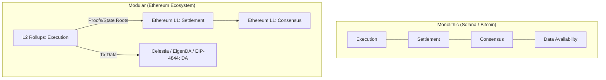

# Blockchain Layer Model Comparison

> **A Comprehensive Reference for Principal Protocol Engineers**
>
> A technical breakdown of L1 consensus models, execution environments, and systemic trade-offs between monolithic and modular architectures.

## Monolithic vs Modular Architectures

> [!TIP]
> **Understanding Modular Trade-offs**: Modular chains abstract execution to L2s, allowing horizontal scaling. However, they break synchronous composability (a smart contract on Arbitrum cannot atomically call a smart contract on Optimism). Monolithic chains maintain atomic composability at the cost of vertical scaling limitations (extreme hardware requirements).

## Consensus Architecture Deep Dive

### Gasper Consensus (Ethereum)
- **Chain**: Linear, LMD-GHOST fork choice.
- **Finality**: Casper FFG finality after 2 epochs (~12.8min).
- **Throughput**: ~15 tps L1 (limited by 30M gas per 12s block).
- **Security**: 33% slashable equivocation, 66% finality revert. Requires massive economic burn to reorg finalized blocks.
- **Decoupling**: Unique client architecture separating execution (Geth, Reth) from consensus (Prysm, Lighthouse).

### Proof of History + Tower BFT (Solana)
- **Chain**: Continuous VDF (Verifiable Delay Function) ticks.
- **Finality**: Deterministic after PoH + Tower (~400ms).
- **Throughput**: 2,000-4,000 tps (peak 50k+ with Firedancer/GPU).
- **Security**: 33% stake Byzantine.
- **Unique**: Global clock via SHA-256 chain removes the need for validators to communicate block times, enabling extreme parallel execution.

### Tendermint BFT (Cosmos)
- **Chain**: Linear, single-slot finality.
- **Finality**: Instant after 2/3+ precommits (~2-7s).
- **Fork choice**: N/A (no forks, BFT deterministic).
- **Throughput**: 1,000-10,000 tps depending on the Cosmos SDK application.
- **Security**: Heavily prioritizes safety over liveness. If 33% of nodes go offline, the chain halts rather than forking.

## Advanced Systemic Trade-offs

### 1. Throughput vs Decentralization
Higher TPS requires larger blocks and faster propagation. This increases disk I/O and bandwidth requirements, pricing out hobbyist node runners and centralizing the network in enterprise data centers.

### 2. Finality vs Latency
Deterministic finality (Cosmos) requires extensive network gossip (O(N^2) communication) before a block is confirmed, limiting the validator set size. Probabilistic finality (Bitcoin) allows infinite node counts but requires waiting for multiple confirmations.

### 3. Programmability vs Security
Turing-complete VMs (EVM) offer infinite flexibility but expand the attack surface. Non-Turing complete scripts (Bitcoin) or constrained execution models (eUTxO on Cardano) are much easier to formally verify but difficult to build complex AMMs or lending pools on.

## Execution VM Comparison

| VM | Data Model | Parallelization | Dominant Lang | Example |
|----|------------|-----------------|---------------|---------|
| **EVM** | Account / Global State | No (Sequential) | Solidity / Vyper | Ethereum |
| **SVM** | Account (explicit IO) | Yes (Sealevel) | Rust | Solana |
| **MoveVM** | Object / Resource | Yes (State access) | Move | Sui / Aptos |
| **Wasm** | Account / Actor | Varies | Rust | Cosmos / Polkadot |
