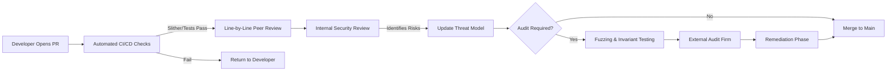

# Code Review and Security Review Process

> **A Comprehensive Reference for Principal Smart Contract Auditors and Lead Developers**
>
> This process governs all code reviews, security reviews, and audits for blockchain/smart contract projects. It establishes a rigorous pipeline designed to catch vulnerabilities before they hit production, recognizing that post-deployment fixes are often impossible or highly complex.

## Security Review Lifecycle



> [!CAUTION]
> **Beware of Audit Fatigue**: Do not rely entirely on external auditors. Internal peer review and robust invariant testing will catch 90% of bugs. Auditors are best utilized for finding the remaining 10% of complex, systemic edge cases.

## PR Review Process: Step-by-Step

### 1. Developer Opens PR
Must include:
- Risk assessment (Does this touch funds? Does it change access control?)
- Gas snapshot diff.
- Fuzzing coverage report.

### 2. CI Checks (Automated)
Every PR must pass:
- Unit tests (`forge test`)
- Slither static analysis with no high findings.
- Gas diff (`forge snapshot --diff`) < 5% increase.
- Coverage report (`forge coverage`) >= 90%.

### 3. Line Review
Assigned to 2 reviewers. Every line must be scrutinized. Reviewers must trace external calls manually.

```typescript
// Reviewer comments must use strict tagging:
// [ISSUE] This unchecked arithmetic can overflow.
// [SUGGESTION] Consider using SafeERC20.safeTransfer instead.
// [SECURITY] Missing reentrancy guard on this state-mutating external call.
```

## Security Review Checklist

Apply this checklist to every function changed in the PR.

### Access Control
- [ ] Are roles correctly checked? (e.g., `onlyOwner`, `onlyRole(MINTER_ROLE)`)
- [ ] For `onlyOwner`: Can ownership be transferred via a two-step process? (Avoid accidental transfers to `address(0)`).
- [ ] Can an initializer be front-run? (Ensure initializers are called in the deployment script atomically).

### Input Validation
- [ ] Are array lengths checked? (Prevent unbounded loops leading to OOG).
- [ ] Are all `uint`/`int` parameters bounded to reasonable protocol limits?
- [ ] Are signature replays prevented? (Include nonces, chain IDs, and use EIP-712).

### Execution Flow & Reentrancy
- [ ] **Checks-Effects-Interactions**: Are all state variables updated *before* the external call?
- [ ] Is `nonReentrant` applied to all functions that handle ETH or token transfers?
- [ ] Is the function safe from cross-function reentrancy? (i.e., reentering a different function in the same contract to exploit intermediate state).
- [ ] Is the contract safe from Read-Only Reentrancy? (e.g., exposing a manipulated `balanceOf` to external viewers).

### Arithmetic & Precision
- [ ] Are precision losses handled? (Always multiply before dividing).
- [ ] Are shares-to-assets calculations rounding in favor of the protocol? (Round down on user withdrawals, round up on user deposits).

### Upgrade Safety
- [ ] **Storage Layout**: Have any variables been inserted or deleted? (Only append to the end of storage).
- [ ] Are `__gap` arrays included at the end of upgradeable base contracts?
- [ ] Is the implementation contract initialized immediately upon deployment to prevent attackers from initializing and self-destructing it?

## Advanced Workflow: Managing External Audits

1. **Code Freeze**: Freeze the `develop` branch. No features may be added. Only documentation and test improvements are permitted.
2. **Audit Handoff**: Provide the auditor with a detailed architecture document, access control matrix, and specific areas of concern.
3. **Triaging Findings**: When the report arrives, categorize findings into:
   - **True Positives**: Fix immediately.
   - **False Positives**: Provide cryptographic or programmatic proof (via a Foundry test) that the attack path is impossible.
4. **Remediation**: Create isolated PRs for each finding. Label them `audit-fix/[finding-id]`.
5. **Re-audit**: Submit the fixes back for the final report phase.
