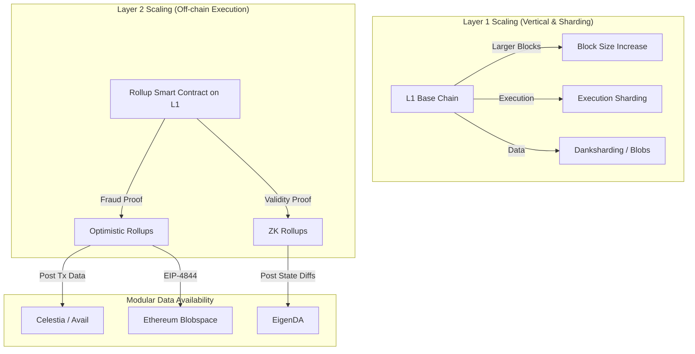

# Blockchain Scalability Landscape

> **A Comprehensive Reference for Principal Blockchain Engineers**
>
> An architectural guide mapping out how distributed systems scale. This covers L1 scaling (sharding, block size), L2 rollups (Optimistic vs. ZK), and modular Data Availability layers.

## The Scalability Trilemma Architecture

Blockchains must balance Decentralization, Security, and Scalability. Pushing scalability too hard at the L1 layer invariably sacrifices decentralization (requiring data center nodes).

> [!TIP]
> **Rollups Scale Computation, Not Data**: A rollup executes transactions off-chain, solving the computation bottleneck. However, it must still post transaction data (or state diffs) back to the L1 so users can reconstruct the state. Thus, L2 scalability is ultimately bottlenecked by L1 Data Availability (DA).

## Layer 2 Rollups Deep Dive

### Optimistic Rollups (Arbitrum, Optimism)
- **Mechanism**: Assume all transactions are valid. Post them to L1.
- **Security**: Watchers have a 7-day dispute window to submit a Fraud Proof if the sequencer lied.
- **Finality**: Instant soft-finality on L2, but takes 7 days for hard finality (withdrawal to L1).
- **Pros**: 100% EVM equivalent. Easy to deploy existing DApps.
- **Cons**: Capital inefficiency due to the 7-day withdrawal delay.

### ZK Rollups (zkSync, Starknet, Scroll)
- **Mechanism**: Generate a cryptographic proof (SNARK/STARK) of correct execution off-chain. Post the proof and state diffs to L1.
- **Security**: Math guarantees validity. The L1 smart contract verifies the proof.
- **Finality**: Fast. Once the proof is verified on L1 (minutes to hours), the state is final.
- **Pros**: Fast withdrawals. Massive throughput.
- **Cons**: Prover generation is computationally expensive. zkEVMs are incredibly complex and carry higher smart contract risk.

## Modular Data Availability (DA) Landscape

With Ethereum's Dencun upgrade (EIP-4844), L2s post data to temporary "blobs". Alternative DA layers exist for cheaper data posting (Validiums/Volitions).

| DA Layer | Mechanism | Throughput | Use Case |
|----------|-----------|------------|----------|
| **Ethereum Blobs** | Native EIP-4844 blobs, expire in 18 days | ~0.5 MB/slot | Standard Rollups |
| **Celestia** | Data Availability Sampling (DAS), sovereign chain | 2-4 MB/block | Modular rollups, high-throughput gaming |
| **EigenDA** | Restaking ETH to secure DA committee | 15 MB/s | Massive scale DeFi, highly secure Validiums |
| **Avail** | KZG commitments, DAS | 2 MB/block | Polygon ecosystem rollups |

## Workflow: Deploying a DApp to an L2

1. **RPC Selection**: Rollup sequencers can go down. Ensure your frontend can handle L2 RPC failures gracefully.
2. **Finality Awareness**: Understand the difference between "Sequencer Finality" (soft, instant) and "L1 Finality" (hard). If building an exchange, accept soft finality for trades, but require hard finality for massive withdrawals.
3. **Bridge Integration**: Use the canonical bridge for native asset transfers to inherit maximum security, accepting the speed trade-off. Use liquidity networks (Hop, Stargate) for fast, user-facing UX.
4. **Gas Optimization**: On L2s, computation is cheap but L1 calldata is expensive. Optimize your contracts to pass *less data* in function arguments, even if it requires slightly more execution logic.

## Advanced Troubleshooting

### 1. Sequencer Downtime
**Symptom**: Transactions hang and RPCs return timeout errors.
**Root Cause**: The centralized sequencer for the L2 has crashed.
**Resolution**: 
- In Optimistic rollups, users can use the "escape hatch" to force a transaction directly via the L1 inbox contract. Educate users on this fallback if downtime is prolonged.

### 2. State Drift in Local L2 Testing
**Symptom**: `forge fork` behaves differently locally than on the L2 testnet.
**Root Cause**: L2s have specific precompiles (e.g., Arbitrum's `ArbSys` contract to get the L2 block number) that Anvil may not perfectly emulate.
**Resolution**:
- Test against live testnets for L2-specific opcodes (`block.number` vs L1 `block.number`).
