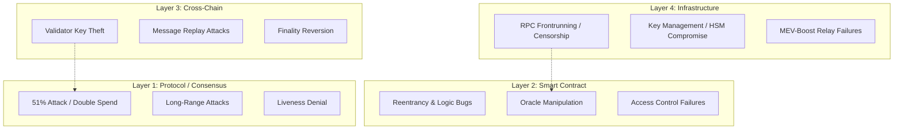

# Blockchain Security Model

> **A Comprehensive Reference for Principal Smart Contract Auditors and Security Engineers**
>
> A deep dive into the multi-layered threat vectors in blockchain environments. This model encompasses consensus layer attacks, smart contract vulnerabilities, cross-chain bridge risks, and infrastructural weaknesses (MEV, RPCs).

## Threat Model Layers

To effectively secure a decentralized application, you must apply STRIDE-like threat modeling across four distinct layers.

> [!CAUTION]
> **The Weakest Link Principle**: A protocol with perfectly audited smart contracts will still be completely drained if the administrative multisig keys are stored insecurely, or if it relies on a centralized Oracle that can be manipulated via flash loans.

## Economic Security Models

| Model | Attack Cost | Defense Mechanism | Example |
|-------|------------|---------|---------|
| PoW | Hash power rental + electricity | ASIC dominance, algorithmic difficulty adjustment | Bitcoin |
| PoS | Stake slashing (33%+ = loss) | Slashing, social slashing, weak subjectivity | Ethereum |
| BFT | 1/3 Byzantine stake | Proof-of-Lock, cryptographic evidence submission | Cosmos |
| DAG | 33% stake (DAG-BFT) | Metastability, virtual voting | Avalanche |

## Workflow: Incident Response (War Room)

When a vulnerability is exploited or disclosed:
1. **Verify**: The security lead verifies the vulnerability on a local fork. DO NOT test it on mainnet or a public testnet.
2. **Pause**: Multisig signers execute the `pause()` function on all affected contracts. (Target time: < 15 minutes).
3. **Assess**: Determine the scope of stolen funds and remaining funds.
4. **Whitehack (Optional)**: If unpaused funds are actively at risk, coordinate with security researchers (e.g., SEAL 911) to rescue the funds to a secure multisig via frontrunning the attacker.
5. **Patch & Upgrade**: Develop the fix, test invariants, pass it through an accelerated review, and queue the upgrade.
6. **Post-Mortem**: Publish a public report detailing the root cause, timeline, and mitigation strategies within 48 hours.

## MEV Security & Economic Exploits

- **MEV as a Security Tax**: Validators extract value through arbitrage, liquidations, and sandwich attacks.
- **Flash Loans**: An attacker borrows $100M with zero collateral, manipulates a DEX spot price, forces your protocol to liquidate users based on that manipulated price, and repays the loan in a single block.
- **Defense**: NEVER use spot prices from an AMM (like Uniswap V2) as an oracle. Always use Time-Weighted Average Prices (TWAP) or decentralized oracle networks (Chainlink) with staleness checks.

## Bridge Security Risk

Bridges hold massive honeypots of locked liquidity, making them prime targets.

| Attack Type | Example | Loss | Root Cause |
|-------------|---------|------|------------|
| Validator key compromise | Wormhole | $326M | Missing guardian signature validation |
| Smart contract bug | Ronin | $625M | Compromised 5/9 validator keys via phishing |
| Economic manipulation | Nomad | $190M | Bridge contract initialization bug allowed zero-hashes |
| Reentrancy across chains | Multichain | $130M | Unverified cross-chain message |

**Advanced Mitigations**:
- **Threshold Signatures (TSS)**: Require multiple nodes to collaboratively sign state roots.
- **ZK Light Clients**: Prove the state of chain A on chain B using zero-knowledge proofs (SNARKs/STARKs) instead of trusting multisig signers.
- **Rate Limiting**: Hard-code limits on the maximum volume that can cross the bridge per hour, acting as a circuit breaker.

## Advanced Troubleshooting

### 1. Phishing & Frontend Compromise
**Symptom**: Users report funds being drained, but the smart contracts are intact.
**Root Cause**: The DNS of the frontend was hijacked, or a malicious dependency injected wallet-draining code (e.g., calling `setApprovalForAll`).
**Resolution**:
- Implement strict Content Security Policies (CSP).
- Monitor DNS and domain registry changes.
- Educate users to verify transaction payloads via hardware wallet screens.
