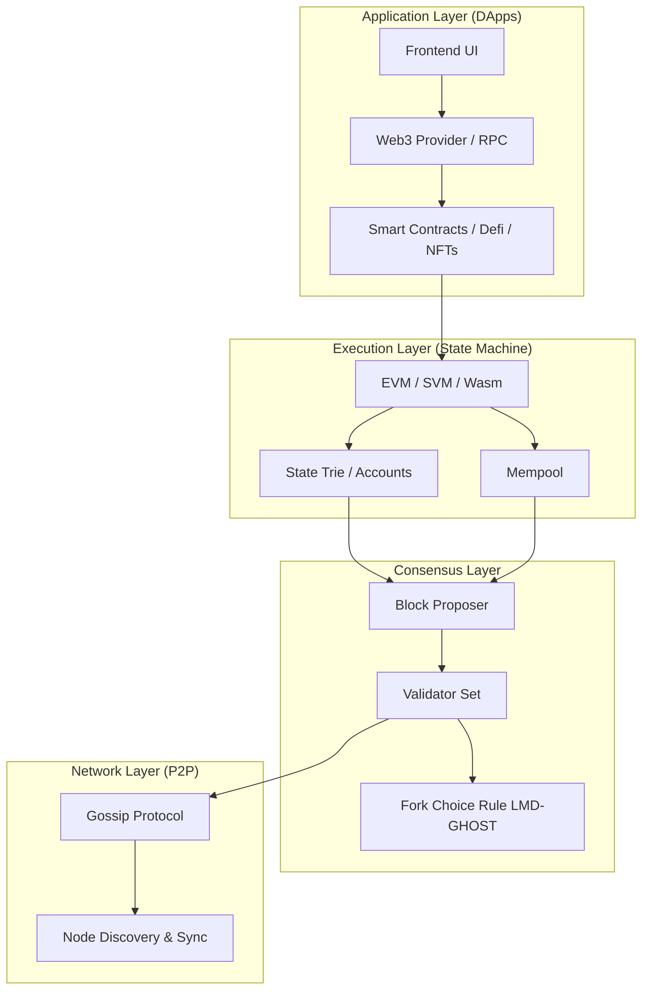

# Blockchain System Architecture

> **A Comprehensive Reference for Principal Blockchain Engineers**
>
> An advanced breakdown of the layered architecture governing modern distributed ledgers. This document details the intersection of peer-to-peer networking, state machines, consensus algorithms, and execution environments (VMs).

## Layered Architecture Model

A blockchain system operates as a replicated state machine across a distributed network.

> [!TIP]
> **Separation of Concerns**: Modern blockchains (like post-Merge Ethereum) decouple the Execution Layer (handling EVM state and mempools) from the Consensus Layer (handling validator duties and fork choice rules). This allows independent scaling and distinct client implementations (e.g., Geth + Prysm).

## Layer Breakdown by Chain

| Layer | Bitcoin | Ethereum | Solana | Cosmos |
|-------|---------|----------|--------|--------|
| Consensus | Nakamoto PoW | Gasper PoS (Casper+LMD) | PoH + Tower BFT | Tendermint BFT |
| Execution | Bitcoin Script | EVM | SeaLevel (SVM) | CosmWasm / EVM |
| State Model | UTXO | Account | Account | Account (IBC) |
| Finality | Probabilistic (~1hr) | Probabilistic (2 epochs) | Deterministic (~0.4s) | Deterministic (~2s) |
| Tx Order | MemPool → Block | MemPool → Beacon → Execution | Gulf Stream → PoH → Banking | MemPool → Proposer |

## Workflow: Transaction Lifecycle (Ethereum)

1. **Signing**: User signs a transaction containing nonce, recipient, value, data, and gas parameters.
2. **Propagation**: The transaction is sent via RPC to a node, validated, and injected into the public Mempool via P2P gossip.
3. **MEV Extraction**: Searchers simulate the transaction and bundle it with others to extract arbitrage. Builders construct the most profitable block.
4. **Proposal**: A validator (chosen randomly for the slot) receives the block header via MEV-Boost and proposes it to the network.
5. **Attestation**: A committee of validators attests to the block, adding their weight to the fork choice rule.
6. **Execution**: The EVM executes the block sequentially. The State Root is updated.
7. **Finalization**: After two epochs (~12.8 minutes), Casper FFG finalizes the block, making it irreversible without a massive economic burn.

## System Properties & Trade-offs (The Trilemma)

- **Security**: Can be Economic (cost of attack > profit), Cryptographic (hash, sig, ZK proofs), or Protocol-level (finality, reorg resistance).
- **Decentralization**: Evaluated by node count, hardware requirements to run a full node, geographic distribution, and client diversity.
- **Scalability**: Transaction throughput (TPS), state growth rate, and block size limits. 

> [!WARNING]
> **State Bloat**: The silent killer of decentralization. As the blockchain history grows, the disk I/O required to read the state trie becomes a bottleneck. Avoid designing contracts that permanently write useless data to storage. Utilize events for historical data mapping instead of state variables when possible.

## Cross-Layer Interactions

- **L1 Finality → L2 Bridge Delay**: Rollups (L2) rely on L1 finality. Optimistic rollups add a 7-day challenge period because execution occurs off-chain.
- **MEV at Execution → Centralization at Consensus**: Maximum Extractable Value creates economies of scale for block builders. This threatens consensus decentralization, which is mitigated by Proposer-Builder Separation (PBS).

## Advanced Troubleshooting

### 1. P2P Network Partitions
**Symptom**: A subset of nodes falls out of sync or forks onto a parallel chain.
**Root Cause**: Misconfigured bootnodes, ISP-level censorship, or a bug in a specific execution client parsing a complex transaction.
**Resolution**: 
- Maintain high client diversity (don't let any single client > 33% share).
- Monitor peering health.

### 2. Mempool Congestion & Dropped Transactions
**Symptom**: User transactions sit pending for hours and eventually drop.
**Root Cause**: The network base fee surges past the user's `maxFeePerGas`, causing nodes to evict the transaction from their local mempools to save RAM.
**Resolution**:
- Implement dynamic fee bumping in your backend services.
- Resubmit the transaction with the exact same nonce and a 10-20% higher priority fee.
