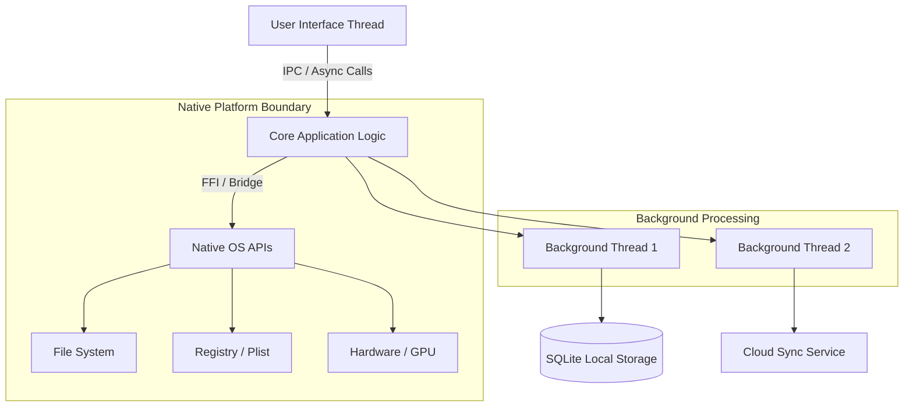
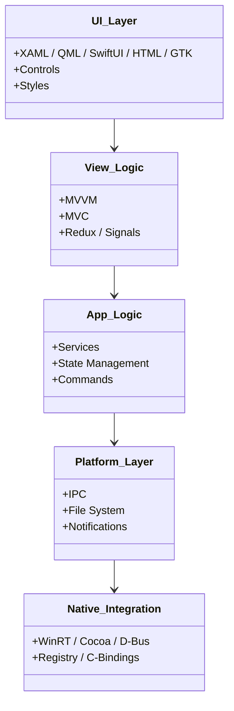

# Desktop Skills Guide

> **A Comprehensive Reference for Principal & Senior Desktop Engineers**
>
> Skills covering desktop application development across all major platforms: cross-platform frameworks, Windows-native, macOS-native, and Linux-native toolkits. This guide covers system integration, memory management, native bridging, and cross-platform architecture patterns.

## System Architecture Overview

When building robust desktop applications, separating the UI from core logic and native APIs is critical to maintaining a responsive interface and enabling testability.



> [!TIP]
> **Keep the Main Thread Clean**: The most common cause of desktop app lag is doing I/O or heavy computation on the main thread. Always offload these to background workers or threads and use message passing (like IPC in Electron/Tauri or `DispatchQueue` in Swift) to return results.

## Skill Map

### Cross-Platform Frameworks

| Skill | Directory | Tech Stack | Targets |
|-------|-----------|------------|---------|
| Electron | `skills/desktop/electron/` | JS/TS, Chromium, Node.js | Windows, macOS, Linux |
| Tauri | `skills/desktop/tauri/` | Rust + web frontend | Windows, macOS, Linux |
| Qt | `skills/desktop/qt/` | C++, QML, PySide | Windows, macOS, Linux, embedded |
| GTK | `skills/desktop/gtk/` | C, Python (PyGObject), Rust (gtk-rs) | Linux, Windows, macOS |
| Flutter Desktop | `skills/mobile/flutter/` | Dart, Skia | Windows, macOS, Linux |
| .NET MAUI | `skills/mobile/dotnet-maui/` | C#, XAML | Windows, macOS, Android, iOS |

### Windows-Native

| Skill | Directory | Tech Stack | Targets |
|-------|-----------|------------|---------|
| WPF | `skills/desktop/wpf/` | .NET, C#, XAML, MVVM | Windows only |
| WinUI 3 | `skills/desktop/winui3/` | .NET, C#, WinAppSDK, modern XAML | Windows 10+ |
| UWP | `skills/desktop/uwp/` | .NET, C#, XAML | Windows 10+, Xbox, HoloLens |
| Windows Forms | `skills/desktop/winforms/` | .NET, C#, drag-drop designer | Windows only |

### macOS-Native

| Skill | Directory | Tech Stack | Targets |
|-------|-----------|------------|---------|
| SwiftUI | `skills/desktop/swiftui/` | Swift, declarative UI | macOS, iOS, watchOS, tvOS |
| AppKit | `skills/desktop/appkit/` | Swift, Objective-C, nibs | macOS only |

### Linux-Native

| Skill | Directory | Tech Stack | Targets |
|-------|-----------|------------|---------|
| GNOME (GTK) | `skills/desktop/gnome/` | C, Python, Rust, GTK 4 | Linux (GNOME desktop) |
| KDE (Qt) | `skills/desktop/kde/` | C++, QML, Kirigami | Linux (KDE desktop) |

## Decision Framework

```
Need cross-platform with web skills?
  ├─ Electron — mature, full Chrome, large bundles, great DX
  ├─ Tauri — smaller, faster, Rust backend, uses system webview
  └─ Qt (with QML or WebEngine) — C++ performance with web-like UI

Need native Windows look and feel?
  ├─ WPF — mature, .NET Framework/.NET, MVVM pattern standard
  ├─ WinUI 3 — modern, Fluent Design, WinAppSDK
  └─ Windows Forms — legacy, quick forms, internal tools

Need native macOS look and feel?
  ├─ SwiftUI — modern, Swift, App Intents, fast iterations
  └─ AppKit — mature, full control, Objective-C/Swift legacy

Need Linux-first?
  ├─ GTK — GNOME standard, C/Python/Rust bindings
  ├─ Qt — KDE standard, C++/Python
  └─ Tauri — Linux bundles, web UI, system webkit2gtk

Need maximum performance?
  ├─ Qt (C++) — native, OpenGL/Vulkan access
  ├─ GTK (C) — lightweight, native rendering
  └─ Tauri (Rust) — zero-cost abstractions in backend
```

## Architecture Layers



## Step-by-Step Workflows

### Workflow: Implementing Secure IPC in Hybrid Apps (Electron/Tauri)
1. **Disable Node Integration**: In the renderer process, ensure Node integration is completely disabled.
2. **Context Isolation**: Enable context isolation to prevent prototype pollution between the renderer and main process.
3. **Define a Strict Preload Script**: Create a bridge using `contextBridge` that only exposes specific, whitelisted functions.
4. **Validate IPC Messages**: On the main process (or Rust backend), sanitize and validate all inputs coming from the UI layer. Never trust the renderer.
5. **Handle Large Data Safely**: For large files, avoid passing buffers through IPC. Instead, pass file paths and read the file natively in the main process, or use streams.

> [!WARNING]
> **XSS in Desktop Apps is RCE**: In hybrid apps like Electron, a Cross-Site Scripting (XSS) vulnerability can escalate to Remote Code Execution (RCE) if IPC is not strictly secured. Always sanitize inputs and strictly control your preload bridges.

## Advanced Troubleshooting

### 1. Memory Leaks in the UI Thread
**Symptom**: The application consumes increasing amounts of RAM over time and eventually crashes or slows down significantly.
**Root Cause**: Unsubscribed event listeners, closure traps keeping objects alive, or unreleased native graphical resources (e.g., GDI objects in Windows).
**Resolution**:
- Use platform-specific profiling tools (Xcode Instruments, Visual Studio Profiler, Chrome DevTools Memory tab).
- Implement Weak References where appropriate.
- Ensure proper cleanup in component teardown/destructor phases.

### 2. IPC Bottlenecks
**Symptom**: UI freezing during data-heavy operations despite offloading logic to the main/backend process.
**Root Cause**: Sending massive JSON payloads over the IPC channel blocks serialization/deserialization.
**Resolution**:
- Use shared memory arrays (e.g., `SharedArrayBuffer` in Electron).
- Send minimal data; paginate or stream data in chunks.
- If processing a file, pass the file path via IPC and let the backend read it directly.

## Skills List

### Cross-Platform
- `skills/desktop/electron/SKILL.md`
- `skills/desktop/tauri/SKILL.md`
- `skills/desktop/qt/SKILL.md`
- `skills/desktop/gtk/SKILL.md`

### Windows
- `skills/desktop/wpf/SKILL.md`
- `skills/desktop/winui3/SKILL.md`
- `skills/desktop/uwp/SKILL.md`
- `skills/desktop/winforms/SKILL.md`

### macOS
- `skills/desktop/swiftui/SKILL.md`
- `skills/desktop/appkit/SKILL.md`

### Linux
- `skills/desktop/gnome/SKILL.md`
- `skills/desktop/kde/SKILL.md`
