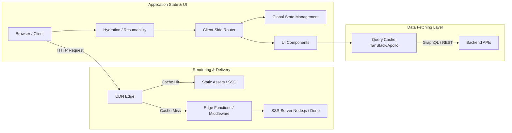
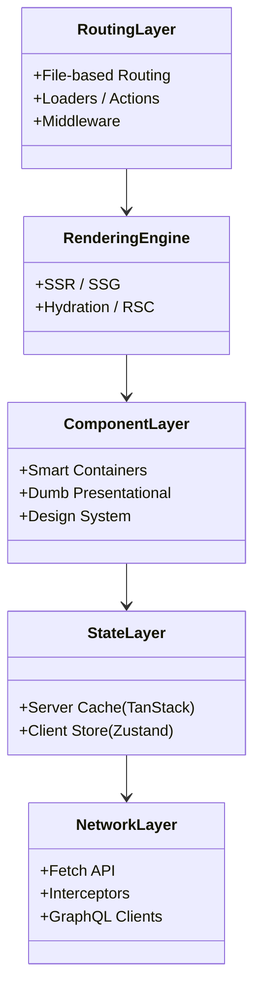

# Frontend Skills Guide

> **A Comprehensive Reference for Principal & Senior Frontend Engineers**
>
> 37+ skills covering the complete frontend development lifecycle: architecture, patterns, rendering strategies, state management, styling, testing, and performance across 8+ framework ecosystems. This guide dives deep into modern web vitals, build optimizations, and scaling frontend applications.

## System Architecture Overview

Modern frontends are no longer just HTML/CSS. They are complex distributed systems that manage state, coordinate APIs, and optimize delivery via various rendering strategies.



> [!TIP]
> **Push Computation to the Edge**: Utilize Edge middleware (e.g., Next.js Middleware, Cloudflare Workers) to handle personalization, A/B testing, and auth verification before the request even hits your SSR server. This dramatically reduces Time To First Byte (TTFB).

## Skill Map

### Framework Ecosystems

| Stack | Architecture | Patterns | Extra |
|-------|-------------|----------|-------|
| **React** | `frontend/react/architecture/` | — | nextjs/ |
| **Vue** | `frontend/vue/architecture/` | `frontend/vue/patterns/` | nuxt/ |
| **Angular** | `frontend/angular/architecture/` | `frontend/angular/patterns/` | — |
| **Svelte** | `frontend/svelte/architecture/` | `frontend/svelte/patterns/` | sveltekit/ |
| **Remix** | `frontend/remix/architecture/` | `frontend/remix/patterns/` | — |
| **Astro** | `frontend/astro/architecture/` | `frontend/astro/patterns/` | — |
| **SolidJS** | `frontend/solidjs/architecture/` | `frontend/solidjs/patterns/` | — |
| **Qwik** | `frontend/qwik/architecture/` | `frontend/qwik/patterns/` | — |
| **Lit** | `frontend/lit/` | — | — |

### Universal Patterns (17 skills)

| Pattern | Skill | Focus |
|---------|-------|-------|
| Accessibility | `frontend/universal/accessibility/` | WCAG, ARIA, screen readers, keyboard nav |
| Animation | `frontend/universal/animation/` | CSS, JS, GSAP, Framer Motion, transitions |
| Bundler Tools | `frontend/universal/bundler-tools/` | Vite, Webpack, Turbopack, esbuild |
| Data Fetching | `frontend/universal/data-fetching/` | React Query, SWR, Apollo, tRPC |
| Design System | `frontend/universal/design-system/` | Storybook, tokens, components, docs |
| Form Handling | `frontend/universal/form-handling/` | React Hook Form, Formik, Zod validation |
| Image Optimization | `frontend/universal/image-optimization/` | Next/Image, responsive, lazy, WebP |
| Microfrontend | `frontend/universal/microfrontend/` | Module Federation, single-spa, qiankun |
| Patterns | `frontend/universal/patterns/` | Container/presenter, hooks, composables |
| Performance | `frontend/universal/performance/` | Core Web Vitals, LCP, CLS, INP, bundle |
| PWA | `frontend/universal/pwa/` | Service workers, manifest, offline, caching |
| SEO | `frontend/universal/seo/` | Meta tags, structured data, sitemaps, SSR |
| State Management | `frontend/universal/state-management/` | Zustand, Pinia, NgRx, signals |
| Storybook | `frontend/universal/storybook/` | Stories, addons, testing, documentation |
| Tailwind CSS | `frontend/universal/tailwind-css/` | Utility-first, customization, responsive |
| Testing | `frontend/universal/testing/` | Vitest, Playwright, Testing Library, Cypress |
| Theming | `frontend/universal/theming/` | Dark mode, CSS variables, design tokens |

## Decision Framework

### Choose Your Framework

```
Need maximum ecosystem and jobs?
  ├─ React — largest ecosystem, Next.js standard, huge community
  ├─ Vue — gentle learning curve, great DX, versatile
  └─ Angular — enterprise scale, opinionated, full-featured

Need best performance and minimal JS?
  ├─ Svelte — compiled, no virtual DOM, tiny bundles
  ├─ SolidJS — fine-grained reactivity, closest to vanilla
  ├─ Qwik — resumable, near-zero JS, instant loading
  └─ Astro — islands architecture, zero JS by default

Need content-focused site?
  ├─ Astro — best SSG, islands architecture, content collections
  ├─ Next.js — SSG + SSR, file-based routing
  └─ Remix — web standards, progressive enhancement, native fetch API

Need web components?
  ├─ Lit — Google's standard, lightweight
  └─ Svelte — compiles to WC natively
```

### Choose Your Rendering Strategy

```
Need SEO and fast FCP?
  ├─ SSR → Next.js, Nuxt, SvelteKit, Remix (Dynamic data)
  ├─ SSG → Astro, Next.js, Nuxt (Static at build time)
  └─ ISR → Next.js (Hybrid, revalidate in background)

Need interactivity and auth behind a login?
  ├─ SPA → React, Vue, Angular (CSR, no SEO required)
  └─ MPA → Remix, traditional forms

Need the best of both worlds?
  ├─ Islands → Astro (partial hydration of only interactive bits)
  ├─ Resumable → Qwik (lazy hydration on user interaction)
  └─ RSC → Next.js (React Server Components, fetch on server, pass to client)
```

### Choose Your State Management

```
Need simple global state?
  ├─ Context API (React) / provide-inject (Vue)
  ├─ Zustand / Pinia (Lightweight, unopinionated)
  └─ Signals (Solid, Qwik, Angular, Preact)

Need server state?
  ├─ TanStack Query (React Query) (Caching, deduping, background fetch)
  ├─ SWR / Apollo Client (GraphQL)
  └─ tRPC (End-to-end typesafe with monorepos)

Need complex client state?
  ├─ Zustand + Immer (Immutable updates)
  ├─ Pinia / NgRx (Redux-like patterns)
  └─ Jotai / Recoil (Atomic, bottom-up state)
```

## Architecture Layers



## Step-by-Step Workflows

### Workflow: Optimizing Core Web Vitals (LCP, CLS, INP)
1. **LCP (Largest Contentful Paint)**: Preload your hero image. Ensure the text font is self-hosted with `font-display: swap`. Use modern formats like WebP or AVIF.
2. **CLS (Cumulative Layout Shift)**: Provide explicit `width` and `height` attributes to all images and iframes. Pre-allocate space for dynamic content (like ads) using CSS aspect-ratio.
3. **INP (Interaction to Next Paint)**: Break up long tasks. If you have heavy JS execution, yield to the main thread using `setTimeout` or the `scheduler.yield()` API so the browser can paint UI updates.
4. **Bundle Analysis**: Use `@next/bundle-analyzer` or `rollup-plugin-visualizer` to find heavy dependencies (e.g., replace moment.js with date-fns).
5. **Code Splitting**: Dynamically import heavy, non-critical components (e.g., modals, rich-text editors) using `React.lazy` or Next.js `dynamic()`.

> [!WARNING]
> **Prop Drilling vs Global State**: Do not default to global state (Redux/Zustand) for everything. If state is only shared between a parent and its direct children, prop drilling or Composition is cleaner. Reserve global state for user sessions, themes, and cross-cutting data.

## Advanced Troubleshooting

### 1. Hydration Mismatches
**Symptom**: Console errors stating "Text content did not match. Server: X Client: Y" and the UI flashing.
**Root Cause**: The HTML rendered on the server differs from what the client expects on its first render. Often caused by using `window` or `Date.now()` without ensuring it only runs on the client.
**Resolution**:
- Suppress hydration warnings selectively only if unavoidable.
- Use a `useIsMounted` hook to delay rendering browser-specific UI until after hydration.

### 2. Infinite Re-renders
**Symptom**: The browser tab freezes, memory spikes, and React/Vue throws maximum update depth exceeded errors.
**Root Cause**: Updating state directly inside the render body, or non-memoized objects/functions being passed into dependency arrays of `useEffect`/`watch`.
**Resolution**:
- Move object creation outside the component if it's static.
- Use `useMemo` or `useCallback` to stabilize references.
- Use React Developer Tools Profiler to pinpoint the exact component triggering the loop.

## By Common Scenarios

### Building a SPA
1. `frontend/{stack}/architecture/` — project structure
2. `frontend/universal/state-management/` — state layer
3. `frontend/universal/data-fetching/` — API integration
4. `frontend/universal/form-handling/` — user input
5. `frontend/universal/routing/` — navigation
6. `frontend/universal/testing/` — quality

### Building a SSR/SSG App
1. `frontend/{stack}/architecture/` — framework setup
2. `frontend/universal/seo/` — meta, structured data
3. `frontend/universal/performance/` — Core Web Vitals
4. `frontend/universal/image-optimization/` — images
5. `frontend/universal/data-fetching/` — server/client fetch

### Building a Design System
1. `frontend/universal/design-system/` — tokens, components
2. `frontend/universal/storybook/` — documentation
3. `frontend/universal/accessibility/` — WCAG compliance
4. `frontend/universal/theming/` — dark mode
5. `frontend/universal/testing/` — component tests

## Skills List

### Per-Stack Skills
- `skills/frontend/react/architecture/SKILL.md`
- `skills/frontend/react/nextjs/SKILL.md`
- `skills/frontend/vue/architecture/SKILL.md`
- `skills/frontend/vue/nuxt/SKILL.md`
- `skills/frontend/vue/patterns/SKILL.md`
- `skills/frontend/angular/architecture/SKILL.md`
- `skills/frontend/angular/patterns/SKILL.md`
- `skills/frontend/svelte/architecture/SKILL.md`
- `skills/frontend/svelte/patterns/SKILL.md`
- `skills/frontend/svelte/sveltekit/SKILL.md`
- `skills/frontend/remix/architecture/SKILL.md`
- `skills/frontend/remix/patterns/SKILL.md`
- `skills/frontend/astro/architecture/SKILL.md`
- `skills/frontend/astro/patterns/SKILL.md`
- `skills/frontend/solidjs/architecture/SKILL.md`
- `skills/frontend/solidjs/patterns/SKILL.md`
- `skills/frontend/qwik/architecture/SKILL.md`
- `skills/frontend/qwik/patterns/SKILL.md`
- `skills/frontend/lit/SKILL.md`

### Universal Skills
- `skills/frontend/universal/accessibility/SKILL.md`
- `skills/frontend/universal/animation/SKILL.md`
- `skills/frontend/universal/bundler-tools/SKILL.md`
- `skills/frontend/universal/data-fetching/SKILL.md`
- `skills/frontend/universal/design-system/SKILL.md`
- `skills/frontend/universal/form-handling/SKILL.md`
- `skills/frontend/universal/image-optimization/SKILL.md`
- `skills/frontend/universal/microfrontend/SKILL.md`
- `skills/frontend/universal/patterns/SKILL.md`
- `skills/frontend/universal/performance/SKILL.md`
- `skills/frontend/universal/pwa/SKILL.md`
- `skills/frontend/universal/seo/SKILL.md`
- `skills/frontend/universal/state-management/SKILL.md`
- `skills/frontend/universal/storybook/SKILL.md`
- `skills/frontend/universal/tailwind-css/SKILL.md`
- `skills/frontend/universal/testing/SKILL.md`
- `skills/frontend/universal/theming/SKILL.md`
