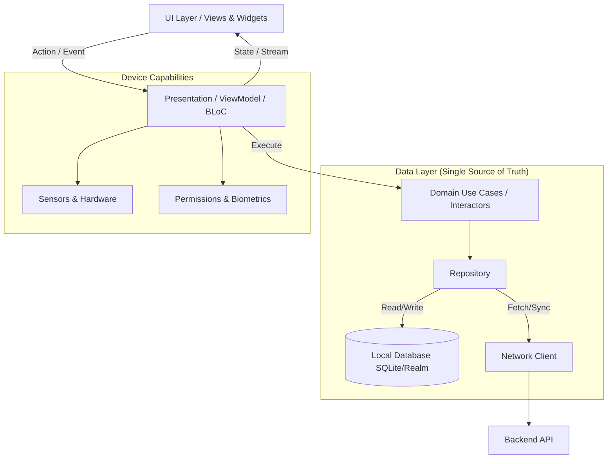
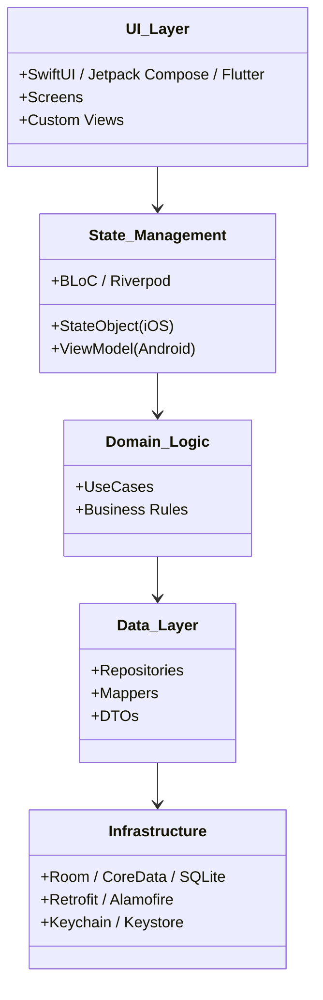

# Mobile Skills Guide

> **A Comprehensive Reference for Principal & Senior Mobile Engineers**
>
> 24 skills covering native and cross-platform mobile development: iOS, Android, Flutter, React Native, Kotlin Multiplatform, and universal patterns for the full mobile lifecycle. This guide explores memory optimization, offline-first architectures, background task scheduling, and state synchronization.

## System Architecture Overview

Mobile applications require careful handling of constrained resources (battery, memory, bandwidth) and unreliable networks. A robust mobile architecture strictly separates UI from data logic and relies heavily on local caching.



> [!TIP]
> **Single Source of Truth**: The Repository pattern should implement an Offline-First approach. The UI always observes the local database. The network client fetches new data and writes it to the local DB. The local DB then emits the new state to the UI. Never update the UI directly from a network response.

## Skill Map

### Platform Skills

| Platform | Skill | Focus |
|----------|-------|-------|
| **iOS** | `skills/mobile/ios/` | Swift, SwiftUI, UIKit, Combine, Xcode |
| **Android** | `skills/mobile/android/` | Kotlin, Jetpack Compose, XML, Android Studio |
| **Flutter** | `skills/mobile/flutter/` | Dart, Widgets, BLoC, Provider, Riverpod |
| **React Native** | `skills/mobile/react-native/` | Expo, RN CLI, Hermes, Metro |
| **Kotlin Multiplatform** | `skills/mobile/kotlin-multiplatform/` | Shared logic, Compose Multiplatform, SQLDelight |
| **Ionic/Capacitor** | `skills/mobile/ionic-capacitor/` | Web-based, plugins, native bridges |
| **.NET MAUI** | `skills/mobile/dotnet-maui/` | C#, XAML, MVVM, platform-specific |

### Universal Patterns (16 skills)

| Pattern | Skill | Focus |
|---------|-------|-------|
| Analytics | `skills/mobile/universal/analytics/` | Amplitude, Mixpanel, GA4, custom events |
| AR/VR | `skills/mobile/universal/ar-vr/` | ARKit, ARCore, SceneKit, RealityKit |
| Biometrics | `skills/mobile/universal/biometrics/` | Face ID, Touch ID, fingerprint, passcode |
| Camera & Media | `skills/mobile/universal/camera-media/` | CameraX, AVFoundation, image picking |
| Crash Reporting | `skills/mobile/universal/crash-reporting/` | Sentry, Crashlytics, App Center |
| Deep Linking | `skills/mobile/universal/deep-linking/` | Universal links, custom schemes, routing |
| Deployment | `skills/mobile/universal/deployment/` | App Store, Play Store, CodePush, signing |
| In-App Purchase | `skills/mobile/universal/in-app-purchase/` | StoreKit, Billing Library, RevenueCat |
| Map & Location | `skills/mobile/universal/map-location/` | MapKit, Google Maps, geocoding, permissions |
| Networking | `skills/mobile/universal/networking/` | URLSession, OkHttp, Dio, GraphQL, caching |
| Offline First | `skills/mobile/universal/offline-first/` | Local DB, sync, conflict resolution |
| Patterns | `skills/mobile/universal/patterns/` | MVVM, MVI, Clean Architecture, BLoC |
| Performance | `skills/mobile/universal/performance/` | Frame rate, memory, startup, battery |
| Push Notifications | `skills/mobile/universal/push-notifications/` | APNS, FCM, local notifications, payloads |
| Security | `skills/mobile/universal/security/` | Keychain, Keystore, SSL pinning, obfuscation |
| Storage | `skills/mobile/universal/storage/` | SQLite, Realm, Core Data, SharedPreferences |
| Testing | `skills/mobile/universal/testing/` | XCTest, JUnit, Espresso, Detox, Maestro |

## Decision Framework

### Choose Your Platform Strategy

```
Need native performance and full OS access?
  ├─ iOS native (Swift + SwiftUI) — Apple ecosystem, best integration with iOS features
  ├─ Android native (Kotlin + Compose) — Google ecosystem, deep hardware control
  └─ Both — Kotlin Multiplatform + Compose Multiplatform (sharing domain logic natively)

Need code sharing across platforms with native UI elements?
  ├─ Flutter — single codebase, near-native perf, own Skia/Impeller rendering engine
  ├─ React Native — JS/TS, large ecosystem, wraps native UI components
  ├─ Kotlin Multiplatform — shared business logic, native UI per platform
  └─ .NET MAUI — C#, Windows + mobile legacy integration

Need quick prototype or web skills reuse?
  ├─ Ionic/Capacitor — web tech, native plugins
  └─ React Native (Expo) — fast dev cycle, OTA updates
```

### Choose Your Architecture

```
Need simple app?
  ├─ MVVM — standard, testable (SwiftUI, Android)
  └─ BLoC / Provider — Flutter, reactive streams

Need complex app?
  ├─ MVI (Model-View-Intent) — unidirectional, predictable, highly scalable
  ├─ Clean Architecture — layers, testable, separate domain models from DTOs
  └─ Redux-like — single store, actions (TCA in iOS)

Need shared logic?
  └─ KMP shared module (Kotlin) + platform UI (SwiftUI / Compose)
```

## Architecture Layers



## Step-by-Step Workflows

### Workflow: Implementing Secure Biometric Authentication
1. **Check Availability**: First, query the OS to see if biometrics are supported and enrolled (e.g., `LocalAuthentication` in iOS, `BiometricManager` in Android).
2. **Generate Crypto Keys**: Do not just use a boolean "success" from the biometric prompt. Instead, generate a public/private key pair inside the Secure Enclave / Android Keystore.
3. **Require Biometrics for Key Access**: Configure the key so that the OS requires a biometric scan to use the private key for signing.
4. **Sign Challenge**: The backend sends a challenge nonce. The mobile app signs this nonce using the biometric-protected private key.
5. **Verify on Server**: The backend verifies the signature against the public key stored during registration.

> [!WARNING]
> **Never Trust the Client**: A compromised or jailbroken device can bypass the boolean `isBiometricSuccess` check by hooking the OS method. Always rely on cryptographic proof generated by hardware-backed keystores.

## Advanced Troubleshooting

### 1. Application Not Responding (ANR) / UI Freezes
**Symptom**: The app drops frames during scrolling, or the OS shows an "App Not Responding" dialog.
**Root Cause**: Heavy operations (I/O, database writes, image decoding, JSON parsing) are executing on the main thread.
**Resolution**:
- Android: Use Kotlin Coroutines (`Dispatchers.IO`) for background work. Inspect ANR traces in Play Console.
- iOS: Use Swift Concurrency (`Task.detached` or background actors) or GCD (`DispatchQueue.global()`).
- Flutter: Use `Isolates` for heavy computation to avoid blocking the UI isolate.

### 2. Battery Drain & Background Execution Limits
**Symptom**: The app uses a high percentage of battery, and the OS frequently kills the app when backgrounded.
**Root Cause**: Polling the network continuously, holding wake locks, or inefficient location tracking.
**Resolution**:
- Use Push Notifications (FCM/APNS) to wake the app instead of polling.
- Use `WorkManager` (Android) or `BGTaskScheduler` (iOS) to batch non-critical network requests when the device is charging and on Wi-Fi.
- For location tracking, use significant location changes rather than continuous GPS polling unless actively navigating.

## By Common Scenarios

### Building a Social App
1. `mobile/{platform}/` — project setup
2. `mobile/universal/patterns/` — architecture
3. `mobile/universal/networking/` — API client
4. `mobile/universal/storage/` — local cache
5. `mobile/universal/push-notifications/` — alerts
6. `mobile/universal/deep-linking/` — navigation
7. `mobile/universal/crash-reporting/` — stability

### Building an E-Commerce App
1. `mobile/{platform}/` — project setup
2. `mobile/universal/patterns/` — architecture
3. `mobile/universal/networking/` — API client
4. `mobile/universal/offline-first/` — offline support
5. `mobile/universal/in-app-purchase/` — payments
6. `mobile/universal/analytics/` — tracking
7. `mobile/universal/security/` — payment security

> [!IMPORTANT]
> **Handle Connectivity State Gracefully**: Always assume the network will fail. Implement retry logic with exponential backoff and provide immediate UI feedback using optimistic UI updates when users perform actions like "adding to cart".

## Skills List

### Platform Skills
- `skills/mobile/ios/SKILL.md`
- `skills/mobile/android/SKILL.md`
- `skills/mobile/flutter/SKILL.md`
- `skills/mobile/react-native/SKILL.md`
- `skills/mobile/kotlin-multiplatform/SKILL.md`
- `skills/mobile/ionic-capacitor/SKILL.md`
- `skills/mobile/dotnet-maui/SKILL.md`

### Universal Skills
- `skills/mobile/universal/analytics/SKILL.md`
- `skills/mobile/universal/ar-vr/SKILL.md`
- `skills/mobile/universal/biometrics/SKILL.md`
- `skills/mobile/universal/camera-media/SKILL.md`
- `skills/mobile/universal/crash-reporting/SKILL.md`
- `skills/mobile/universal/deep-linking/SKILL.md`
- `skills/mobile/universal/deployment/SKILL.md`
- `skills/mobile/universal/in-app-purchase/SKILL.md`
- `skills/mobile/universal/map-location/SKILL.md`
- `skills/mobile/universal/networking/SKILL.md`
- `skills/mobile/universal/offline-first/SKILL.md`
- `skills/mobile/universal/patterns/SKILL.md`
- `skills/mobile/universal/performance/SKILL.md`
- `skills/mobile/universal/push-notifications/SKILL.md`
- `skills/mobile/universal/security/SKILL.md`
- `skills/mobile/universal/storage/SKILL.md`
- `skills/mobile/universal/testing/SKILL.md`
