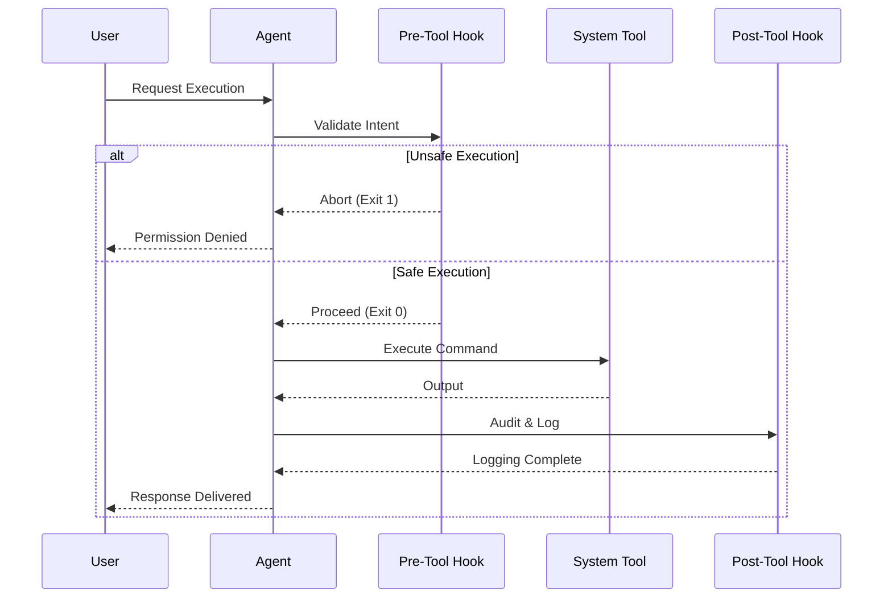
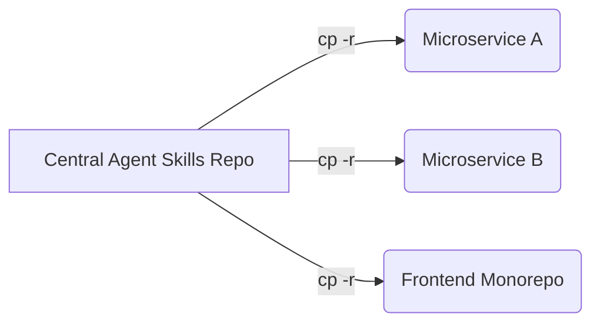

# Universal Agent Reference & Orchestration Guide

This reference provides exhaustive documentation on the configuration matrices, hook architectures, and operational policies for the AI agents supported in this ecosystem. It serves as the master blueprint for deploying and customizing multi-agent orchestration.

## Enterprise Agent Config Matrix

Understanding the operational boundaries of your agent is crucial for system stability.

| Agent Framework | Config Path | Auto-loaded | Extensibility | Ideal Use Case | Native Compression | Context Limits |
|-------|-------------|-------------|-------|--------|---|---|
| **Claude Code** | `.claude/CLAUDE.md` | Yes | Bash / PS Hooks | Autonomous CLI operations | High | 200k+ tokens |
| **OpenCode** | `.opencode/AGENTS.md` | Yes | Custom Scripting | Local, privacy-first models | Custom | VRAM dependent |
| **Amp** | `.amp/AGENTS.md` | Yes | Subagent REST | Complex distributed workflows | High | Variable |
| **Cursor** | `.cursor/rules/*.mdc`| Yes | Pre/Post Commands | Real-time IDE assistance | Native | IDE limits |
| **Windsurf** | `.windsurf/rules/*.md`| Yes | Cascade | Context-aware codebase editing | High | Native |
| **Codex CLI** | `.codex/AGENTS.md` | Yes | Python Hooks | Legacy CLI integrations | Medium | 128k tokens |
| **Copilot** | `.github/copilot-instructions.md`| Yes | N/A | Quick snippet generation | Low | 32k tokens |
| **Gemini** | `.gemini/INSTRUCTIONS.md` | Yes | Ext-based | Deep architectural planning | High | 1M+ tokens |

> [!IMPORTANT]
> Ensure that only one primary agent configuration is actively routing at the root level per repository to prevent conflict loops during automated task execution.

## System Architecture & Hook Lifecycle

The orchestration layer relies on a universal lifecycle hook pattern. Supported agents (like Claude Code and Codex CLI) utilize this to guarantee deterministic execution, safety, and observability.



## Deep Dive: Platform Configurations

### 1. Claude Code
Configuration is primarily handled via `.claude/CLAUDE.md` and supplementary files in `.claude/rules/`.

**Advanced Skills Map (`.claude/skills/`):**
- `commit`: Conventional commit enforcer. Stages all files, runs linters, and applies semantic commit syntax.
- `deep-research`: Forks the Explore agent for autonomous internet and internal documentation deep-dives, outputting structured markdown artifacts.
- `deploy`: Validates deployment checklists before executing CI/CD pipelines.
- `fix-issue`: Integrates with the GitHub CLI to automatically pull, analyze, and resolve issues locally.

**Hook Security Architecture (`.claude/hooks/`):**
Claude Code enforces strict security boundaries using scripts in `.claude/hooks/scripts/` (`.sh` + `.ps1`).
- `PreToolUse`: A regex-based AST analyzer that aggressively blocks destructive commands (`rm -rf`, network exposure scripts, `DROP TABLE`).
- `PostToolUse`: Asynchronously pipes AST changes and `git diff` outputs to `.claude/hooks/logs/` for security auditing and rollback tracking.
- `SessionStart`: Bootstraps session analytics, injects `.env` proxies, and warms up the context cache with the core routing schema.

> [!CAUTION]
> Bypassing the `PreToolUse` hook on production workstations can lead to catastrophic file deletion during autonomous agent loops.

### 2. OpenCode
Optimized specifically for local models (e.g., `qwen2.5-coder:14b` and `llama3`).
- **Commands**: Stored in `.opencode/commands/`. Includes `routes.md` (105 mapped skills), `add-skill.md` (scaffolding), and `help.md`.
- **Optimization**: Uses extreme token compression techniques, stripping markdown headers and redundant phrasing to fit within local VRAM constraints.

### 3. Cursor & Windsurf (IDE Agents)
These agents operate within the IDE ecosystem and utilize global routing rules parsed upon file load.
- **Cursor**: Uses `.cursor/rules/agent-skills.mdc`. The MDC format allows the agent to dynamically attach rules based on the active file extension or glob pattern. Rules are loaded by glob scope for all files.
- **Windsurf**: Uses `.windsurf/rules/compression.md` and `routing.md`. Integrated deeply into the Cascade engine for unified file tracking and multi-file semantic edits.

### 4. Amp & Multi-Agent Topologies
Amp relies on a distributed subagent architecture defined in `.amp/subagents.md` and `.amp/agent-skills.md`. 
Instead of a single monolithic prompt, Amp routes requests to specific LLM instances tuned for distinct tasks (e.g., a specific instance tuned purely for SQL generation, another for CSS rendering).

### 5. Codex CLI
Configuration: `.codex/AGENTS.md` + `.codex/rules/`
- **Routing**: All 105 skills mapped in `.codex/skills/skill-map.json` and triggered via `routing.md`.
- **Hooks**: Python-based event triggers (`readme.py`, `session-start.py`, `pre-tool-use.py`, `post-tool-use.py`, `stop.py`).

## Bundling & Distribution System

To prevent context exhaustion and latency spikes, do not load all 400+ skills simultaneously. Use Bundles. Bundles define pre-configured skill collections for specific project archetypes in `bundles/*.json`.

| Enterprise Bundle | Target Architecture |
|---|---|
| `fullstack-nestjs-react` | Enterprise microservices (NestJS + React SPA) |
| `fullstack-nestjs-react-complete` | Full-stack with all supporting Devops/QA skills |
| `fullstack-golang-vue` | High-throughput systems (Go + Vue3) |
| `fullstack-rust-angular` | Secure, low-level financial systems |
| `backend-only` | SRE, API, DB skills |
| `frontend-only` | UI/UX, Component systems |
| `devops-only` | Platform Engineering teams |
| `management-only` | Product Managers and Agile leaders |

**Bundle Definition Schema (`bundles/bundle-definitions.json`):**
```json
{
  "name": "fullstack-nestjs-react",
  "description": "Full stack: NestJS backend + React frontend",
  "skills": ["master-orchestrator", "project-init", "create-brief", "nestjs-architecture", "react-patterns"]
}
```

During setup the user selects a bundle, and skill files are copied from `skills/` into the project. Bundles compose with kits (see `kits/` directory) for domain-specific add-ons.

## Migration & Configuration Portability

To propagate agent behaviors across your microservices, use standard UNIX utilities. Copying configurations effectively transplants the agent's "brain" to the new repository.



```bash
# Claude Code
cp -r .claude /path/to/project/

# OpenCode
cp -r .opencode /path/to/project/

# Cursor
cp -r .cursor /path/to/project/

# Amp
cp -r .amp /path/to/project/

# Codex CLI
cp -r .codex /path/to/project/

# Copilot (copy to .github/ in project root)
cp .github/copilot-instructions.md /path/to/project/.github/

# Gemini (copy to .gemini/ in project root)
cp -r .gemini /path/to/project/

# Windsurf
cp -r .windsurf /path/to/project/
```

## Advanced Troubleshooting

If an agent misbehaves, it is almost always a configuration or routing issue. Use this diagnostic table:

| Symptom | Diagnosis | Fix |
|---|---|---|
| Claude Code enters infinite loop | `PostToolUse` hook failing | Check shell script syntax and ensure `exit 0` is strictly enforced on success. |
| Cursor ignores `.mdc` rules | Glob mismatch | Verify the glob pattern in the MDC header matches the active file tree exactly. Ensure `.cursor/` is at project root. |
| Out of Context Errors | Bundle too large | Reduce the number of loaded skills. Utilize `context-compressor` to summarize references. |
| Unsafe commands executing | Missing Hook permissions | Ensure your OS allows script execution (e.g., `chmod +x` for Bash, `Set-ExecutionPolicy` for PS). |
| Copilot gives generic answers | Instructions not respected | Move `.github/copilot-instructions.md` exactly to `.github/` folder. It does not work if placed in root. |

> [!TIP]
> Always maintain a `master-orchestrator` skill in your bundle. It acts as the primary router and safety net for ambiguous prompts, preventing the agent from guessing which domain skill to use.
