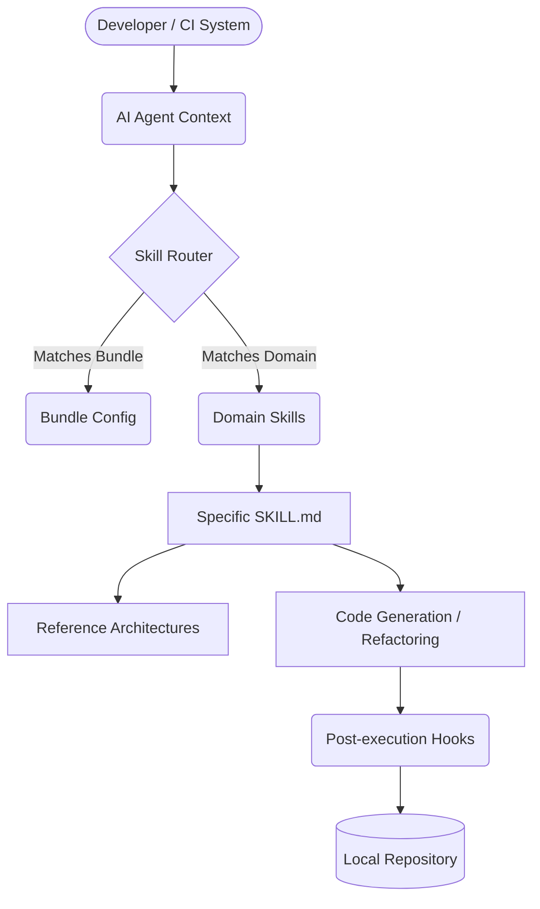
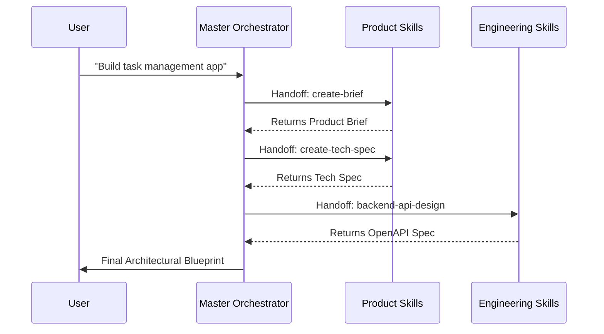
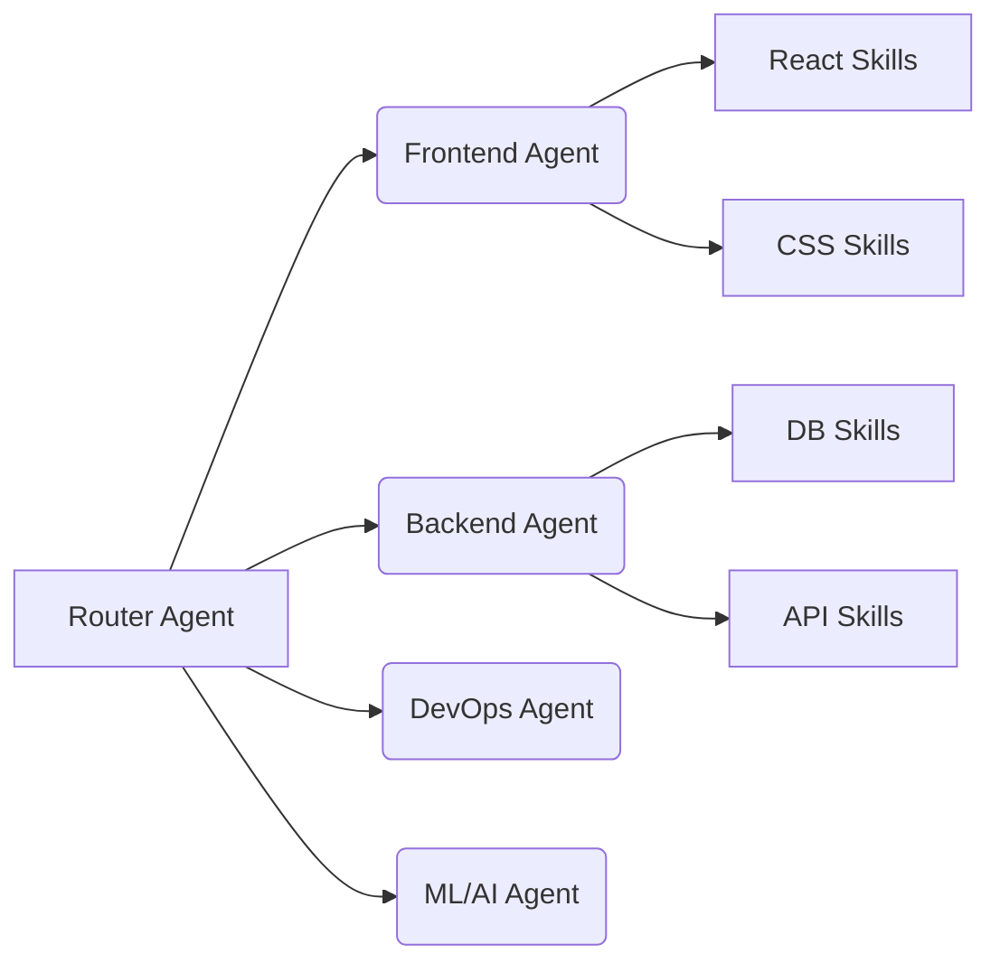

# Quickstart & Enterprise Setup Guide

Welcome to the definitive guide for bootstrapping the Agent Skills ecosystem. This guide is designed for senior engineers and engineering managers deploying context-aware agents across organizations. The documentation has been expanded to provide deep insights into multi-agent topologies and troubleshooting.

## System Architecture

Before initializing the skills framework, it's critical to understand the architecture of how user intents are mapped to skill execution.



## Prerequisites

Before initialization, ensure your environment meets the strict enterprise requirements:
- **Git** (v2.30+ recommended for sparse-checkout features)
- **AI Agent** supporting large context windows (Claude Code, OpenCode, Cursor, Codex CLI, Copilot, Gemini, Amp)
- **Node.js / Python** (Optional, for executing pre/post agent hooks)

## Phase 1: Core Setup

Clone the repository and initialize the agent configurations:

```bash
git clone https://github.com/j4flmao/agent-skills
cd agent-skills
```

### Auto-loaded Configurations

When you open this directory in your agent, the system securely auto-loads the context boundaries:

| Agent | Auto-loaded config path | Mechanism | Context Size |
|-------|--------------------|-----------|--------------|
| Claude Code | `.claude/CLAUDE.md` + `.claude/rules/` | Directory Read | 200k+ |
| OpenCode | `.opencode/AGENTS.md` | Local Model Hook | Tuned |
| Cursor | `.cursor/rules/` | MDC Ruleset Glob | 100k+ |
| Codex CLI | `.codex/AGENTS.md` + `.codex/rules/` | Python Script | 128k |
| Copilot | `.github/copilot-instructions.md` | Workspace Config | 32k |
| Gemini | `.gemini/INSTRUCTIONS.md` | System Prompt | 1M+ |
| Amp | `.amp/AGENTS.md` + `.amp/agent-skills.md` | Subagent Router | 200k+ |

## Phase 2: Workflow & Skill Triggers

Skills activate deterministically based on trigger keywords embedded in prompt semantics.

### Common Activation Vectors

```
User: "write a brief for a chat app"       -> [Product] create-brief
User: "design the database schema"          -> [Data] database-patterns
User: "review this code for bugs"           -> [Quality] code-review
User: "set up Docker for my project"        -> [DevOps] docker-patterns
User: "build an iOS login screen"           -> [Mobile] ios
User: "how do I cache API responses?"       -> [Backend] caching
User: "set up GitHub Actions CI"            -> [DevOps] github-actions
User: "implement push notifications"        -> [Mobile] push-notifications
```

> [!NOTE]
> Trigger phrases use regex pattern matching under the hood for command-line agents, and semantic matching for IDE-based agents. Ensure your prompt clearly includes the intended keyword.

## Phase 3: Enterprise Integration

To embed these skills into your proprietary corporate repositories, you must selectively synchronize the configurations.

### Option A: Complete Context Transfer
Copy the entire agent configuration into your project root. This is suitable for monolithic applications.

```bash
# Example for a multi-agent IDE stack
cp -r .claude /path/to/your/project/     # CLI Orchestration
cp -r .cursor /path/to/your/project/     # IDE Orchestration
```

### Option B: Bundle Selection (Recommended)

Instead of moving everything, instantiate a **bundle** matching your exact architectural stack to prevent context overflow:

```bash
# List available verified bundles
ls bundles/*.json

# Bundle Archetypes:
#   fullstack-nestjs-react   — Microservices with NestJS + React SPA
#   fullstack-golang-vue     — High-performance Go + Vue3
#   fullstack-rust-angular   — Systems-level Rust + Angular Enterprise
#   backend-only             — API, DB, and DevOps skills
#   frontend-only            — UI/UX, Design Systems, State Management
#   devops-only              — Kubernetes, Terraform, CI/CD
#   management-only          — Product Management, Agile, Roadmaps
```

See `docs/agent-reference.md#bundle-system` for deep-dive schema definitions.

## Advanced Workflow: Master Orchestrator

The Master Orchestrator acts as the central intelligence node, delegating tasks across a fleet of specialized capabilities.



1. **Intake Phase**: User queries the agent.
2. **Routing Phase**: The `master-orchestrator` identifies the multi-stage intent.
3. **Execution Phase**: Delegated skills process sequentially.
4. **Handoff Phase**: Context variables are passed downstream.

## Multi-Agent Coordination Topology

For advanced setups leveraging Amp subagents or Codex CLI, skills are distributed across specialized actors:



**Key distinction:** Bundles define *which* skills exist; agent configuration defines *how* they execute contextually. Single-agent setups will self-route using internal thought logic, while multi-agent setups explicitly invoke sub-instances via tools.

## Team Best Practices

- **Atomic Prompts**: Keep prompts focused on a single skill domain to prevent agent hallucination. If you need a full app built, ask for the architecture first, approve it, then ask for implementation step-by-step.
- **Context Pinning**: Always pin `SKILL.md` files in your IDE if relying on IDE agents (like Cursor) for specific tasks.
- **Periodic Syncing**: Run a CRON job to pull upstream updates from `agent-skills` into your mono-repos.
- **Commit Early**: AI agents work best when they can easily roll back mistakes.

## Advanced Troubleshooting & Diagnostic Guide

When skills fail to trigger or agents act unexpectedly, consult the matrix below:

| Symptom | Root Cause | Resolution Workflow |
|---------|------------|------------|
| Agent fails to load skills | Missing workspace root | Verify configuration folders (e.g., `.cursor/`) exist precisely at the Git root. Restart your IDE window. |
| Non-deterministic routing | Overlapping trigger phrases | Refine prompt with exact tags: `Use the docker-patterns skill to...` rather than generic questions. |
| Reference files ignored | Context window exhaustion | Use `context-compressor` skill before requesting complex architectures to free up token space. |
| Hook execution failure | Missing execute permissions | Run `chmod +x .claude/hooks/scripts/*.sh` on UNIX systems. |
| Hallucinations in generated code | Skill scope creep | Force the agent to follow the "Handoff" section in the SKILL.md. Tell it: "Stop here and handoff". |
| Incorrect framework version | Outdated Reference | Check the `version` field in the SKILL.md frontmatter. Update your bundle if a newer version exists. |

## Next Steps
- Dive into `docs/agent-reference.md` for hook specifications and internal metrics.
- Explore `docs/skill-template.md` to author custom corporate skills for your organization.
- Test your configurations locally using the `npm run test:skills` script to validate frontmatter schemas.
