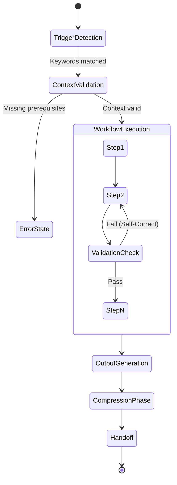
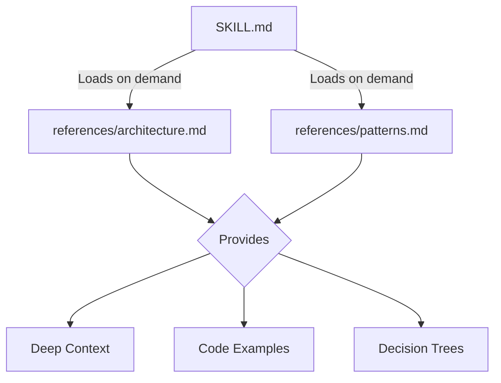

# Enterprise SKILL.md Reference Template & Architecture

This document defines the strict schema and lifecycle architecture for all skills within the repository. Adherence to this specification guarantees cross-platform compatibility across all LLM orchestration engines (Claude Code, Cursor, Copilot, Windsurf, Codex, etc.). Following this exact structure is non-negotiable for skills that will be merged into the master bundle.

## Skill Lifecycle Architecture

The execution of a skill by an AI agent follows a highly deterministic state machine.



## The Standard Template

Copy and paste the following template when scaffolding new skills. Do not alter the frontmatter fields.

```markdown
---
name: {area}-{skill-name}
description: >
  Use this skill when the user says '{trigger keywords}'. This skill enforces
  {key constraints}. Applies to {applicable stacks}. Do NOT use for: {exclusions}.
version: "1.0.0"
author: "j4flmao"
license: "MIT"
compatibility:
  claude-code: true
  cursor: true
  codex: true
  windsurf: true
tags: [{area}, {skill-name}, {phase}, {category}]
---

# {Skill Title}

## Purpose
One sentence describing the exact transformation or execution this skill provides.

## Agent Protocol

### Trigger
Exact user phrases that activate this skill. List 5-10 keywords. Use distinct terms to avoid routing conflicts.

### Input Context
What the agent must verify before activating: 
- Prerequisites (e.g., Git initialized)
- Required knowledge (e.g., Target architecture)
- Files that must exist (e.g., `package.json`)

### Output Artifact
What this skill produces: file type, structure, contents. State "No file output unless requested" if it is purely advisory.

### Response Format
How the agent structures its response. Specify templates, code block formats, and include the strict compression rule.

### Completion Criteria
- [ ] Checklist condition 1 verified
- [ ] Checklist condition 2 verified
- [ ] Security validation complete

### Max Response Length
Define a hard token limit or line count (e.g., "Limit response to 500 words").

## Advanced Workflow

### Step 1: {First Action}
Explanation, contextual retrieval instructions, and exact code examples. Define what CLI tools to run if applicable.

### Step 2: {Second Action}
Validation logic and structural transformations. Check for edge cases.

### Step N: ...
Finalization and auditing steps. Prepare variables for handoff.

## Engineering Rules
- Bullet list of strict hard constraints.
- Security and compliance rules (e.g., "Never log PII").
- Anti-patterns to actively detect and avoid.

## Deep References
- `references/{ref1}.md` — Core concepts / architecture
- `references/{ref2}.md` — Implementation patterns / operations

## Routing Handoff
Next skill to route to after this one completes. Define the exact variables to carry forward.
```

## Mandatory Compression Rule

To prevent LLM verbosity and context degradation, every SKILL.md **must** conclude its Response Format section with the following directive:

```text
No preamble. No postamble. No explanations. No filler/hedging/transitions. Compress output — why use many token when few do trick.
```

## Frontmatter Schema Definition

The YAML frontmatter is the most critical piece of the skill, as it is parsed by routing scripts and IDE extensions before the skill is even loaded into context.

| Field | Required | Type | Description | Best Practice |
|-------|----------|------|-------------|---------------|
| `name` | Yes | String | Unique identifier: `{area}-{skill-name}` | Keep it kebab-case and under 30 chars. |
| `description` | Yes | String | Multi-line trigger description with explicit exclusions | Make it dense with semantic keywords. |
| `version` | Yes | Semver | Versioning for continuous integration tracking | Bump major version on breaking rule changes. |
| `author` | Yes | String | GitHub username or team alias | Use your organizational alias. |
| `license` | Yes | String | SPDX identifier (e.g., MIT, Proprietary) | Standard is MIT for open-source skills. |
| `compatibility` | Yes | Object | Agent compatibility boolean flags | Explicitly set false if a skill requires Bash but the agent doesn't support it. |
| `tags` | Yes | Array | Categorization tags used by `master-orchestrator` | Always include the phase (e.g., `phase-3`). |

> [!IMPORTANT]
> The `description` field is parsed by embedding models in vector-based routing (like Amp). Make it highly semantic and dense with relevant industry terminology.

## Section Ordering Constraints

Agents rely on positional parsing. The exact order must be preserved:
1. Frontmatter (YAML)
2. H1 Title
3. Purpose
4. Agent Protocol
5. Advanced Workflow
6. Engineering Rules
7. Deep References
8. Routing Handoff

## Reference File Architecture

Reference files provide the "depth" that prevents context window bloating in the primary skill file. 



Each reference file must be a standalone `.md` document in the `references/` subdirectory, containing:
- **Overview**: What the reference covers.
- **Content**: Detailed technical specs, code snippets, and config templates.
- **Key Points**: Actionable takeaways for the agent to memorize.

## Troubleshooting & Best Practices

When authoring skills, you may encounter issues where the agent behaves unexpectedly. Use this matrix to debug your `SKILL.md` design:

| Issue | Diagnosis | Solution |
|-------|-----------|----------|
| Skill ignores rules | Rule density too low | Convert paragraph-long explanations into declarative checklists. LLMs respond better to `- [ ] Do X` than `You should try to do X`. |
| Infinite routing loop | Circular handoff | Ensure the Handoff section points to a distinct, downstream skill and explicitly tells the agent to stop executing current operations. |
| Hallucinated reference | Path mismatch | Double-check `references/` directory names against the links in the markdown. Use relative paths strictly. |
| Agent over-explains | Missing Compression Rule | Add the mandatory compression rule block at the end of the Response Format. |
| Agent stops halfway | Completion Criteria weak | Add intermediate validation steps (e.g., `Run tests to ensure Step 1 passed before proceeding to Step 2`). |

> [!TIP]
> Periodically validate your skills using the `skills-testing` harness to ensure frontmatter parses correctly across all supported CLI and IDE environments. A malformed YAML block will silently fail in OpenCode and Codex CLI.
