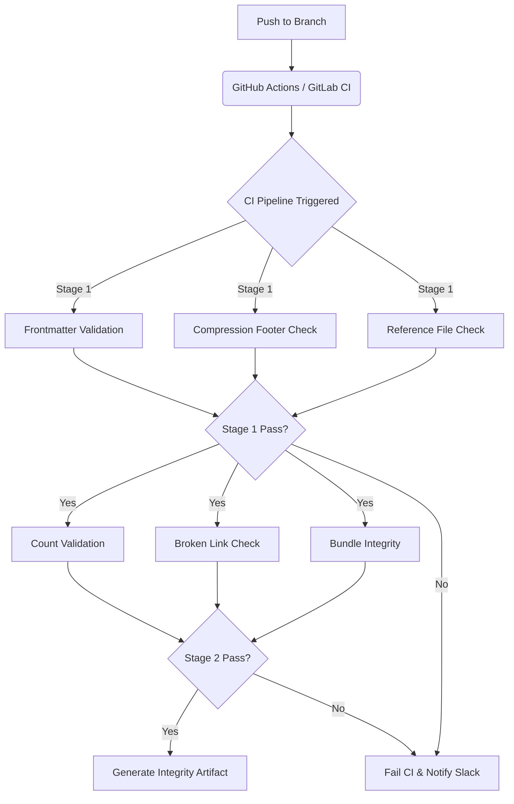

# CI/CD Pattern Guide

## Purpose
Validate skill suite integrity in CI pipeline — catch frontmatter gaps, broken references, missing files, and count mismatches before merging. As platforms scale, enforcing rigid schema validation at the CI level prevents downstream corruption and ensures that metadata is always accurate, machine-readable, and highly available for parsers.

> [!IMPORTANT]
> **Production Best Practice**: Always run metadata validation in a blocking matrix before kicking off expensive build or deployment jobs. Fast feedback loops on documentation and metadata save compute costs and developer time.

## Architecture



## Pattern 1: Frontmatter Validation
Check every `SKILL.md` has all required frontmatter fields: `name`, `description`, `version`, `author`, `license`, `compatibility`, `tags`. Fail if any are missing.

```bash
required_fields="name description version author license"
find skills -name SKILL.md | while read f; do
  for field in $required_fields; do
    grep -q "^$field:" "$f" || echo "MISSING $field in $f"
  done
done
```

### Advanced Troubleshooting
- **Missing Frontmatter Silently Passing**: Ensure that your `grep` pattern correctly handles `\r\n` (CRLF) if checking out on Windows machines without `core.autocrlf`.
- **YAML Validation**: For stricter enforcement, use a tool like `yq` to parse the frontmatter instead of `grep`.

## Pattern 2: Compression Footer Check
Verify every `SKILL.md` has the compression footer (`No preamble...` or `SKILL_COMPRESSED`). Warn if missing — do not fail.

```bash
find skills -name SKILL.md | while read f; do
  tail -1 "$f" | grep -q "SKILL_COMPRESSED" || echo "WARN: Missing footer in $f"
done
```

> [!TIP]
> **Production Best Practice**: Instead of warning in standard output where it might be ignored, pipe warnings to a GitHub Checks API annotation or GitLab Code Quality report.

## Pattern 3: Reference File Check
For every `SKILL.md` that has a `## References` section, verify all referenced files exist on disk. Fail if any are missing.

```bash
find skills -name SKILL.md | while read f; do
  dir=$(dirname "$f")
  grep -oP '(?<=references/)\S+' "$f" 2>/dev/null | while read ref; do
    [ -f "$dir/references/$ref" ] || echo "MISSING: $dir/references/$ref"
  done
done
```

## Pattern 4: Count Validation
Verify `SKILL.md` count matches the README inventory table. Verify agent config counts match actual on-disk skills.

```bash
actual=$(find skills -name SKILL.md | wc -l)
readme_count=$(grep -oP '\*\*\d+ SKILL\.md\*\*' README.md | grep -oP '\d+')
[ "$actual" -eq "$readme_count" ] || echo "MISMATCH: README says $readme_count, actual $actual"
```

## Pattern 5: Broken Link Check
Verify all reference file links resolve. Parse `## References` sections and check each path.

```bash
find skills -name SKILL.md | while read f; do
  sed -n '/^## References/,/^## /p' "$f" | grep -oP '\(.*?\)' | tr -d '()' | while read link; do
    full="$dir/$link"
    [ -f "$full" ] || echo "BROKEN: $full"
  done
done
```

## Pattern 6: Bundle Integrity
Verify all skills listed in `bundle-definitions.json` exist on disk as `SKILL.md` files.

```bash
bundles=$(cat bundles/bundle-definitions.json)
echo "$bundles" | jq -r '.bundles[] | .[]' | sort -u | while read skill; do
  find skills -name SKILL.md | grep -q "/$skill/SKILL.md" || echo "MISSING: $skill in bundles"
done
```

## Complex Workflow Implementation: Advanced CI/CD Integration

To mature these patterns into a production-ready workflow, follow this step-by-step implementation guide:
1. **Isolated Testing**: Containerize the testing suite using a lightweight Alpine or Distroless image pre-packaged with `jq`, `yq`, and `findutils`.
2. **Matrix Execution**: Use CI matrix strategies to partition validations if the `skills` directory grows beyond thousands of files.
3. **Artifact Promotion**: Generate a validated `skills.tar.gz` only after all CI steps succeed, ensuring broken states are never published to downstream consumers.

### Example GitHub Actions Workflow Snippet

```yaml
name: Validate Skills
on: [pull_request, push]
jobs:
  validate:
    runs-on: ubuntu-latest
    steps:
      - uses: actions/checkout@v4
      - name: Frontmatter Validation
        run: |
          for field in name description version author license; do
            find skills -name SKILL.md -exec grep -L "^$field:" {} \; && exit 1 || true
          done
      - name: Compression Footer Check
        run: |
          find skills -name SKILL.md -exec sh -c 'tail -1 "$1" | grep -q "SKILL_COMPRESSED" || echo "WARN: $1"' _ {} \;
      - name: Reference File Check
        run: |
          find skills -name SKILL.md -exec sh -c 'dir=$(dirname "$1"); grep -oP "(?<=references/)\S+" "$1" | while read ref; do [ -f "$dir/references/$ref" ] || { echo "MISSING: $dir/references/$ref"; exit 1; }; done' _ {} \;
      - name: Count Validation
        run: |
          actual=$(find skills -name SKILL.md | wc -l)
          expected=$(grep -oP "\*\*\K\d+(?= SKILL\.md\*\*)" README.md)
          [ "$actual" = "$expected" ] || { echo "Count mismatch: expected $expected, actual $actual"; exit 1; }
      - name: Bundle Integrity
        run: |
          jq -r ".bundles[] | .[]" bundles/bundle-definitions.json | sort -u | while read skill; do
            find skills -name SKILL.md | grep -q "/$skill/SKILL.md" || { echo "MISSING bundle skill: $skill"; exit 1; }
          done
```

### Example GitLab CI Snippet

```yaml
stages:
  - validate

validate-skills:
  stage: validate
  image: alpine:latest
  before_script:
    - apk add --no-cache jq findutils grep
  script:
    - for field in name description version author license; do
        find skills -name SKILL.md -exec grep -L "^$field:" {} \; && exit 1 || true;
      done
    - find skills -name SKILL.md -exec sh -c 'tail -1 "$1" | grep -q "SKILL_COMPRESSED" || echo "WARN: $1"' _ {} \;
    - find skills -name SKILL.md -exec sh -c 'dir=$(dirname "$1"); grep -oP "(?<=references/)\S+" "$1" | while read ref; do [ -f "$dir/references/$ref" ] || { echo "MISSING: $dir/references/$ref"; exit 1; }; done' _ {} \;
    - jq -r ".bundles[] | .[]" bundles/bundle-definitions.json | sort -u | while read skill; do
        find skills -name SKILL.md | grep -q "/$skill/SKILL.md" || { echo "MISSING bundle skill: $skill"; exit 1; };
      done
  only:
    - merge_requests
    - main
```

## Enterprise CI/CD Integration

For enterprise pipelines, merge these patterns into an existing `.gitlab-ci.yml` or GitHub Actions workflow. Integrating these tightly coupled verification loops guarantees system stability.

- **Gate merges** — make frontmatter + reference validation a required check before merge using repository branch protections.
- **Slack/Teams notification** — pipe warnings to a channel for awareness without blocking. Use webhooks to push structured JSON alerts.
- **Scheduled audit** — run a weekly full-suite validation to catch drift or accidental direct commits.
- **Monorepo integration** — scope validation to changed skills only using `git diff --name-only` to optimize pipeline execution times.
- **Artifact generation** — produce a validation report JSON for dashboard ingestion.
- **Self-service** — let team leads add skills via MR; CI validates structure automatically without requiring manual core-team review.

> [!CAUTION]
> Avoid bypassing validation checks with admin privileges. Forced merges that skip integrity checks are the leading cause of corrupted skill bundles in production.
