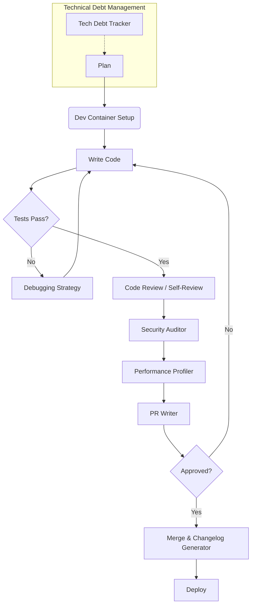

# Dev Loop Skills Guide

12 skills covering the inner development loop: code review, debugging, refactoring, security auditing, performance profiling, changelog generation, readme writing, PR writing, git workflow, dev container setup, tech debt tracking, and API client generation.

## Skill Map

| Skill | Directory | Focus |
|-------|-----------|-------|
| API Client Generator | `skills/dev-loop/api-client-generator/` | OpenAPI→client, typed wrappers, endpoint stubs |
| Changelog Generator | `skills/dev-loop/changelog-generator/` | Keep a Changelog, conventional commits, auto-release |
| Code Review | `skills/dev-loop/code-review/` | Review checklist, security scan, diff analysis |
| Debugging Strategy | `skills/dev-loop/debugging-strategy/` | Root cause, bisect, logging, REPL debugging |
| Dev Container | `skills/dev-loop/dev-container/` | Devcontainer.json, Docker, VS Code remote |
| Git Workflow | `skills/dev-loop/git-workflow/` | Branch strategy, commit conventions, merge vs rebase |
| Performance Profiler | `skills/dev-loop/performance-profiler/` | CPU, memory, I/O profiling, flame graphs |
| PR Writer | `skills/dev-loop/pr-writer/` | PR templates, changelog, reviewers, description |
| Readme Writer | `skills/dev-loop/readme-writer/` | Setup, API docs, badges, examples, contribution |
| Refactor Guide | `skills/dev-loop/refactor-guide/` | Code smells, extraction, patterns, testing strategy |
| Security Auditor | `skills/dev-loop/security-auditor/` | Dependency audit, SAST, secrets, container scan |
| Tech Debt Tracker | `skills/dev-loop/tech-debt-tracker/` | Debt catalog, prioritization, repayment plan |

## Decision Framework

To build a robust internal developer platform (IDP), standardizing these decisions prevents cognitive overload. 

```
Starting a new feature?
  1. dev-loop/git-workflow — branch from main
  2. dev-loop/dev-container — consistent environment
  3. Write code
  4. dev-loop/code-review — self-review before PR
  5. dev-loop/debugging-strategy — fix any issues
  6. dev-loop/pr-writer — create PR
  7. dev-loop/changelog-generator — update changelog

Maintaining existing code?
  1. dev-loop/refactor-guide — identify smells
  2. dev-loop/tech-debt-tracker — catalog debt
  3. dev-loop/security-auditor — scan for vulns
  4. dev-loop/performance-profiler — profile hotspots

Shipping a project?
  1. dev-loop/readme-writer — document setup/usage
  2. dev-loop/api-client-generator — generate SDKs
  3. dev-loop/changelog-generator — release notes
```

## Dev Loop Flow

A structured inner dev loop minimizes friction. By integrating these skills into developer tooling natively, teams can ship faster with higher confidence.



> [!TIP]
> **Production Best Practice**: Tie your `Tech Debt Tracker` into Jira or Linear directly. Un-tracked debt within the repository often goes forgotten. Periodically allocate 15-20% of sprint capacity specifically for repaying cataloged tech debt.

### Advanced Troubleshooting
- **Dev Container Fails to Build**: Often caused by underlying OS architecture mismatches (e.g., Apple Silicon vs x86_64). Explicitly define the `--platform` flag in your Dockerfiles.
- **Git Rebase Conflicts**: Rebase frequently during development using `dev-loop/git-workflow`. If conflicts span multiple commits, squash locally before rebasing to minimize conflict resolution overhead.
- **Profiling Overhead**: When using `dev-loop/performance-profiler`, ensure you are profiling optimized/release builds. Profiling debug builds yields inaccurate latency and memory metrics.

## Step-By-Step Workflow: The Refactor Cycle

When touching legacy code, execute the following workflow to ensure stability:
1. **Baseline Profiling**: Run `performance-profiler` and capture flame graphs of the current state.
2. **Audit Security**: Run `security-auditor` to ensure dependencies aren't harboring known vulnerabilities that you might accidentally expose.
3. **Write/Verify Tests**: Do not refactor without a test harness. If missing, apply `debugging-strategy` to trace execution and write characterization tests.
4. **Iterative Extraction**: Use `refactor-guide` to extract methods and classes incrementally.
5. **Self-Review Diff**: Use `code-review` checks on your local git diff before committing.

> [!IMPORTANT]
> **Code Review Philosophy**: Code reviews should not be the primary mechanism for finding bugs. That is what tests are for. Code reviews should focus on architectural alignment, readability, and security.

## Skills List

- `skills/dev-loop/api-client-generator/SKILL.md`
- `skills/dev-loop/changelog-generator/SKILL.md`
- `skills/dev-loop/code-review/SKILL.md`
- `skills/dev-loop/debugging-strategy/SKILL.md`
- `skills/dev-loop/dev-container/SKILL.md`
- `skills/dev-loop/git-workflow/SKILL.md`
- `skills/dev-loop/performance-profiler/SKILL.md`
- `skills/dev-loop/pr-writer/SKILL.md`
- `skills/dev-loop/readme-writer/SKILL.md`
- `skills/dev-loop/refactor-guide/SKILL.md`
- `skills/dev-loop/security-auditor/SKILL.md`
- `skills/dev-loop/tech-debt-tracker/SKILL.md`
