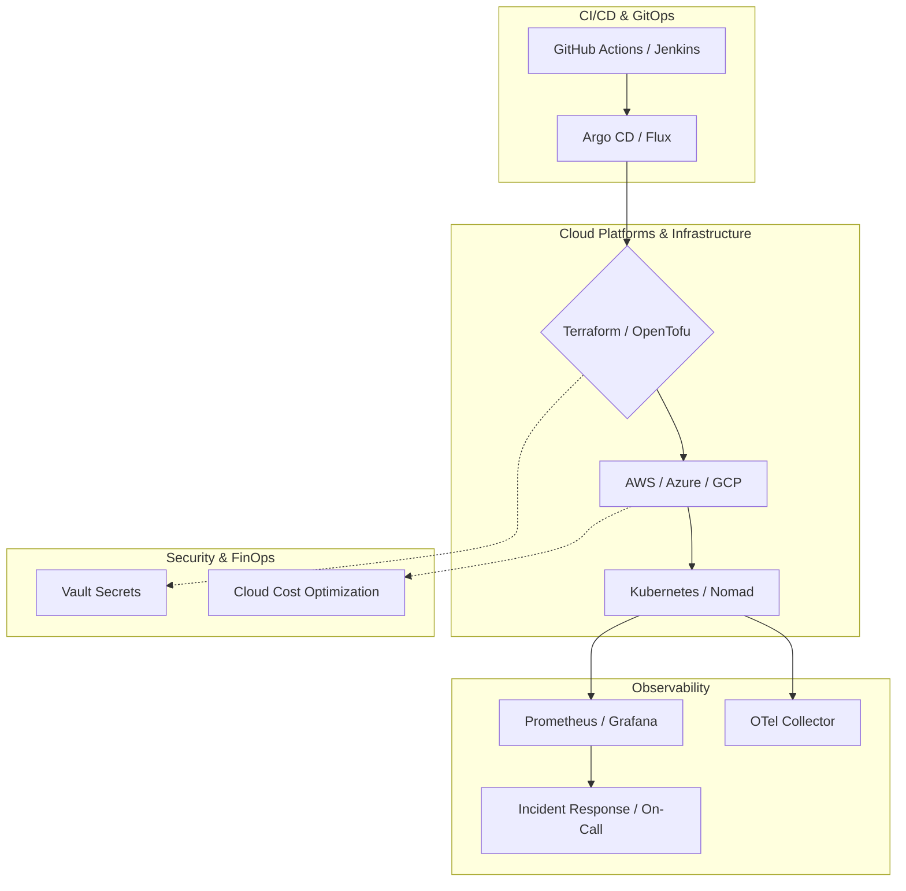

# DevOps Skills Guide

32 skills covering the complete DevOps lifecycle: CI/CD, container orchestration, infrastructure as code, cloud platforms, monitoring, security, cost optimization, and platform engineering. 

This guide serves as the backbone for establishing a mature Site Reliability Engineering (SRE) and DevOps culture, bridging the gap between development teams and operational infrastructure.

## Architecture: DevOps Platform Ecosystem



## Skill Map

### Core Infrastructure

| Skill | Directory | Focus |
|-------|-----------|-------|
| Docker Patterns | `skills/devops/docker-patterns/` | Multi-stage builds, caching, non-root, compose |
| Kubernetes Patterns | `skills/devops/kubernetes-patterns/` | Pods, services, ingress, autoscaling, networking |
| Helm Patterns | `skills/devops/helm-patterns/` | Charts, templating, hooks, dependencies |
| Nomad | `skills/devops/nomad/` | Job specs, task groups, HCL, service discovery |
| Terraform | `skills/devops/terraform/` | Modules, state, workspaces, providers |
| Ansible | `skills/devops/ansible/` | Playbooks, roles, inventories, idempotency |
| Vault | `skills/devops/vault/` | Secrets, dynamic secrets, PKI, policies |

### CI/CD & GitOps

| Skill | Directory | Focus |
|-------|-----------|-------|
| CI/CD Pipeline | `skills/devops/cicd-pipeline/` | Pipeline design, stages, gates, environments |
| GitHub Actions | `skills/devops/github-actions/` | Workflows, runners, matrices, actions |
| GitOps | `skills/devops/gitops/` | ArgoCD, Flux, sync strategies, PR-based |
| Argo CD | `skills/devops/argo-cd/` | Applicationsets, sync waves, hooks, SSO |
| Jenkins | `skills/devops/jenkins/` | Pipelines, shared libraries, agents, JCasC |

### Cloud Platforms

| Skill | Directory | Focus |
|-------|-----------|-------|
| AWS | `skills/devops/aws/` | EC2, ECS, EKS, Lambda, RDS, networking |
| Azure | `skills/devops/azure/` | AKS, App Service, Functions, DevOps |
| GCP | `skills/devops/gcp/` | GKE, Cloud Run, Cloud Functions, networking |
| Serverless | `skills/devops/serverless/` | Lambda, DynamoDB, API Gateway, SAM |

### Observability & Monitoring

| Skill | Directory | Focus |
|-------|-----------|-------|
| Monitoring | `skills/devops/monitoring/` | Prometheus, Grafana, alerts, dashboards |
| Observability | `skills/devops/observability/` | OTel, traces, metrics, logs correlation |
| Incident Response | `skills/devops/incident-response/` | On-call, runbooks, postmortems, severity |
| Service Mesh | `skills/devops/service-mesh/` | Istio, Linkerd, mTLS, traffic management |

### Cost & Operations

| Skill | Directory | Focus |
|-------|-----------|-------|
| Cloud Cost Optimization | `skills/devops/cloud-cost-optimization/` | FinOps, tagging, reservations, waste |
| FinOps | `skills/devops/finops/` | Budgets, chargeback, forecasting, optimization |
| Backup & DR | `skills/devops/backup-dr/` | Velero, RPO/RTO, restore testing, replication |
| Chaos Engineering | `skills/devops/chaos-engineering/` | Litmus, Chaos Mesh, experiments, hypotheses |

### Platform & Data

| Skill | Directory | Focus |
|-------|-----------|-------|
| Kubernetes for Data | `skills/devops/kubernetes-for-data/` | Spark, Airflow, Kafka on K8s, GPU |
| DataOps | `skills/devops/dataops/` | dbt CI/CD, data contracts, data testing |
| MLOps | `skills/devops/mlops/` | Model CI/CD, registry, canary, drift monitoring |
| Longhorn | `skills/devops/longhorn/` | Kubernetes storage, volumes, backups |

### Cross-Cutting

| Skill | Directory | Focus |
|-------|-----------|-------|
| Monorepo | `skills/devops/monorepo/` | Nx, Turborepo, pnpm workspaces, scripts |
| Dependency Management | `skills/devops/dependency-management/` | Renovate, Dependabot, lock files, audits |
| API Documentation | `skills/devops/api-documentation/` | Swagger, OpenAPI, Stoplight, versioning |
| Database Migration | `skills/devops/database-migration/` | Flyway, Liquibase, Prisma Migrate, rollbacks |

## Decision Framework

### Infrastructure

```
Need to run containers?
  ├─ Single host → Docker Compose
  ├─ Multi-host → Kubernetes (EKS, AKS, GKE)
  ├─ Serverless → Cloud Run, Lambda
  └─ Edge → Nomad (lightweight scheduler)

Need infrastructure as code?
  ├─ Multi-cloud → Terraform
  ├─ Kubernetes-native → Helm + Kustomize
  ├─ Config management → Ansible
  └─ Policy as code → Crossplane, Pulumi

Need secrets management?
  └─ Vault — dynamic secrets, PKI, encryption
```

### Observability

```
Need metrics?
  ├─ Prometheus + Grafana → monitoring
  └─ Managed → Datadog, Grafana Cloud

Need traces?
  ├─ OTel collector → observability
  └─ Managed → Honeycomb, Datadog APM

Need logs?
  ├─ Loki + Grafana → monitoring
  ├─ ELK → Elasticsearch + Kibana
  └─ Managed → Datadog, Splunk

Need everything unified?
  └→ observability — OTel, traces + metrics + logs
```

### CI/CD

```
Need simple CI?
  ├─ GitHub Actions — built-in, matrices
  ├─ GitLab CI — integrated, Kubernetes
  └─ Jenkins — customizable, plugins

Need GitOps?
  ├─ Argo CD — Kubernetes-native, ApplicationSets
  └─ Flux — SOPS, Kustomize, notification

Need deployment strategies?
  ├─ Rolling update → Kubernetes
  ├─ Blue-green → Argo CD + Istio
  ├─ Canary → Istio + Flagger
  └─ Feature flags → LaunchDarkly + GitOps
```

## Standard Delivery Pipeline

```
┌──────────┐   ┌──────────┐   ┌──────────┐   ┌──────────┐   ┌──────────┐
│   CODE   │ → │  BUILD   │ → │  TEST    │ → │ DEPLOY   │ → │ MONITOR  │
│          │   │          │   │          │   │          │   │          │
│ lint     │   │ compile  │   │ unit     │   │ staging  │   │ metrics  │
│ secrets  │   │ docker   │   │ integ    │   │ canary   │   │ logs     │
│ scan     │   │ SBOM     │   │ e2e      │   │ prod     │   │ alerts   │
│ SAST     │   │ scan     │   │ perf     │   │ rollback │   │ traces   │
└──────────┘   └──────────┘   └──────────┘   └──────────┘   └──────────┘
```

> [!IMPORTANT]
> **Production Best Practice**: Enforce immutable artifacts. The container image built in the `BUILD` phase must be the exact same SHA digest promoted through `TEST`, `DEPLOY (Staging)`, and `DEPLOY (Prod)`. Do not rebuild images for production.

### Advanced Troubleshooting
- **Terraform State Locks**: When CI/CD pipelines crash abruptly, state lock files (e.g., in DynamoDB or GCS) can remain locked. Always run `terraform force-unlock` with extreme caution after verifying no other jobs are running.
- **Argo CD Sync Loops**: If resources are continually out of sync, ensure Mutating Webhooks aren't modifying manifests injected by Argo CD. Use `ignoreDifferences` in the Application spec to ignore fields modified at runtime.

### High-Availability Kubernetes Step-by-Step Workflow
1. **Control Plane Redundancy**: Deploy clusters with a minimum of 3 control plane nodes across diverse Availability Zones (AZs).
2. **Pod Anti-Affinity**: Use `podAntiAffinity` rules to ensure replicas of critical deployments aren't scheduled onto the same physical node.
3. **Pod Disruption Budgets (PDB)**: Enforce PDBs to guarantee a minimum availability during voluntary disruptions (e.g., node upgrades).
4. **Auto-scaling**: Configure both Cluster Autoscaler (for nodes) and HPA (for pods based on CPU/Memory/Custom Metrics).

## Skills List

- `skills/devops/ansible/SKILL.md`
- `skills/devops/api-documentation/SKILL.md`
- `skills/devops/argo-cd/SKILL.md`
- `skills/devops/aws/SKILL.md`
- `skills/devops/azure/SKILL.md`
- `skills/devops/backup-dr/SKILL.md`
- `skills/devops/chaos-engineering/SKILL.md`
- `skills/devops/cicd-pipeline/SKILL.md`
- `skills/devops/cloud-cost-optimization/SKILL.md`
- `skills/devops/dataops/SKILL.md`
- `skills/devops/database-migration/SKILL.md`
- `skills/devops/dependency-management/SKILL.md`
- `skills/devops/docker-patterns/SKILL.md`
- `skills/devops/finops/SKILL.md`
- `skills/devops/gcp/SKILL.md`
- `skills/devops/github-actions/SKILL.md`
- `skills/devops/gitops/SKILL.md`
- `skills/devops/helm-patterns/SKILL.md`
- `skills/devops/incident-response/SKILL.md`
- `skills/devops/jenkins/SKILL.md`
- `skills/devops/kubernetes-for-data/SKILL.md`
- `skills/devops/kubernetes-patterns/SKILL.md`
- `skills/devops/longhorn/SKILL.md`
- `skills/devops/mlops/SKILL.md`
- `skills/devops/monitoring/SKILL.md`
- `skills/devops/monorepo/SKILL.md`
- `skills/devops/nomad/SKILL.md`
- `skills/devops/observability/SKILL.md`
- `skills/devops/serverless/SKILL.md`
- `skills/devops/service-mesh/SKILL.md`
- `skills/devops/terraform/SKILL.md`
- `skills/devops/vault/SKILL.md`
