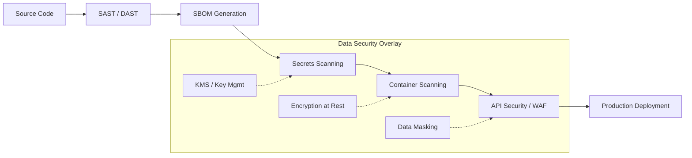

# Security Skills Guide

## Overview
The Security skill set provides a defense-in-depth approach covering the full software security lifecycle: static analysis, software bill of materials, secrets detection, container hardening, and API protection.

## Security Workflow Architecture

Each stage catches different classes of vulnerabilities. Run sequentially in CI/CD — earlier stages are cheaper and faster. Never deploy without passing all stages.

> [!IMPORTANT]
> **Production Best Practice**: Always "Fail Closed." If a security scanner crashes or is unavailable, the CI pipeline should block the merge. Allowing bypasses due to tool failure introduces blind spots.

## Skill Map

| Skill | Stage | When to Use | Tools |
|---|---|---|---|
| `security/sast-dast` | Static & dynamic analysis | Scanning source code and running apps for vulnerabilities | Semgrep, SonarQube, CodeQL, Burp Suite, OWASP ZAP |
| `security/sbom` | Dependency inventory | Tracking open-source components, licenses, known CVEs | Syft, Grype, Dependency-Track, Snyk, npm audit |
| `security/secrets-management` | Credential detection | Finding hardcoded keys, tokens, passwords in code/repos | Gitleaks, TruffleHog, detect-secrets, GitGuardian |
| `security/container-security` | Image hardening | Scanning container images, securing Kubernetes deployments | Trivy, Docker Scout, Falco, Kube-bench, Kube-hunter |
| `security/api-security` | API protection | Securing endpoints, auth, rate limiting, WAF config | OWASP API Top 10, ModSecurity, Kong, Envoy, API gateways |

## When to Use Each Skill

- **sast-dast**: Every commit — integrate into CI pipeline with fail-on-critical policy. Run DAST on staging before production releases.
- **sbom**: Every build — generate SBOM for every deployable artifact. Store in centralized Dependency-Track instance for continuous monitoring.
- **secrets-management**: Every commit — scan all git history including branches. Block commits containing secrets via pre-commit hooks.
- **container-security**: Every image build — scan base images, all layers, and runtime dependencies. Reject images with critical/high CVEs.
- **api-security**: Every API change — threat model new endpoints, review auth/permission models, load test rate limiting.

## Advanced Step-by-Step Security Pipeline

### 1. Pre-Commit Hook (Left-Shifted Security)
Developer attempts a commit. `Gitleaks` or `Trufflehog` runs locally to scan the diff.
If a secret is found, the commit is aborted.

### 2. Build Stage (SAST & SCA)
Code reaches CI server. `Semgrep` scans for logic flaws and OWASP top 10 violations in code.
`Syft` extracts the SBOM, saving it as a CycloneDX XML.

### 3. Container Scan (Hardening)
Image is built. `Trivy` scans the image layers against the CVE database.
Any "CRITICAL" score immediately fails the pipeline.

### 4. Dynamic Verification (DAST)
Deployment sent to staging. `OWASP ZAP` probes the live endpoints for injection vectors and misconfigured headers.

### Alert and Remediation Workflows
- **Critical CVE**: Auto-create security Jira ticket, block deployment, page security team.
- **Hardcoded secret**: Auto-revoke via cloud provider API, notify committer, rotate immediately.
- **API abuse detected**: WAF auto-rate-limits IP, logs payload to SIEM, alerts on-call.

> [!CAUTION]
> **Token Rotation Warning**: If a secret is committed, rewriting git history is NOT sufficient. The token must be assumed compromised and rotated immediately through the issuing provider.

## Data Security

The `security/data-security` skill covers encryption (at rest, in transit, in use), key management (KMS, HSM), data masking (static/dynamic), column-level security, data classification, anonymization, tokenization, and compliance controls for GDPR, CCPA, and HIPAA. It composes with `security/secrets-management` for key rotation and `security/api-security` for encryption-in-transit at the API layer.

| Skill | Stage | When to Use | Tools |
|---|---|---|---|
| `security/data-security` | Data protection | Encrypting data at rest/transit, masking PII, managing keys, classifying data | AWS KMS, HashiCorp Vault, Azure Key Vault, GCP Cloud KMS, HSM, tokenization platforms |

## Compliance Mapping

| Requirement | SOC 2 | GDPR | HIPAA | Applicable Skills |
|---|---|---|---|---|
| Code vulnerability scanning | ✓ | - | ✓ | sast-dast |
| Software bill of materials | ✓ | - | - | sbom |
| Secrets / credential detection | ✓ | ✓ | ✓ | secrets-management |
| Container image hardening | ✓ | - | ✓ | container-security |
| API security / auth controls | ✓ | ✓ | ✓ | api-security |
| Encryption at rest | ✓ | ✓ | ✓ | data-security |
| Encryption in transit | ✓ | ✓ | ✓ | data-security + api-security |
| Data classification | ✓ | ✓ | ✓ | data-security |
| Access controls (RBAC) | ✓ | ✓ | ✓ | data-security |
| Audit logging | ✓ | ✓ | ✓ | all skills + observability |
| PII detection / redaction | - | ✓ | ✓ | data-security, ai/ai-safety |
| Breach notification | ✓ | ✓ | ✓ | incident-response |
| Vendor risk management | ✓ | - | ✓ | sbom |

## Best Practices
- **SAST before SBOM** — fix your own code before worrying about dependency issues.
- **Secrets scanning** runs on every push, not just merges — credentials in feature branches still count.
- **Container images** should be rebuilt regularly even without code changes — base images get CVEs over time.
- **Data security** must start with classification — you cannot protect what you have not categorized.
- **Rotate keys and secrets** on a schedule, not just on incident — automated rotation reduces blast radius.

## Skills List
- `skills/security/sast-dast/SKILL.md`
- `skills/security/sbom/SKILL.md`
- `skills/security/secrets-management/SKILL.md`
- `skills/security/container-security/SKILL.md`
- `skills/security/api-security/SKILL.md`
- `skills/security/data-security/SKILL.md`
