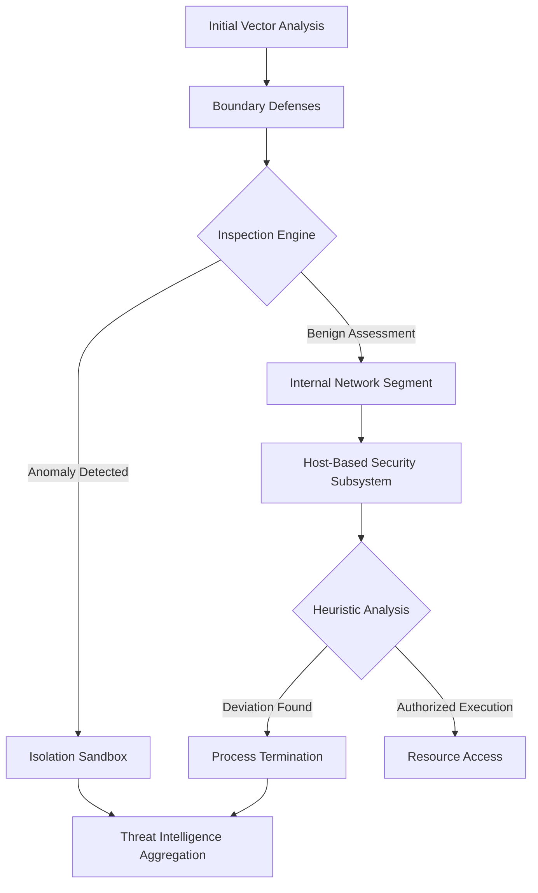

# Theoretical Anatomy of Advanced Persistent Threats (APTs): Evasion, Lateral Movement, and Defense-in-Depth

## Abstract
This paper examines the theoretical underpinnings of Advanced Persistent Threats (APTs), defining them not merely as sophisticated malware, but as continuous, adaptive, and highly resourced campaigns. We delineate the mathematical and architectural paradigms governing evasion mechanisms, the topological principles of lateral movement within segmented networks, and the epistemological foundation of Defense-in-Depth (DiD) architectures.

## The Epistemology of Evasion Mechanisms
Evasion in the context of APTs is a stochastic game between the adversary and the detection mechanisms. Theoretical evasion relies on entropy manipulation and polymorphic obfuscation. The adversary seeks to minimize the Kullback-Leibler divergence between benign operational noise and malicious activity.

### Memory-Only Architectures and Polymorphism
Advanced actors utilize fileless or memory-resident execution paradigms. By hijacking native system binaries (Living off the Land - LotL) and employing Reflective DLL Injection, the adversary bypasses static analysis. The code exists only in volatile memory, meaning its cryptographic hash is never written to non-volatile storage, rendering signature-based heuristics ineffective.

## Topological Principles of Lateral Movement
Lateral movement is modeled as a traversal on a directed graph $G = (V, E)$, where vertices $V$ represent network nodes and edges $E$ represent permissible communication pathways. The adversary aims to find a path from the initial compromise node $v_0$ to the target node $v_t$, minimizing the path weight, where weight is proportional to the probability of detection.

### Privilege Escalation as a Graph Operation
Gaining higher privileges is equivalent to increasing the out-degree of a compromised node, thereby expanding the reachable subgraph. Theoretical lateral movement minimizes anomalous edge traversals by mimicking legitimate administrative pathways (e.g., hijacking Kerberos ticket-granting tickets, conceptualized as forging cryptographic proofs of authorization).

## Architecture of Defense-in-Depth
A robust Defense-in-Depth strategy is an overlapping series of deterministic and probabilistic controls designed to disrupt the adversary's graph traversal.

## Conclusion
The theoretical study of APTs requires a multi-disciplinary approach encompassing graph theory, cryptography, and stochastic modeling. Effective DiD architectures must operate continuously, expecting compromise and focusing on anomaly detection within the network's topological structure.
