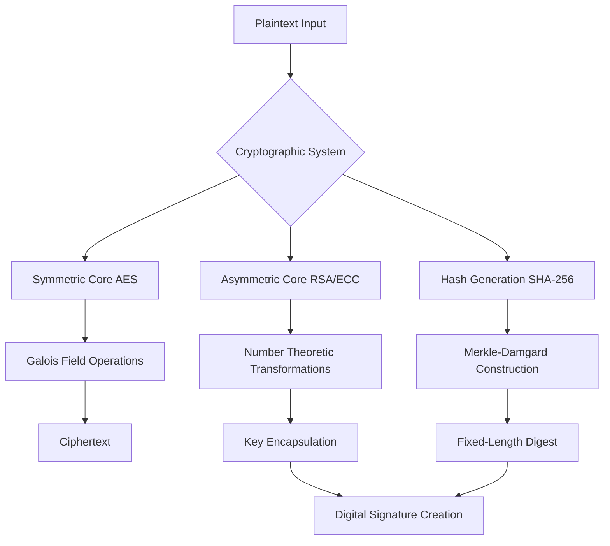

# Mathematical Foundations of Applied Cryptography: Symmetric, Asymmetric, and Hashing Paradigms

## Abstract
This manuscript provides a rigorous theoretical exposition of modern applied cryptography. We deconstruct the mathematical primitives underlying symmetric-key algorithms, the number-theoretic hardness assumptions of asymmetric cryptography, and the collision-resistance properties of cryptographic hash functions.

## Symmetric Encryption Algorithms (AES)
Symmetric cryptography relies on a shared secret key $K$ for both encryption $E$ and decryption $D$, such that $D(K, E(K, P)) = P$, where $P$ is the plaintext. The Advanced Encryption Standard (AES) operates as a substitution-permutation network (SPN) over the finite field $GF(2^8)$.

The security of AES rests on its resistance to linear and differential cryptanalysis, achieved through rigorous confusion (via the S-box, utilizing multiplicative inverses in the Galois field) and diffusion (via the MixColumns transformation, a matrix multiplication in $GF(2^8)$).

## Asymmetric Cryptography (RSA and ECC)
Public-key cryptography utilizes a key pair $(K_{pub}, K_{priv})$. 

### RSA (Rivest-Shamir-Adleman)
RSA security is predicated on the integer factorization problem. Given a semiprime $n = p \cdot q$ where $p$ and $q$ are large primes, finding $p$ and $q$ from $n$ is computationally infeasible. The encryption function is $C \equiv M^e \pmod n$, and decryption is $M \equiv C^d \pmod n$, where $d$ is the modular multiplicative inverse of $e$ modulo $\phi(n)$.

### Elliptic Curve Cryptography (ECC)
ECC relies on the algebraic structure of elliptic curves over finite fields. The security is based on the Elliptic Curve Discrete Logarithm Problem (ECDLP). Given points $P$ and $Q$ on curve $E$, such that $Q = kP$, finding the scalar $k$ is exponentially difficult. ECC provides equivalent security to RSA with significantly smaller key sizes.

## Cryptographic Hashing (SHA-256)
A cryptographic hash function $H: \{0,1\}^* \rightarrow \{0,1\}^n$ maps arbitrary-length input to a fixed-length output. SHA-256, part of the SHA-2 family, utilizes the Merkle-Damgård construction.

Key theoretical properties:
1.  **Pre-image resistance**: Given $h$, it is hard to find $m$ such that $H(m) = h$.
2.  **Second pre-image resistance**: Given $m_1$, it is hard to find $m_2 \neq m_1$ such that $H(m_1) = H(m_2)$.
3.  **Collision resistance**: It is hard to find any two distinct messages $m_1$ and $m_2$ such that $H(m_1) = H(m_2)$.

## Digital Signatures
Digital signatures combine asymmetric cryptography and hashing to provide non-repudiation and integrity. The sender hashes the message $h = H(m)$, then encrypts the hash with their private key to create the signature $S = E(K_{priv}, h)$. The receiver verifies by decrypting $S$ with the sender's public key and comparing it to the locally computed hash of the message.
