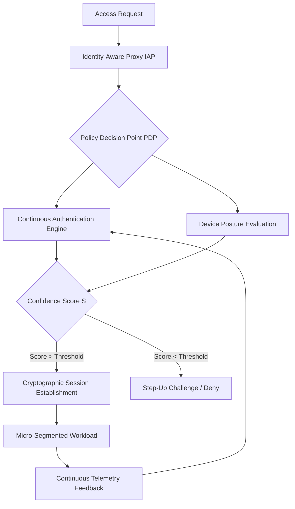

# Theoretical Paradigms of Zero Trust Architecture: Micro-segmentation and Continuous Authentication

## Abstract
Zero Trust Architecture (ZTA) fundamentally abolishes the perimeter-based security model. It posits that trust is never granted implicitly based on network location. This paper details the theoretical constructs of ZTA, focusing on granular micro-segmentation, Identity-Aware Proxies (IAP), and the mathematics of continuous authentication scoring.

## The Fallacy of the Trusted Perimeter
Traditional architectures assume an isomorphic relationship between topological position (internal network) and trust. ZTA dismantles this, asserting that all network interfaces are hostile. Trust is a dynamic, continuously evaluated variable, $T(t)$, rather than a static binary state.

## Micro-segmentation and Software-Defined Perimeters
Micro-segmentation mathematically isolates workloads by defining cryptographic boundaries around individual application instances. It replaces coarse-grained VLANs with fine-grained policy enforcement points.

Let $W$ be the set of workloads. The communication policy is defined by a sparse matrix $P$, where $P_{ij} = 1$ if workload $w_i$ is authorized to communicate with $w_j$ over a specific cryptographic protocol, and $0$ otherwise. This enforces a default-deny posture at the most granular level.

## Identity-Aware Proxy (IAP) Architecture
The IAP acts as the Policy Enforcement Point (PEP). It brokers all access requests based on context rather than network origin. The IAP evaluates the request vector $R = (\text{User}, \text{DevicePosture}, \text{Resource}, \text{Context})$.

Access is granted if and only if the Policy Decision Point (PDP) evaluates a boolean function $F_{policy}(R) \rightarrow \text{True}$. The IAP establishes a secure TLS tunnel (mutual TLS - mTLS) ensuring cryptographic confidentiality and integrity of the session.

## Continuous Authentication Mechanisms
In ZTA, authentication is not a discrete event but a continuous stochastic process. The system calculates a continuous confidence score $S(t)$ using Hidden Markov Models (HMMs) or recurrent neural networks based on behavioral biometrics, device health telemetry, and access patterns.

If at any time $t$, $S(t) < \tau$ (where $\tau$ is the acceptable risk threshold), the session is cryptographically terminated or a step-up authentication challenge is issued.

## Conclusion
ZTA represents a paradigm shift from topological trust to cryptographically asserted identity and context. By implementing continuous authentication and rigorous micro-segmentation, organizations can mathematically bound the impact of a breach.
