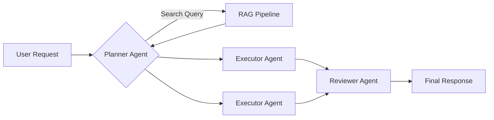

# Agentic Workflows & RAG

## Core Principles
- **Modularity**: Separate concerns into distinct agent roles (e.g., Planner, Executor, Reviewer).
- **Context Management**: Use RAG to fetch only highly relevant context to reduce token bloat.

## Multi-Agent Architecture


## RAG Implementation Snippet
```python
from langchain.vectorstores import Chroma
from langchain.embeddings import OpenAIEmbeddings
from langchain.chat_models import ChatOpenAI
from langchain.chains import RetrievalQA

def build_rag_pipeline(docs):
    vectorstore = Chroma.from_documents(documents=docs, embedding=OpenAIEmbeddings())
    retriever = vectorstore.as_retriever(search_kwargs={"k": 3})
    llm = ChatOpenAI(temperature=0)
    return RetrievalQA.from_chain_type(llm=llm, retriever=retriever)
```
