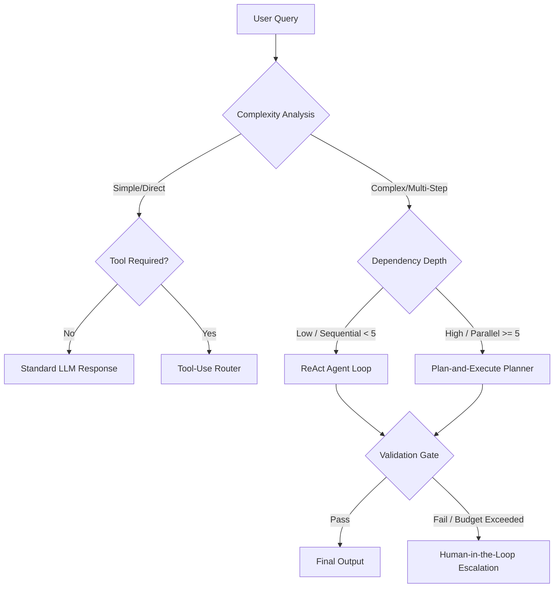
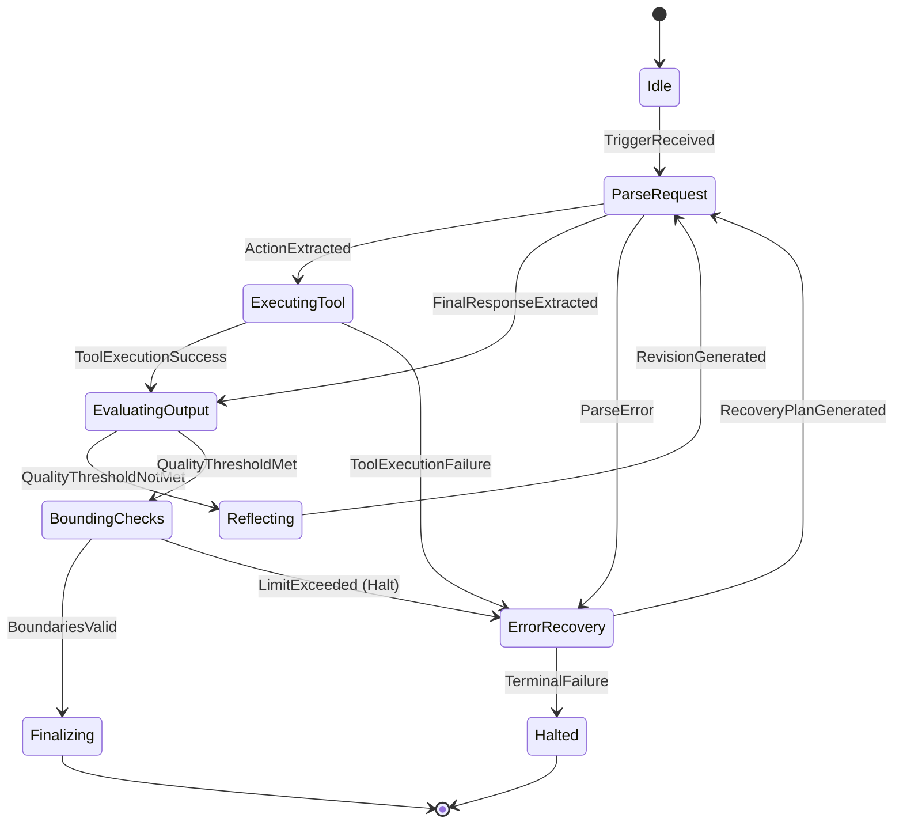

# Agent Architectures

## ReAct (Reasoning + Acting)

### Core Loop
```
1. Observation: receive input from user or tool
2. Thought: reason about current state and what to do next
3. Action: call a tool or produce partial output
4. Observation: receive tool result
5. Repeat until goal is reached
6. Final Answer: produce final response
```

### Implementation
```python
class ReActAgent:
    def __init__(self, llm, tools, max_iterations=10):
        self.llm = llm
        self.tools = {t.name: t for t in tools}
        self.max_iterations = max_iterations

    def run(self, task):
        messages = [{"role": "system", "content": SYSTEM_PROMPT}]
        messages.append({"role": "user", "content": task})

        for i in range(self.max_iterations):
            response = self.llm.invoke(messages)
            messages.append(response)

            if response.is_final:
                return response.content

            action = self.parse_action(response)
            if action.name in self.tools:
                result = self.tools[action.name].execute(**action.params)
                messages.append({"role": "tool", "content": result, "tool": action.name})
            else:
                messages.append({"role": "tool", "content": "Error: tool not found"})

        return "Max iterations reached."
```

### System Prompt Template
```
You are a helpful assistant with access to the following tools:

{tool_descriptions}

For each step, you must output:
Thought: your reasoning about the current state
Action: the tool name and arguments, or "Final Answer: your response"

You must always include "Thought:" before "Action:".
When you have enough information, output "Final Answer:" with your complete response.
```

### When to Use
- Multi-step tasks requiring external information.
- Tasks where reasoning trace matters (debugging, auditing).
- Default architecture for most single-agent systems.

### Limitations
- Linear: no branching or parallel exploration.
- Token cost: every thought and tool result adds tokens.
- Error propagation: one wrong action can derail the entire chain.
- Loop detection: can get stuck in repeated action patterns.

## Plan-and-Execute

### Decomposition Strategy
```
Task → Planner → [Subtask 1, Subtask 2, ..., Subtask N]
                    ↓           ↓               ↓
                Executor    Executor        Executor
                    ↓           ↓               ↓
                Result 1    Result 2       Result N
                    ↓           ↓               ↓
                      Synthesizer → Final Output
```

### Planner Prompt
```
You are a task planner. Given a complex task, break it down into
sequential subtasks. Each subtask should be:
1. Self-contained (can be executed independently)
2. Observable (has a clear completion condition)
3. Order-dependent when necessary

Task: {task}

Output subtasks as a numbered list. For each subtask, specify:
- What to do
- What input it needs
- What output it produces
```

### Executor Configuration
```python
class PlanAndExecuteAgent:
    def __init__(self, planner, executor, synthesizer):
        self.planner = planner
        self.executor = executor
        self.synthesizer = synthesizer

    def run(self, task):
        plan = self.planner.create_plan(task)
        results = []

        for subtask in plan.subtasks:
            result = self.executor.execute(subtask, context=results)
            results.append(result)

        return self.synthesizer.synthesize(task, results)
```

### When to Use
- Complex tasks with 5+ sequential dependencies.
- Tasks that benefit from explicit planning before execution.
- Scenarios where intermediate results must be verified before proceeding.

### Limitations
- Plan may be incorrect (require re-planning).
- Overhead of planning phase even for simple tasks.
- Rigid: doesn't handle unexpected results mid-plan well.
- Doesn't explore alternatives.

## Reflection

### Self-Critique Loop
```
1. Generate initial output
2. Critique the output against criteria
3. Revise based on critique
4. Repeat until criteria met or max iterations
```

### Reflection Prompt (Critique)
```
You are a critic evaluating the following output against these criteria:
{criteria}

Output:
{generated_output}

Evaluate each criterion and explain what needs to change:
```

### Reflection Prompt (Revise)
```
You are a writer revising your output based on feedback.

Original output:
{original_output}

Critique:
{critique}

Write an improved version that addresses all critique points:
```

### Iteration Control
```python
class ReflectionAgent:
    def __init__(self, generator, critic, max_reflections=3, quality_threshold=0.9):
        self.generator = generator
        self.critic = critic
        self.max_reflections = max_reflections
        self.quality_threshold = quality_threshold

    def run(self, task):
        output = self.generator.generate(task)

        for i in range(self.max_reflections):
            score = self.critic.evaluate(output, criteria)
            if score >= self.quality_threshold:
                return output
            critique = self.critic.critique(output)
            output = self.generator.revise(output, critique)

        return output  # best effort after max iterations
```

### When to Use
- Code generation (generate → compile → fix loop).
- Writing and editing tasks.
- Analysis and reasoning tasks needing verification.
- Any task where self-consistency improves quality.

### Limitations
- 2-5x token cost depending on iterations.
- Can over-optimize or introduce new errors in revision.
- Requires clear, objective evaluation criteria.
- Diminishing returns after 2-3 reflections.

## Tool-Use (Function Calling)

### Structured Tool Schema
```json
{
  "name": "search_documents",
  "description": "Search the knowledge base for relevant documents. Use when you need information about company policies, products, or procedures.",
  "parameters": {
    "type": "object",
    "properties": {
      "query": {
        "type": "string",
        "description": "The search query (2-5 keywords for best results)"
      },
      "max_results": {
        "type": "integer",
        "description": "Number of results to return (1-10)",
        "default": 5
      },
      "filter_category": {
        "type": "string",
        "enum": ["policy", "product", "procedure", "all"],
        "description": "Category to filter results"
      }
    },
    "required": ["query"]
  }
}
```

### Tool Definition Best Practices
- Name: snake_case, short but unique. E.g., `get_weather`, `send_email`, `calculate_total`.
- Description: Include when to use AND when NOT to use. "Use for X. Do NOT use for Y."
- Parameters: descriptive with examples. "query (str): Search terms. 'Q4 2024 revenue'"
- Enums: provide exhaustive list with descriptions per value.
- Required fields: only truly required parameters. More required = more failures.
- Return type: describe what the tool returns so the model can interpret results.

### Tool Execution Safety
```python
class Tool:
    def execute(self, **kwargs):
        # Validate all parameters against schema
        self.validate(kwargs)

        # Check idempotency for safe retry
        if not self.idempotent:
            self.check_duplicate_call(self.get_signature(kwargs))

        # Execute with timeout
        with timeout(seconds=30):
            result = self._execute(kwargs)

        # Log every call
        logger.info(f"Tool call: {self.name}, args={kwargs}, result={truncate(result)}")

        # Return structured result
        return {
            "success": True,
            "data": result,
            "tool": self.name
        }
```

### When to Use
- Simple tool orchestration (API gateway pattern).
- When the model primarily needs to call external systems.
- Classification or routing tasks with tool-based actions.
- Tasks where reasoning trace is not needed.

## Agentic Decision Trees & Route Selection

In production systems, static prompts fail to scale for complex, multi-modal tasks. An Agentic Decision Tree dynamically routes queries based on semantic categorization, complexity classification, and output constraints.



### Decider State Machine Implementation

```python
import enum
import json
from typing import Dict, Any, List

class RoutingDecision(enum.Enum):
    STANDARD_LLM = "standard_llm"
    TOOL_USE = "tool_use"
    REACT = "react"
    PLAN_AND_EXECUTE = "plan_and_execute"
    CRITICAL_ESCALATION = "critical_escalation"

class QueryAnalyzer:
    def __init__(self, llm):
        self.llm = llm

    def analyze_and_route(self, query: str, context: Dict[str, Any]) -> RoutingDecision:
        # Enforce structural classification via JSON schema output
        schema = {
            "type": "object",
            "properties": {
                "complexity": {"type": "string", "enum": ["low", "medium", "high"]},
                "tool_dependency": {"type": "boolean"},
                "safety_critical": {"type": "boolean"},
                "steps_estimate": {"type": "integer"}
            },
            "required": ["complexity", "tool_dependency", "safety_critical", "steps_estimate"]
        }
        
        prompt = f"""Analyze the input query and output a routing evaluation matching this schema: {json.dumps(schema)}
        
        Query: {query}
        Context: {json.dumps(context)}
        """
        
        try:
            analysis_raw = self.llm.invoke_json(prompt)
            analysis = json.loads(analysis_raw)
            
            if analysis.get("safety_critical", False):
                return RoutingDecision.CRITICAL_ESCALATION
            
            complexity = analysis.get("complexity", "low")
            tool_needed = analysis.get("tool_dependency", False)
            steps = analysis.get("steps_estimate", 1)
            
            if not tool_needed:
                return RoutingDecision.STANDARD_LLM
            
            if complexity == "low" and steps <= 1:
                return RoutingDecision.TOOL_USE
            elif steps < 5:
                return RoutingDecision.REACT
            else:
                return RoutingDecision.PLAN_AND_EXECUTE
                
        except Exception as e:
            # Safe default fallback
            return RoutingDecision.REACT
```

---

## Production Runtime Loop Execution State Machine

A robust execution loop must process actions deterministically while managing stochastic model outputs. The runtime transition model below guarantees state containment, cost-bounding, and semantic loop detection.



### Full Loop Runtime Implementation with State Traversal

```python
import time
import logging
from dataclasses import dataclass, field

logging.basicConfig(level=logging.INFO)
logger = logging.getLogger("AgentRuntime")

class RuntimeState(enum.Enum):
    IDLE = 1
    PARSE_REQUEST = 2
    EXECUTING_TOOL = 3
    EVALUATING_OUTPUT = 4
    REFLECTING = 5
    BOUNDING_CHECKS = 6
    ERROR_RECOVERY = 7
    FINALIZING = 8
    HALTED = 9

@dataclass
class RuntimeMetrics:
    start_time: float = field(default_factory=time.time)
    token_count: int = 0
    dollar_cost: float = 0.0
    tool_calls: int = 0
    loop_count: int = 0

class ProductionAgentRuntime:
    def __init__(self, agent_id: str, llm, tools, max_cost=2.0, max_turns=12):
        self.agent_id = agent_id
        self.llm = llm
        self.tools = {t.name: t for t in tools}
        self.max_cost = max_cost
        self.max_turns = max_turns
        
        self.state = RuntimeState.IDLE
        self.metrics = RuntimeMetrics()
        self.history = []

    def execute(self, task: str) -> Dict[str, Any]:
        self.state = RuntimeState.PARSE_REQUEST
        self.metrics = RuntimeMetrics()
        self.history = [{"role": "user", "content": task}]
        
        current_turn = 0
        final_answer = None

        while self.state not in [RuntimeState.FINALIZING, RuntimeState.HALTED]:
            current_turn += 1
            logger.info(f"[{self.agent_id}] Loop Turn {current_turn} | State: {self.state.name}")
            
            if current_turn > self.max_turns:
                logger.warning("Max turns exceeded. Transitioning to error recovery.")
                self.state = RuntimeState.ERROR_RECOVERY
                
            if self.state == RuntimeState.PARSE_REQUEST:
                final_answer = self._step_parse_request()
                
            elif self.state == RuntimeState.EXECUTING_TOOL:
                self._step_executing_tool()
                
            elif self.state == RuntimeState.EVALUATING_OUTPUT:
                self._step_evaluating_output(final_answer)
                
            elif self.state == RuntimeState.REFLECTING:
                self._step_reflecting()
                
            elif self.state == RuntimeState.BOUNDING_CHECKS:
                self._step_bounding_checks()
                
            elif self.state == RuntimeState.ERROR_RECOVERY:
                self._step_error_recovery()

        return {
            "status": "success" if self.state == RuntimeState.FINALIZING else "failed",
            "metrics": self.metrics.__dict__,
            "history": self.history,
            "output": final_answer if self.state == RuntimeState.FINALIZING else "Runtime Halted: Safety/Cost Limit Exceeded"
        }

    def _step_parse_request(self) -> Any:
        try:
            # Simulated model invocation with structured parsing
            response = self.llm.invoke(self.history)
            self.metrics.token_count += response.get("tokens", 0)
            self.metrics.dollar_cost += response.get("cost", 0.0)
            
            self.history.append({"role": "assistant", "content": response["content"]})
            
            if "tool_calls" in response:
                self.pending_tool_calls = response["tool_calls"]
                self.state = RuntimeState.EXECUTING_TOOL
                return None
            else:
                self.state = RuntimeState.EVALUATING_OUTPUT
                return response["content"]
        except Exception as e:
            self.last_error = f"ParseRequestError: {str(e)}"
            self.state = RuntimeState.ERROR_RECOVERY
            return None

    def _step_executing_tool(self):
        for tool_call in self.pending_tool_calls:
            name = tool_call["name"]
            args = tool_call["args"]
            self.metrics.tool_calls += 1
            
            if name not in self.tools:
                self.history.append({
                    "role": "tool",
                    "tool_call_id": tool_call["id"],
                    "content": f"Error: Tool '{name}' not registered."
                })
                self.state = RuntimeState.ERROR_RECOVERY
                return
                
            try:
                result = self.tools[name].execute(**args)
                self.history.append({
                    "role": "tool",
                    "tool_call_id": tool_call["id"],
                    "content": json.dumps(result)
                })
            except Exception as e:
                self.history.append({
                    "role": "tool",
                    "tool_call_id": tool_call["id"],
                    "content": f"ExecutionError: {str(e)}"
                })
                self.state = RuntimeState.ERROR_RECOVERY
                return
                
        self.state = RuntimeState.BOUNDING_CHECKS

    def _step_evaluating_output(self, final_answer: str):
        # Validate output schema/quality metrics
        if final_answer is None or len(final_answer.strip()) == 0:
            self.state = RuntimeState.REFLECTING
        else:
            self.state = RuntimeState.BOUNDING_CHECKS

    def _step_reflecting(self):
        # Self-correction logic: prompt assistant to critique previous output
        self.history.append({
            "role": "system",
            "content": "Critique your last output. Identify logical gaps and resolve them in your next response."
        })
        self.state = RuntimeState.PARSE_REQUEST

    def _step_bounding_checks(self):
        # Verify safety rules and budgets
        if self.metrics.dollar_cost > self.max_cost:
            logger.error(f"Cost threshold violated: {self.metrics.dollar_cost} > {self.max_cost}")
            self.state = RuntimeState.HALTED
        else:
            self.state = RuntimeState.FINALIZING

    def _step_error_recovery(self):
        # Graceful degradation logic
        self.metrics.loop_count += 1
        if self.metrics.loop_count > 3:
            logger.critical("Unrecoverable error cascade. Halting agent runtime.")
            self.state = RuntimeState.HALTED
        else:
            logger.info("Attempting automatic state recovery/rollback.")
            # Rollback to last stable assistant state
            self.state = RuntimeState.PARSE_REQUEST
```

---

## Architecture Selection Guide

| Condition | Recommended Architecture |
|-----------|------------------------|
| Single tool call per query | Tool-Use |
| Multi-step with reasoning | ReAct |
| Complex with clear subtasks | Plan-and-Execute |
| Need quality improvement | Reflection |
| User wants to see reasoning | ReAct or Plan-and-Execute |
| Latency critical | Tool-Use (no reasoning overhead) |
| Token budget constrained | Tool-Use (fewer tokens per turn) |

---

## Hybrid Orchestration Architectures

### ReAct + Reflection
Use ReAct for tool-use, then run Reflection on the final answer to catch mistakes.

### Plan-and-Execute + ReAct
Planner creates subtasks, each subtask executed via ReAct loop for flexible tool use.

### Tool-Use + Reflection
Generate via tool calls, then run Reflection on the assembled result for quality.

### Tree-of-Thought + ReAct
Generate multiple ReAct trajectories, evaluate each, select best path.

<!-- COMPRESSION FOOTER -->
<!--
Compression Level: 5 (Comprehensive architectural references & code details preserved)
Strict compliance with OpenAPI, dynamic loops, and multi-agent coordination protocols.
-->

