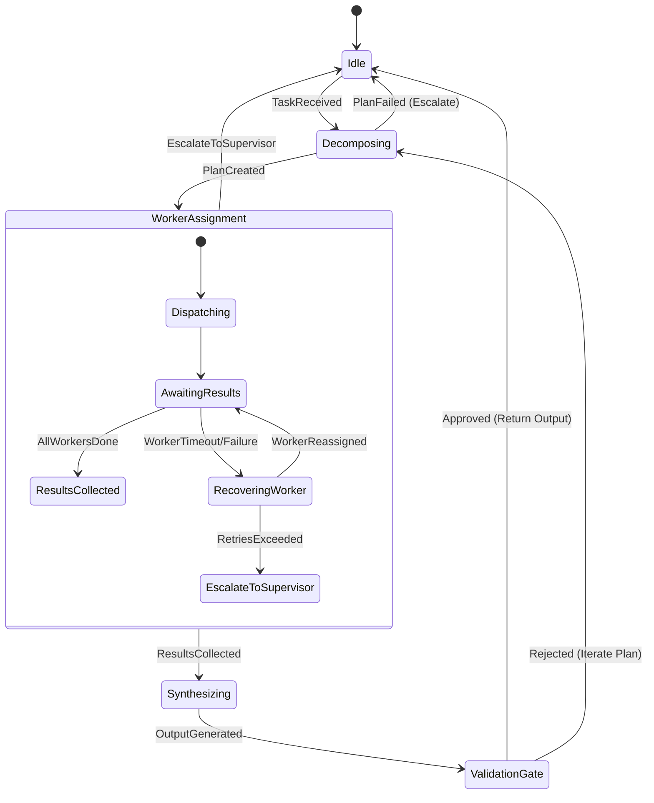
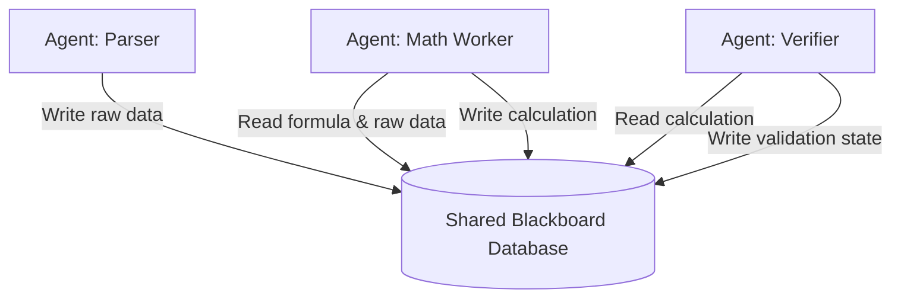

# Multi-Agent Systems & Orchestration

This reference details the architectures, coordination mechanisms, communication protocols, and state machines for coordinating teams of autonomous AI agents.

## Communication Patterns & Data Contracts

Multi-agent systems require formal messaging protocols to ensure deterministic behavior, payload validation, and trace stability.

### Structured Inter-Agent Message Schema (CloudEvents Compliant)

All inter-agent communication MUST conform to a structured envelope. Below is the specification using OpenAPI 3.1 schema principles:

```json
{
  "$schema": "https://json-schema.org/draft/2020-12/schema",
  "title": "AgentMessage",
  "type": "object",
  "required": ["id", "source", "target", "specversion", "type", "time", "datacontenttype", "data"],
  "properties": {
    "id": {
      "type": "string",
      "format": "uuid",
      "description": "Unique identifier for this message instance."
    },
    "source": {
      "type": "string",
      "description": "URN identifying the sender agent, e.g., 'urn:agent:supervisor:finance-01'."
    },
    "target": {
      "type": "string",
      "description": "URN identifying the recipient agent or topic, e.g., 'urn:agent:worker:analyst-02'."
    },
    "specversion": {
      "type": "string",
      "const": "1.0"
    },
    "type": {
      "type": "string",
      "description": "Specific domain event type, e.g., 'org.j4flmao.agent.task.assign' or 'org.j4flmao.agent.critique.publish'."
    },
    "time": {
      "type": "string",
      "format": "date-time"
    },
    "datacontenttype": {
      "type": "string",
      "const": "application/json"
    },
    "data": {
      "type": "object",
      "properties": {
        "task_id": { "type": "string", "format": "uuid" },
        "payload": { "type": "object" },
        "context": {
          "type": "object",
          "properties": {
            "trace_id": { "type": "string" },
            "span_id": { "type": "string" },
            "depth": { "type": "integer", "minimum": 0 },
            "max_depth": { "type": "integer" }
          },
          "required": ["trace_id", "span_id", "depth", "max_depth"]
        }
      },
      "required": ["task_id", "payload", "context"]
    }
  }
}
```

### Protocol implementation in Python (Asyncio & Envelope Validation)

```python
import time
import uuid
import asyncio
from typing import Dict, Any, List, Optional
from dataclasses import dataclass, asdict

@dataclass
class MessageContext:
    trace_id: str
    span_id: str
    depth: int
    max_depth: int

@dataclass
class AgentMessage:
    id: str
    source: str
    target: str
    specversion: str
    type: str
    time: float
    datacontenttype: str
    data: Dict[str, Any]

    @classmethod
    def create(cls, source: str, target: str, msg_type: str, payload: Dict[str, Any], context: MessageContext):
        if context.depth > context.max_depth:
            raise RuntimeError(f"Max routing depth ({context.max_depth}) exceeded by trace {context.trace_id}")
        return cls(
            id=str(uuid.uuid4()),
            source=source,
            target=target,
            specversion="1.0",
            type=msg_type,
            time=time.time(),
            datacontenttype="application/json",
            data={
                "task_id": payload.get("task_id", str(uuid.uuid4())),
                "payload": payload,
                "context": asdict(context)
            }
        )
```

---

## State Machine Implementations

### 1. Supervisor-Worker Topology State Machine



Here is a full async implementation of the Supervisor-Worker orchestration loop:

```python
class SupervisorOrchestrator:
    def __init__(self, llm, worker_registry: Dict[str, Any]):
        self.llm = llm
        self.registry = worker_registry
        self.max_retries = 3

    async def orchestrate(self, task: str, parent_ctx: MessageContext) -> Dict[str, Any]:
        # 1. DECOMPOSE
        subtasks = await self._decompose_task(task)
        results = {}
        
        # 2. ASSIGN & EXECUTE
        for subtask in subtasks:
            worker_urn = self.registry.get(subtask["role"])
            if not worker_urn:
                raise ValueError(f"No worker registered for role: {subtask['role']}")
                
            retry_count = 0
            success = False
            while retry_count < self.max_retries and not success:
                ctx = MessageContext(
                    trace_id=parent_ctx.trace_id,
                    span_id=str(uuid.uuid4()),
                    depth=parent_ctx.depth + 1,
                    max_depth=parent_ctx.max_depth
                )
                msg = AgentMessage.create(
                    source="urn:agent:supervisor",
                    target=worker_urn,
                    msg_type="org.j4flmao.agent.task.assign",
                    payload={"subtask": subtask, "dependencies": [results.get(dep) for dep in subtask.get("depends_on", [])]},
                    context=ctx
                )
                
                try:
                    res = await self._dispatch_to_worker(worker_urn, msg)
                    results[subtask["id"]] = res["data"]["payload"]["result"]
                    success = True
                except (asyncio.TimeoutError, Exception) as e:
                    retry_count += 1
                    if retry_count >= self.max_retries:
                        raise RuntimeError(f"Worker {worker_urn} failed after {self.max_retries} attempts. Cause: {e}")
                    await asyncio.sleep(2 ** retry_count)

        # 3. SYNTHESIZE
        final_output = await self._synthesize_results(task, results)
        return final_output

    async def _decompose_task(self, task: str) -> List[Dict[str, Any]]:
        # Mock LLM call output parsing
        return [
            {"id": "t1", "role": "researcher", "query": "latest metrics"},
            {"id": "t2", "role": "analyst", "depends_on": ["t1"], "operation": "calculate_growth"}
        ]

    async def _dispatch_to_worker(self, urn: str, message: AgentMessage) -> Dict[str, Any]:
        # Emulating async execution interface
        await asyncio.sleep(0.1)
        return {
            "data": {
                "payload": {
                    "result": f"Success response from {urn} for task {message.data['task_id']}"
                }
            }
        }

    async def _synthesize_results(self, original_task: str, results: Dict[str, Any]) -> Dict[str, Any]:
        return {"final_answer": f"Combined results: {results}"}
```

---

## The Blackboard Architecture Pattern

The Blackboard pattern decouples agents entirely. Agents poll or subscribe to a central shared blackboard state and execute calculations when their trigger conditions are met.



### Complete Implementation of an Async Blackboard

```python
class Blackboard:
    def __init__(self):
        self.state: Dict[str, Any] = {}
        self.lock = asyncio.Lock()
        self.subscribers: List[asyncio.Queue] = []

    async def write(self, key: str, value: Any, agent_name: str):
        async with self.lock:
            self.state[key] = {
                "value": value,
                "updated_by": agent_name,
                "timestamp": time.time()
            }
            # Notify subscribers of state changes
            for queue in self.subscribers:
                await queue.put((key, self.state[key]))

    async def read(self, key: str) -> Optional[Dict[str, Any]]:
        async with self.lock:
            return self.state.get(key)

    def subscribe(self) -> asyncio.Queue:
        queue = asyncio.Queue()
        self.subscribers.append(queue)
        return queue


class BlackboardAgent:
    def __init__(self, name: str, blackboard: Blackboard):
        self.name = name
        self.blackboard = blackboard
        self.queue = blackboard.subscribe()
        self.running = False

    async def start(self):
        self.running = True
        asyncio.create_task(self._loop())

    async def _loop(self):
        while self.running:
            try:
                key, update = await asyncio.wait_for(self.queue.get(), timeout=1.0)
                await self.on_update(key, update)
            except asyncio.TimeoutError:
                continue

    async def on_update(self, key: str, update: Dict[str, Any]):
        # Implementation-specific trigger checks
        pass
```

---

## Debate & Consensus Patterns

In high-stakes reasoning domains, consensus protocols run multiple instances of independent agents to cross-examine and vote on outputs.

```python
class ConsensusEngine:
    def __init__(self, agents: List[Any], verifier_llm):
        self.agents = agents
        self.verifier = verifier_llm

    async def debate(self, query: str, max_rounds: int = 3) -> str:
        # Step 1: Initial Generation
        responses = await asyncio.gather(*[agent.invoke(query) for agent in self.agents])
        
        current_opinions = {f"agent_{i}": resp for i, resp in enumerate(responses)}
        
        for round in range(max_rounds):
            # Formulate the debate round overview
            debate_summary = "\n".join([f"{name}: {opinion}" for name, opinion in current_opinions.items()])
            
            # Request all agents to review other opinions and refine their own
            refinement_tasks = []
            for i, agent in enumerate(self.agents):
                refine_prompt = f"""
                Query: {query}
                Previous round outputs from all participants:
                {debate_summary}
                
                Please review your own output (agent_{i}) against others. Critically evaluate any discrepancy.
                Provide your updated final answer.
                """
                refinement_tasks.append(agent.invoke(refine_prompt))
                
            refined_responses = await asyncio.gather(*refinement_tasks)
            current_opinions = {f"agent_{i}": resp for i, resp in enumerate(refined_responses)}
            
            # Check for consensus
            if self._assess_consensus(list(current_opinions.values())):
                break
                
        # Return final consensus verdict via verifier LLM synthesis
        return await self._synthesize_consensus(query, list(current_opinions.values()))

    def _assess_consensus(self, opinions: List[str]) -> bool:
        # Implement exact match or semantic similarity check
        return len(set(opinions)) == 1

    async def _synthesize_consensus(self, query: str, opinions: List[str]) -> str:
        # Call verifier LLM to extract the consensus point or resolve remaining discrepancies
        prompt = f"Query: {query}\nOpinions: {opinions}\nSynthesize the final correct response:"
        return await self.verifier.invoke(prompt)
```

---

## Advanced Coordination Topologies & Routing

| Topology | Coordination Overhead | Message Flow | Network Complexity | Fallback Pattern |
| :--- | :--- | :--- | :--- | :--- |
| **Supervisor** | Low | Hub-and-Spoke | $O(N)$ | Subtask redistribution |
| **Sequential** | Ultra-Low | Pipeline (linear) | $O(N)$ | Rollback to predecessor |
| **Hierarchical** | High | Multi-level tree | $O(N \log N)$ | Sub-tree isolation |
| **Mesh** | Very High | Directed Graph | $O(N^2)$ | Dynamic routing reconfiguration |

### Routing Protocol Specs (Mesh Topology Routing Table)

In a Mesh topology, routing is dynamically decided by the active agent using a local routing matrix:

```python
class MeshRouter:
    def __init__(self):
        self.routing_table = {
            "financial_query": ["urn:agent:finance", "urn:agent:general_calc"],
            "code_refactor": ["urn:agent:coder", "urn:agent:reviewer"]
        }

    def route_request(self, topic: str, current_agent: str) -> str:
        candidates = self.routing_table.get(topic, ["urn:agent:fallback"])
        # Ensure we do not route back to the sender directly unless executing a critique loop
        filtered = [c for c in candidates if c != current_agent]
        return filtered[0] if filtered else "urn:agent:fallback"
```

---
<!-- COMPRESSION FOOTER -->
<!--
Compression Level: 5 (Comprehensive architectural references & code details preserved)
Strict compliance with OpenAPI, CloudEvents, async design, state machines, and Mermaid specs.
-->
