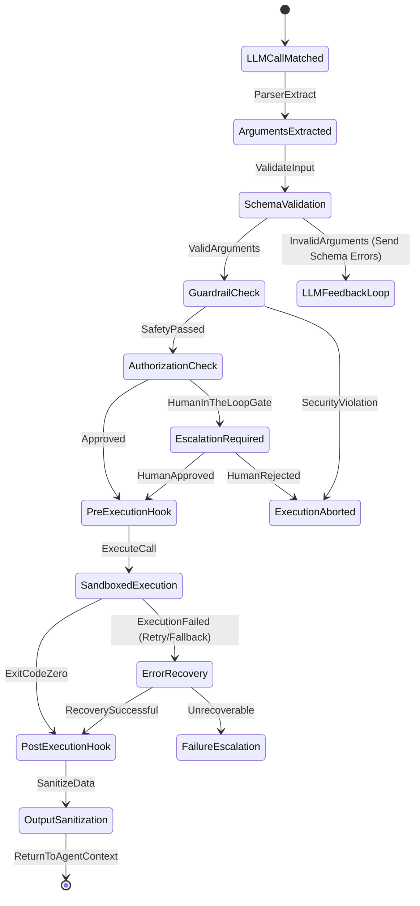

# Tool-Use Patterns

This reference details advanced patterns for tool definition, schema design, validation, execution loops, sandboxing, and error recovery in agentic systems.

## Tool Execution Lifecycle & State Machine

Every tool call goes through a deterministic lifecycle. This ensures that untrusted outputs from the LLM do not execute side effects without strict verification and sandboxing.



---

## Tool Parameter Validation Schema

Production agents must validate LLM outputs using schema validators (like Pydantic or Draft 2020-12 JSON Schema) to prevent unexpected parsing exceptions or code injections.

### Complex JSON Schema Spec for Database Query Tool

```json
{
  "$schema": "https://json-schema.org/draft/2020-12/schema",
  "title": "SQLReadQuerySchema",
  "type": "object",
  "required": ["query", "parameters", "execution_profile"],
  "properties": {
    "query": {
      "type": "string",
      "description": "SQL SELECT statement. Must not contain write operations (INSERT, UPDATE, DELETE, DROP).",
      "pattern": "(?i)^\\s*SELECT\\s+"
    },
    "parameters": {
      "type": "array",
      "description": "Positional parameter values to bind to query placeholders to prevent SQL injection.",
      "items": {
        "anyOf": [
          { "type": "string" },
          { "type": "number" },
          { "type": "boolean" },
          { "type": "null" }
        ]
      }
    },
    "execution_profile": {
      "type": "object",
      "required": ["timeout_ms", "max_rows"],
      "properties": {
        "timeout_ms": {
          "type": "integer",
          "minimum": 100,
          "maximum": 30000,
          "default": 5000
        },
        "max_rows": {
          "type": "integer",
          "minimum": 1,
          "maximum": 1000,
          "default": 100
        }
      }
    }
  },
  "additionalProperties": false
}
```

---

## Python Implementation: Secure Tool Wrapper with Pre/Post Hooks

Here is a production-grade wrapper in Python showcasing schema validation, validation feedback injection, human approval gates, and sanitization:

```python
import re
import json
import asyncio
from typing import Callable, Any, Dict, Optional, Tuple
from pydantic import BaseModel, ValidationError, Field

class ExecutionProfile(BaseModel):
    timeout_ms: int = Field(default=5000, ge=100, le=30000)
    max_rows: int = Field(default=100, ge=1, le=1000)

class SQLReadQueryModel(BaseModel):
    query: str
    parameters: list[Any]
    execution_profile: ExecutionProfile

    @classmethod
    def validate_sql(cls, query: str) -> bool:
        # Strictly enforce read-only query structures
        forbidden = ["insert", "update", "delete", "drop", "truncate", "alter", "create"]
        normalized = query.lower().strip()
        if not normalized.startswith("select"):
            return False
        for keyword in forbidden:
            if re.search(r'\b' + re.escape(keyword) + r'\b', normalized):
                return False
        return True

class SecureToolWrapper:
    def __init__(self, name: str, execution_fn: Callable, model_schema: type[BaseModel]):
        self.name = name
        self.execute_raw = execution_fn
        self.schema = model_schema

    async def call(self, raw_input: Dict[str, Any], user_ctx: Dict[str, Any]) -> Dict[str, Any]:
        # 1. Validation Phase
        try:
            validated_args = self.schema.model_validate(raw_input)
        except ValidationError as e:
            return {
                "success": False,
                "error": "SCHEMA_VALIDATION_ERROR",
                "message": e.errors(),
                "should_retry": True
            }

        # Custom SQL Safety checks
        if hasattr(validated_args, "query"):
            if not self.schema.validate_sql(validated_args.query):
                return {
                    "success": False,
                    "error": "SECURITY_VIOLATION",
                    "message": "Write operations are strictly prohibited on read queries.",
                    "should_retry": False
                }

        # 2. Authorization / Gate Checking
        if "admin" not in user_ctx.get("roles", []):
            if validated_args.execution_profile.timeout_ms > 10000:
                return {
                    "success": False,
                    "error": "UNAUTHORIZED_LIMIT",
                    "message": "Timeout above 10s is reserved for admin operations.",
                    "should_retry": False
                }

        # 3. Execution Phase
        try:
            result = await asyncio.wait_for(
                self.execute_raw(validated_args),
                timeout=validated_args.execution_profile.timeout_ms / 1000.0
            )
            
            # 4. Output Sanitization Phase
            sanitized_result = self._sanitize_output(result)
            return {
                "success": True,
                "data": sanitized_result
            }
        except asyncio.TimeoutError:
            return {
                "success": False,
                "error": "TIMEOUT",
                "message": "Tool execution timed out."
            }
        except Exception as e:
            return {
                "success": False,
                "error": "RUNTIME_ERROR",
                "message": str(e)
            }

    def _sanitize_output(self, raw_output: Any) -> Any:
        # Strip potential PII (e.g. Email/SSN) from outputs before returning to the model
        if isinstance(raw_output, str):
            email_pattern = r'[a-zA-Z0-9_.+-]+@[a-zA-Z0-9-]+\.[a-zA-Z0-9-.]+'
            return re.sub(email_pattern, "[REDACTED_EMAIL]", raw_output)
        return raw_output
```

---

## Sandboxed Code Execution Environments

When agents generate code (Python, Bash, JS) to solve tasks, the runtime execution MUST be isolated from the host.

### Architecture for Sandboxed Sandbox Execution (Docker + gRPC)

```
┌───────────────────────────────────────────────┐
│              Host Agent Runtime               │
└───────────────────────┬───────────────────────┘
                        │ gRPC / TLS
                        ▼
┌───────────────────────────────────────────────┐
│     Docker Sandbox Pool Manager (Daemon)      │
│  - Restricts cpu-shares / limits memory       │
│  - Disables host networking (bridge mode)     │
│  - Read-only root file system                 │
└───────────────────────┬───────────────────────┘
                        │ Spawns
                        ▼
┌───────────────────────────────────────────────┐
│          Isolated Docker Container            │
│  - Ephemeral volume (100MB max)               │
│  - No capabilities (no-new-privileges)        │
│  - System calls filtered by Seccomp           │
└───────────────────────────────────────────────┘
```

### Sandbox Resource Profile Spec

```yaml
sandbox:
  engine: docker
  isolation: hyper-v (Windows) or runc (Linux)
  networking: disabled
  limits:
    cpu: 0.5
    memory: 256MB
    read_only_rootfs: true
    storage_size_limit: 50MB
    process_limit: 20
    timeout_seconds: 15
  security:
    seccomp_profile: /etc/docker/seccomp-agent.json
    capabilities: ["drop-all"]
```

---

## Stateful Transaction Patterns for Multi-Step Database Execution

When an agent needs to perform multiple database mutations, it must use a transactional manager tool to ensure atomic rollback capabilities:

```python
class DBTransactionTool:
    def __init__(self, db_connection):
        self.db = db_connection
        self.active_transactions: Dict[str, Any] = {}

    async def execute(self, action: str, tx_id: str = None, query: str = None, params: list = None) -> Dict[str, Any]:
        if action == "begin":
            new_tx_id = str(uuid.uuid4())
            tx = await self.db.begin_transaction()
            self.active_transactions[new_tx_id] = tx
            return {"tx_id": new_tx_id, "status": "started"}

        if action == "execute":
            if not tx_id or tx_id not in self.active_transactions:
                raise ValueError("Valid transaction ID (tx_id) required.")
            tx = self.active_transactions[tx_id]
            res = await tx.execute(query, params)
            return {"status": "executed", "rows_affected": res.rowcount}

        if action == "commit":
            if not tx_id or tx_id not in self.active_transactions:
                raise ValueError("Valid transaction ID (tx_id) required.")
            tx = self.active_transactions.pop(tx_id)
            await tx.commit()
            return {"status": "committed"}

        if action == "rollback":
            if not tx_id or tx_id not in self.active_transactions:
                raise ValueError("Valid transaction ID (tx_id) required.")
            tx = self.active_transactions.pop(tx_id)
            await tx.rollback()
            return {"status": "rolled_back"}

        raise ValueError("Invalid transaction operation.")
```

---
<!-- COMPRESSION FOOTER -->
<!--
Compression Level: 5 (Comprehensive architectural references & code details preserved)
Strict compliance with OpenAPI, Docker configurations, transactions, validation, and Mermaid specs.
-->
