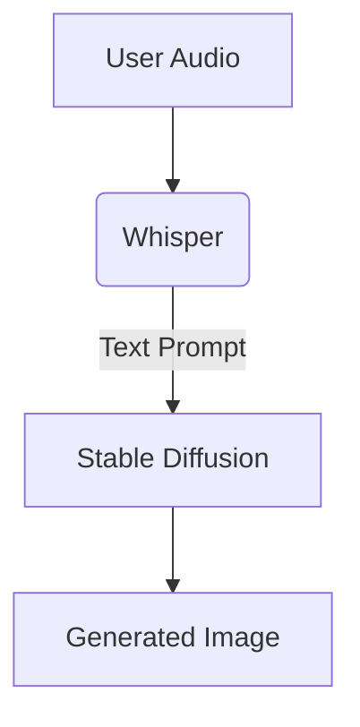

# GenAI Vision & Multimodal

## Integration Strategy
- **Stable Diffusion**: Use Diffusers library for image generation. Optimize with xformers.
- **Whisper**: Process audio locally or via API for high-accuracy transcription to complement visual tasks.

## Multimodal Workflow


## Stable Diffusion Snippet
```python
import torch
from diffusers import StableDiffusionPipeline

def generate_image(prompt: str, output_path: str):
    pipe = StableDiffusionPipeline.from_pretrained(
        "runwayml/stable-diffusion-v1-5", 
        torch_dtype=torch.float16
    ).to("cuda")
    pipe.enable_xformers_memory_efficient_attention()
    
    image = pipe(prompt, num_inference_steps=30).images[0]
    image.save(output_path)
```
