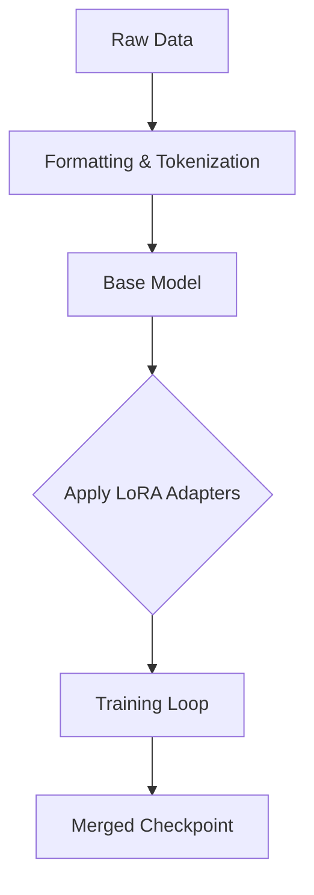

# LLM Fine-Tuning (PEFT/LoRA)

## Dataset Preparation
- Format data strictly as Instruction/Input/Output pairs.
- Clean and deduplicate to prevent overfitting.

## Fine-Tuning Pipeline


## LoRA Configuration Snippet
```python
import torch
from transformers import AutoModelForCausalLM
from peft import LoraConfig, get_peft_model

def setup_lora_model(model_id):
    model = AutoModelForCausalLM.from_pretrained(model_id, torch_dtype=torch.float16)
    lora_config = LoraConfig(
        r=16,
        lora_alpha=32,
        target_modules=["q_proj", "v_proj"],
        lora_dropout=0.05,
        bias="none",
        task_type="CAUSAL_LM"
    )
    return get_peft_model(model, lora_config)
```
