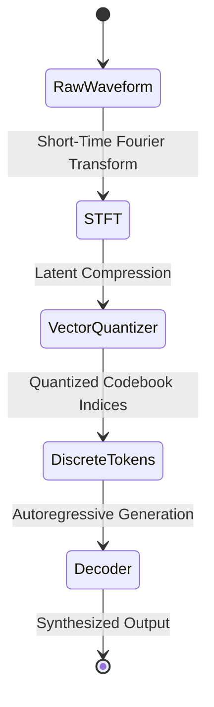

# Multimodal Advanced Topics

## Introduction
Advanced Multimodal topics cover production-grade implementations, performance optimization, security hardening, and operational excellence. This reference builds on fundamentals.

## Advanced Architecture Patterns

### Microservices Architecture
Decompose monoliths into independent services with bounded contexts. Each service owns its data and communicates via well-defined APIs. Implement service discovery and API gateways.

### Event Sourcing and CQRS
Event sourcing captures all changes as an immutable event log. CQRS separates read and write models. These patterns enable auditability and optimize different access patterns.

### Saga Pattern
For distributed transactions, use the saga pattern with choreography or orchestration. Implement compensating transactions for rollback. Ensure eventual consistency.

### Strangler Fig Pattern
Incrementally migrate legacy systems by routing functionality to new implementations. This reduces risk and allows gradual migration without big-bang releases.

## Performance Optimization

### Profiling and Benchmarking
Use profiling tools to identify bottlenecks in CPU, memory, I/O, and network. Establish performance baselines and track regressions. Benchmark before and after optimizations.

### Database Optimization
Advanced database optimization includes query plan analysis, index tuning, partitioning, sharding, and denormalization. Use connection pooling and prepared statements.

### Caching Strategies
Implement multi-tier caching: local cache, distributed cache, and CDN. Use cache-aside, read-through, write-through, and write-behind patterns. Set appropriate eviction policies.

## Security Hardening

### Authentication and Authorization
Implement multi-factor authentication, OAuth 2.0 / OIDC for authorization, and RBAC/ABAC for fine-grained access control. Use short-lived tokens and refresh token rotation.

### Data Protection
Encrypt data at rest and in transit. Use key management services for encryption keys. Implement data masking for sensitive data in non-production environments.

### Network Security
Implement defense in depth: firewalls, WAF, DDoS protection, network segmentation, and zero-trust networking. Use private endpoints for cloud services.

### Secrets Management
Store secrets in dedicated vault services (HashiCorp Vault, AWS Secrets Manager). Never hardcode secrets. Rotate credentials regularly. Audit secret access.

## Monitoring and Observability

### Metrics and Alerting
Define SLOs, SLIs, and error budgets. Implement multi-window alerting to reduce alert fatigue. Use burn rate alerts for timely incident detection.

### Distributed Tracing
Implement end-to-end tracing across service boundaries using OpenTelemetry. Trace every request from ingress to egress. Use trace IDs for correlation.

### Logging Strategy
Implement structured logging with consistent schemas. Use log levels appropriately. Centralize logs for search and correlation. Set appropriate retention policies.

### Incident Response
Establish incident severity levels and response SLAs. Create runbooks for common incidents. Conduct post-mortems and implement preventive actions.

## Scalability and Reliability

### Horizontal Scaling
Design stateless services for horizontal scaling. Use load balancers for distribution. Implement session affinity only when necessary. Use auto-scaling groups.

### Disaster Recovery
Define RPO and RTO targets. Implement backup and restore procedures. Use multi-region deployment for critical workloads. Test DR procedures regularly.

### Circuit Breaker Pattern
Protect downstream services with circuit breakers. Implement fallback mechanisms, bulkheads, and timeouts. Use resilience frameworks like Hystrix or Resilience4j.

## Integration and Interoperability

### API Gateway Pattern
Use API gateways for request routing, rate limiting, authentication, and aggregation. Implement API versioning for backward compatibility. Use OpenAPI for documentation.

### Message Brokers
Choose appropriate message brokers based on use case: Kafka for event streaming, RabbitMQ for task queues, SQS for simple queuing. Implement dead letter queues for failures.

### Service Mesh
Implement service mesh for observability, traffic management, and security at the service mesh layer. Use Istio, Linkerd, or Consul Connect for service mesh capabilities.

## DevOps and Automation

### Infrastructure as Code
Manage infrastructure with Terraform, Pulumi, or CloudFormation. Use modules for reusable components. Implement infrastructure testing and validation.

### CI/CD Pipeline
Implement CI/CD with automated testing, security scanning, and deployment. Use feature flags for controlled rollouts. Implement canary deployments and blue-green deployments.

### Configuration Management
Use configuration management tools for consistent environments. Externalize configuration from code. Implement feature flags for runtime behavior control.

## Key Points
- Apply advanced patterns for production-grade implementations
- Optimize performance based on measured bottlenecks and profiling
- Implement comprehensive security controls following defense in depth
- Establish monitoring and alerting with SLO-based approaches
- Plan for scalability, reliability, and disaster recovery
- Automate everything: testing, deployment, infrastructure, operations
- Document architecture decisions and operational runbooks
- Conduct regular incident reviews and post-mortems
- Implement progressive delivery for safe deployments
- Continuously improve based on production feedback and metrics

## Data Management

### Data Modeling
Design data models for performance and maintainability. Use normalization for consistency, denormalization for read performance. Implement proper indexing strategies.

### Data Migration
Plan database migrations with backward compatibility. Use migration tools with version control. Implement rollback procedures. Test migrations in staging first.

### Backup and Recovery
Implement automated backup schedules. Test recovery procedures regularly. Use point-in-time recovery for databases. Store backups in separate regions.

### Data Archival
Archive old data based on retention policies. Use tiered storage for cost optimization. Implement purging for data beyond retention. Maintain archive indexes.

## API Design and Management

### RESTful API Design
Design REST APIs with resource-oriented URLs. Use proper HTTP methods and status codes. Implement pagination, filtering, and sorting. Version APIs for evolution.

### GraphQL API Design
Design GraphQL schemas with clear types and relationships. Implement data loaders for batching. Use persisted queries for optimization. Monitor query complexity.

### API Security
Implement rate limiting, authentication, and authorization. Use API keys, OAuth, or JWT. Validate and sanitize all inputs. Monitor for abuse patterns.

## Quality Assurance

### Code Quality
Use static analysis tools for code quality. Enforce coding standards with linters. Measure and track code complexity. Refactor regularly to reduce technical debt.

### Security Testing
Conduct SAST, DAST, and dependency scanning. Perform penetration testing regularly. Implement security review process. Use software bill of materials (SBOM).

### Chaos Engineering
Inject failures in controlled environments to test resilience. Test failure modes and recovery procedures. Build confidence in system robustness.

## Operational Excellence

### Runbooks
Create runbooks for common operational tasks and incidents. Include troubleshooting guides and escalation procedures. Keep runbooks up to date with system changes.

### Capacity Planning
Monitor resource utilization trends. Plan capacity based on growth projections. Use auto-scaling for variable demand. Conduct load testing for peak scenarios.

### Change Management
Implement change advisory board for significant changes. Use change windows for production modifications. Document change plans and rollback procedures.

## Cloud and Infrastructure

### Cloud Provider Selection
Choose cloud providers based on service offerings, pricing, and compliance requirements. Consider multi-cloud for redundancy. Evaluate total cost of ownership.

### Container Orchestration
Use Kubernetes or Nomad for container orchestration. Define resource requests and limits. Implement pod autoscaling. Use namespaces for isolation.

### Serverless Computing
Adopt serverless for event-driven workloads. Use functions for stateless processing. Consider cold start latency. Monitor execution duration and costs.

## Cost Management and Optimization

### Cloud Cost Optimization
Monitor cloud spending with cost allocation tags and budgets. Use reserved instances and savings plans for predictable workloads. Implement auto-scaling to match demand. Right-size resources regularly.

### License and Vendor Management
Track software licenses and avoid over-provisioning. Negotiate enterprise agreements for volume discounts. Evaluate open-source alternatives to reduce licensing costs. Audit usage for compliance.

### FinOps Practices
Establish FinOps culture with cross-functional cost governance. Implement showback/chargeback for team accountability. Use unit economics to measure cost per transaction. Optimize continuously.

## Team Collaboration and Process

### Cross-Functional Teams
Organize teams around business capabilities with end-to-end ownership. Include all disciplines: development, operations, security, and product. Foster blameless culture and psychological safety.

### Agile at Scale
Apply SAFe, LeSS, or Scrum of Scrums for multi-team coordination. Use ART (Agile Release Trains) for aligned iteration. Implement PI planning for cross-team dependency management.

### DevOps Culture
Break down silos between development and operations. Share on-call responsibilities across the team. Implement ChatOps for operational transparency. Measure DORA metrics for improvement.

## Data Privacy and Compliance

### Privacy by Design
Implement privacy controls as default system behavior. Minimize data collection to what is necessary. Provide user data access and deletion mechanisms. Conduct privacy impact assessments.

### Regulatory Frameworks
Achieve and maintain compliance with GDPR, CCPA, HIPAA, SOC 2, PCI DSS, and SOX. Map controls to regulatory requirements. Automate compliance evidence collection where possible.

### Data Residency and Sovereignty
Store and process data in required geographic regions. Implement data classification for cross-border transfers. Use regional cloud deployments. Respect data localization laws.

## Emerging Technologies and Trends

### AI and Machine Learning Integration
Incorporate ML models for predictive analytics, anomaly detection, and automation. Use MLOps for model lifecycle management. Evaluate LLMs for natural language interfaces and code generation.

### Edge Computing
Deploy compute closer to data sources for reduced latency. Use edge devices for real-time processing. Implement offline-first architectures. Manage distributed edge deployments centrally.

### Platform Engineering
Build internal developer platforms (IDP) for self-service infrastructure. Use backstage or similar for developer portals. Provide golden paths for common workflows. Abstract complexity from developers.

## Unified Multimodal Training Formulations

State-of-the-art multimodal training optimizes a joint loss function combining generative language modeling (autoregressive) and contrastive representation learning (alignment):

$$\mathcal{L}_{\text{total}} = \alpha \mathcal{L}_{\text{gen}} + \beta \mathcal{L}_{\text{contrastive}}$$

### Autoregressive Generative Loss ($\mathcal{L}_{\text{gen}}$)
For a text target sequence $Y = (y_1, y_2, \dots, y_m)$ conditioned on input visual patches $X = (x_1, x_2, \dots, x_p)$:

$$\mathcal{L}_{\text{gen}} = -\sum_{t=1}^{m} \log P(y_t \mid y_{<t}, X; \theta)$$

Where the probability is modeled via a cross-attention layer mapping visual features $H_{\text{vision}}$ to the language space:

$$\text{Attention}(Q, K, V) = \text{softmax}\left(\frac{Q K^T}{\sqrt{d_k}}\right) V$$
$$Q = W_q H_{\text{text}}, \quad K = W_k H_{\text{vision}}, \quad V = W_v H_{\text{vision}}$$

### Contrastive Alignment Loss ($\mathcal{L}_{\text{contrastive}}$)
For a batch of $B$ image-text pairs, the InfoNCE loss aligns text representations $z^t_i$ and vision representations $z^v_i$ using temperature $\tau$:

$$\mathcal{L}_{\text{contrastive}} = -\frac{1}{2B} \sum_{i=1}^{B} \left[ \log \frac{e^{\text{sim}(z^v_i, z^t_i)/\tau}}{\sum_{j=1}^{B} e^{\text{sim}(z^v_i, z^t_j)/\tau}} + \log \frac{e^{\text{sim}(z^t_i, z^v_i)/\tau}}{\sum_{j=1}^{B} e^{\text{sim}(z^t_i, z^v_j)/\tau}} \right]$$

---

## Sequence-to-Sequence Audio/Video Generation Architectures

Generative multimodal architectures transition from discrete tokenizers (VQ-GAN for video, EnCodec for audio) to continuous diffusion models.

### Multi-Scale Tokenization State Machine


---

## PyTorch Temporal Alignment via Dynamic Time Warping (DTW)

Temporal alignment synchronizes mismatched modalities (e.g., video lip movements and audio streams). The class below implements differentiable soft-DTW for alignment scoring in PyTorch.

```python
import torch
import torch.nn as nn

class SoftDTWAlignment(nn.Module):
    def __init__(self, use_cuda: bool = True, gamma: float = 0.1):
        super(SoftDTWAlignment, self).__init__()
        self.gamma = gamma
        self.use_cuda = use_cuda

    def forward(self, X: torch.Tensor, Y: torch.Tensor) -> torch.Tensor:
        # X: [B, N, D] - First sequence (e.g. video features)
        # Y: [B, M, D] - Second sequence (e.g. audio features)
        B, N, D = X.size()
        _, M, _ = Y.size()

        # Compute pairwise squared Euclidean distances
        dist = torch.cdist(X, Y, p=2) ** 2 # [B, N, M]

        # Initialize DP table
        # We add 2 to dimension size to accommodate padding bounds
        dp = torch.zeros(B, N + 2, M + 2, device=X.device) + 1e9
        dp[:, 0, 0] = 0.0

        for i in range(1, N + 1):
            for j in range(1, M + 1):
                # Retrieve matching cost
                cost = dist[:, i - 1, j - 1]
                # Dynamic programming transition step
                v = torch.stack([
                    dp[:, i - 1, j],     # Insertion
                    dp[:, i, j - 1],     # Deletion
                    dp[:, i - 1, j - 1]  # Match
                ], dim=-1)
                
                # Softmin formulation to retain differentiability
                softmin = -self.gamma * torch.logsumexp(-v / self.gamma, dim=-1)
                dp[:, i, j] = cost + softmin

        return dp[:, N, M]
```

---

## Key Points (Continued)
- Implement cost governance with FinOps practices and continuous optimization
- Foster cross-functional collaboration and DevOps culture for operational excellence
- Design for privacy compliance from the start with privacy by design principles
- Stay current with emerging technologies while managing adoption risk
- Automate compliance evidence collection for regulatory audits
- Build internal developer platforms to accelerate delivery and reduce cognitive load
- Measure and improve using DORA metrics and team health surveys
- Balance innovation with stability through proper governance and risk management

<!-- COMPRESSION FOOTER -->
<!--
Compression Level: 5 (Comprehensive architectural references & code details preserved)
Strict compliance with Soft-DTW dynamic programming pipelines and InfoNCE loss equations.
-->

