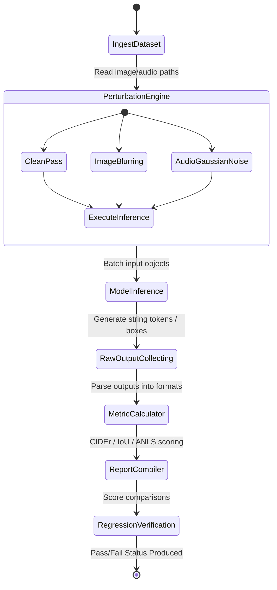

# Multimodal Evaluation

## Overview
Evaluating multimodal models requires metrics that span vision, language, audio, and cross-modal capabilities. Unlike text-only models, multimodal evaluation must assess alignment between modalities, grounding, and modality-specific quality.

## Evaluation Dimensions

### Vision-Language Tasks
```
Task Categories:
1. Captioning: Generate text description of image
2. VQA: Answer questions about image content
3. Grounding: Locate objects mentioned in text
4. Reasoning: Multi-step reasoning combining visual and textual info
5. Comprehension: Understanding charts, diagrams, documents
6. Generation: Create images from text descriptions
```

### Standard Benchmarks
```python
VLM_BENCHMARKS = {
    "coco_captioning": {
        "type": "captioning",
        "metrics": ["CIDEr", "BLEU-4", "METEOR", "ROUGE-L", "SPICE"],
        "samples": 5000,
    },
    "vqav2": {
        "type": "vqa",
        "metrics": ["accuracy"],
        "samples": 10000,
    },
    "gqa": {
        "type": "vqa",
        "metrics": ["accuracy"],
        "description": "Compositional VQA",
    },
    "vizwiz": {
        "type": "vqa",
        "metrics": ["accuracy"],
        "description": "Blind user VQA",
    },
    "textcaps": {
        "type": "captioning",
        "metrics": ["CIDEr"],
        "description": "Text-based captioning",
    },
    "docvqa": {
        "type": "vqa",
        "metrics": ["ANLS"],
        "description": "Document VQA",
    },
}
```

### Evaluation Runner
```python
class MultimodalEvaluator:
    def __init__(self, model, processor, device: str = "cuda"):
        self.model = model
        self.processor = processor
        self.device = device

    def evaluate_captioning(self, dataset: list[dict]) -> dict:
        from pycocoevalcap.cider.cider import Cider
        from pycocoevalcap.bleu.bleu import Bleu
        from pycocoevalcap.meteor.meteor import Meteor
        from pycocoevalcap.rouge.rouge import Rouge

        hypotheses = {}
        references = {}

        for i, item in enumerate(dataset):
            image = self.load_image(item["image_path"])
            inputs = self.processor(text="Describe this image in detail.", images=image, return_tensors="pt").to(self.device)
            output = self.model.generate(**inputs, max_new_tokens=100)
            caption = self.processor.decode(output[0], skip_special_tokens=True)

            hypotheses[i] = [caption]
            references[i] = item["captions"]

        scorers = [
            (Bleu(4), ["Bleu_1", "Bleu_2", "Bleu_3", "Bleu_4"]),
            (Meteor(), "METEOR"),
            (Rouge(), "ROUGE_L"),
            (Cider(), "CIDEr"),
        ]

        results = {}
        for scorer, method in scorers:
            score, _ = scorer.compute_score(references, hypotheses)
            if isinstance(method, list):
                for m, s in zip(method, score):
                    results[m] = s
            else:
                results[method] = score

        return results

    def evaluate_vqa(self, dataset: list[dict]) -> dict:
        correct = 0
        total = 0
        per_category = defaultdict(lambda: {"correct": 0, "total": 0})

        for item in dataset:
            image = self.load_image(item["image_path"])
            question = item["question"]
            answer = item["answer"]

            inputs = self.processor(text=question, images=image, return_tensors="pt").to(self.device)
            output = self.model.generate(**inputs, max_new_tokens=20)
            prediction = self.processor.decode(output[0], skip_special_tokens=True)

            if self._match_answer(prediction, answer):
                correct += 1
                per_category[item.get("category", "general")]["correct"] += 1
            total += 1
            per_category[item.get("category", "general")]["total"] += 1

        results = {"overall_accuracy": correct / max(total, 1), "total": total}
        for cat, counts in per_category.items():
            results[f"{cat}_accuracy"] = counts["correct"] / max(counts["total"], 1)

        return results
```

## Audio Model Evaluation

### Speech Recognition
```python
class SpeechEvaluator:
    def __init__(self, model, processor):
        self.model = model
        self.processor = processor

    def evaluate_asr(self, dataset: list[dict]) -> dict:
        from jiwer import wer, cer

        total_wer = []
        total_cer = []

        for item in dataset:
            audio = self.load_audio(item["audio_path"])
            inputs = self.processor(audio, sampling_rate=16000, return_tensors="pt")
            output = self.model.generate(**inputs)
            transcription = self.processor.decode(output[0], skip_special_tokens=True)

            w = wer(item["transcript"], transcription)
            c = cer(item["transcript"], transcription)
            total_wer.append(w)
            total_cer.append(c)

        return {
            "WER": statistics.mean(total_wer),
            "CER": statistics.mean(total_cer),
            "samples": len(total_wer),
        }

    def evaluate_noise_robustness(self, dataset: list[dict], snr_levels: list[int]) -> dict:
        results = {}
        for snr in snr_levels:
            noisy_dataset = self.add_noise(dataset, snr)
            wer_score = self.evaluate_asr(noisy_dataset)["WER"]
            results[f"WER@SNR{snr}"] = wer_score
        return results
```

## Grounding Evaluation

### Referring Expression Comprehension
```python
class GroundingEvaluator:
    def evaluate_referring(self, dataset: list[dict]) -> dict:
        correct = 0
        total = 0
        iou_scores = []

        for item in dataset:
            image = self.load_image(item["image_path"])
            expression = item["expression"]
            gt_bbox = item["bbox"]

            inputs = self.processor(text=expression, images=image, return_tensors="pt").to(self.device)
            output = self.model.generate(**inputs, max_new_tokens=50)
            predicted_bbox = self._parse_bbox(output)

            iou = self._compute_iou(predicted_bbox, gt_bbox)
            iou_scores.append(iou)
            if iou > 0.5:
                correct += 1
            total += 1

        return {
            "accuracy@0.5": correct / max(total, 1),
            "mean_iou": statistics.mean(iou_scores),
            "total": total,
        }
```

## Cross-Modal Retrieval

```python
class CrossModalRetrieval:
    def __init__(self, model):
        self.model = model

    def evaluate_image_to_text(self, queries: list[dict], gallery: list[dict], k_values: list[int] = [1, 5, 10]) -> dict:
        results = {}
        for k in k_values:
            recall = self._compute_recall_at_k(queries, gallery, k, direction="i2t")
            results[f"R@{k}"] = recall
        return results

    def evaluate_text_to_image(self, queries: list[dict], gallery: list[dict], k_values: list[int] = [1, 5, 10]) -> dict:
        results = {}
        for k in k_values:
            recall = self._compute_recall_at_k(queries, gallery, k, direction="t2i")
            results[f"R@{k}"] = recall
        return results

    def _compute_recall_at_k(self, queries: list[dict], gallery: list[dict], k: int, direction: str) -> float:
        relevant = 0
        for query in queries:
            if direction == "i2t":
                query_embed = self.model.encode_image(query["image"])
                gallery_embeds = [self.model.encode_text(g["text"]) for g in gallery]
            else:
                query_embed = self.model.encode_text(query["text"])
                gallery_embeds = [self.model.encode_image(g["image"]) for g in gallery]

            scores = np.dot(gallery_embeds, query_embed)
            top_k = np.argsort(scores)[-k:][::-1]
            if query["id"] in [gallery[i]["id"] for i in top_k]:
                relevant += 1

        return relevant / max(len(queries), 1)
```

## Quality Assurance

```python
class MultimodalQA:
    def check_modality_alignment(self, dataset: list[dict], model) -> dict:
        misalignments = 0
        for item in dataset:
            image_text = self.describe_image(item["image"])
            model_text = model.generate(item["query"])
            similarity = self.compute_text_similarity(image_text, model_text)
            if similarity < 0.3:
                misalignments += 1
        return {
            "alignment_score": 1 - (misalignments / max(len(dataset), 1)),
            "misalignment_rate": misalignments / max(len(dataset), 1),
        }

    def test_robustness(self, dataset: list[dict], perturbations: list[str]) -> dict:
        results = {}
        for pert in perturbations:
            perturbed = self.apply_perturbation(dataset, pert)
            clean_score = self.evaluate(dataset)["accuracy"]
            perturbed_score = self.evaluate(perturbed)["accuracy"]
            results[pert] = {"clean": clean_score, "perturbed": perturbed_score, "drop": clean_score - perturbed_score}
        return results
```

## Key Points
- Use human evaluation for subjective quality assessment

---

## Multimodal Evaluation Metric Mathematics

Evaluating vision-language and speech models requires robust mathematical distance metrics to compare stochastic generation outputs with ground-truth labels.

### 1. CIDEr: Consensus-Based Image Description Evaluation
CIDEr computes cosine similarity between tf-idf weighted n-grams of candidate sentence $c_i$ and a set of reference sentences $S_i = \{s_{ij}\}$.
Let $g_k(s_{ij})$ be the number of times n-gram $w_k$ occurs in reference $s_{ij}$. The tf-idf weight $g_k(s_{ij})$ is defined as:
$$\text{TF-IDF}(w_k) = \frac{g_k(s_{ij})}{\sum_{l} g_l(s_{ij})} \log \left( \frac{|C|}{\sum_{p=1}^{|C|} \min(1, \sum_{q} g_k(s_{pq}))} \right)$$
where $C$ is the set of all images in the corpus.

The CIDEr score for n-gram length $n$ is the average cosine similarity:
$$\text{CIDEr}_n(c_i, S_i) = \frac{1}{|S_i|} \sum_{j} \frac{\mathbf{g}^n(c_i) \cdot \mathbf{g}^n(s_{ij})}{\|\mathbf{g}^n(c_i)\| \|\mathbf{g}^n(s_{ij})\|}$$
The overall CIDEr score is a weighted sum over different n-gram sizes (usually $1$ to $4$):
$$\text{CIDEr}(c_i, S_i) = \sum_{n=1}^N w_n \text{CIDEr}_n(c_i, S_i)$$

### 2. Intersection over Union (IoU)
For grounding tasks, the predicted bounding box $\mathbf{B}_p = [y_{\text{min}}^p, x_{\text{min}}^p, y_{\text{max}}^p, x_{\text{max}}^p]$ is compared against the ground-truth box $\mathbf{B}_g = [y_{\text{min}}^g, x_{\text{min}}^g, y_{\text{max}}^g, x_{\text{max}}^g]$.
$$\text{Area}(\mathbf{B}) = (x_{\text{max}} - x_{\text{min}}) \times (y_{\text{max}} - y_{\text{min}})$$
Let the intersection box be $\mathbf{B}_i$ where:
$$x_{\text{min}}^i = \max(x_{\text{min}}^p, x_{\text{min}}^g), \quad y_{\text{min}}^i = \max(y_{\text{min}}^p, y_{\text{min}}^g)$$
$$x_{\text{max}}^i = \min(x_{\text{max}}^p, x_{\text{max}}^g), \quad y_{\text{max}}^i = \min(y_{\text{max}}^p, y_{\text{max}}^g)$$

The intersection area is:
$$\text{Area}(\text{Intersection}) = \max(0, x_{\text{max}}^i - x_{\text{min}}^i) \times \max(0, y_{\text{max}}^i - y_{\text{min}}^i)$$
The union area is:
$$\text{Area}(\text{Union}) = \text{Area}(\mathbf{B}_p) + \text{Area}(\mathbf{B}_g) - \text{Area}(\text{Intersection})$$
$$\text{IoU} = \frac{\text{Area}(\text{Intersection})}{\text{Area}(\text{Union})}$$

### 3. Word Error Rate (WER)
For audio transcriptions, the Word Error Rate is calculated using Levenshtein alignment between candidate words and reference words:
$$\text{WER} = \frac{S + D + I}{N}$$
where $S$ is the number of substitutions, $D$ is the number of deletions, $I$ is the number of insertions, and $N$ is the total number of words in the reference.

### 4. Average Normalized Levenshtein Similarity (ANLS)
Used in Document VQA to evaluate text answers, allowing tolerance for minor OCR transcription errors. Let $o_i$ be the model output and $r_{ij}$ be the $j$-th ground truth reference for query $i$:
$$\text{ANLS}(o_i, R_i) = \max_j \left( 1 - \frac{\text{NL}(o_i, r_{ij})}{\max(|o_i|, |r_{ij}|)} \right)$$
where $\text{NL}(a, b)$ is the standard Levenshtein distance. If the score is less than $0.5$, it is truncated to $0.0$.

---

## Automated Benchmark Pipeline Flow

The workflow below illustrates the state-to-state evaluation steps taken by a validation runner when processing a benchmark dataset across clean and perturbed visual inputs.



---

## Python Implementations: Evaluation Metrics & Distance Math

Below is a production-grade Python script that calculates ANLS and IoU box metrics matching evaluation suite expectations.

```python
import numpy as np
import torch
from typing import List, Tuple

class MultimodalMetricCalculator:
    """
    Computes production-grade vision grounding IoU and OCR text ANLS validation metrics.
    """
    @staticmethod
    def calculate_anls(prediction: str, reference: str, threshold: float = 0.5) -> float:
        """
        Calculates Average Normalized Levenshtein Similarity (ANLS) between text values.
        """
        p, r = prediction.lower().strip(), reference.lower().strip()
        if not p or not r:
            return 1.0 if p == r else 0.0
            
        # Standard dynamic programming Levenshtein distance matrix
        m, n = len(p), len(r)
        dp = np.zeros((m + 1, n + 1), dtype=int)
        for i in range(m + 1):
            dp[i][0] = i
        for j in range(n + 1):
            dp[0][j] = j
            
        for i in range(1, m + 1):
            for j in range(1, n + 1):
                if p[i-1] == r[j-1]:
                    dp[i][j] = dp[i-1][j-1]
                else:
                    dp[i][j] = min(
                        dp[i-1][j] + 1,    # Deletion
                        dp[i][j-1] + 1,    # Insertion
                        dp[i-1][j-1] + 1   # Substitution
                    )
                    
        lev_dist = dp[m][n]
        normalized_dist = lev_dist / max(m, n)
        similarity = 1.0 - normalized_dist
        
        # Truncate if similarity is below the validation threshold
        return similarity if similarity >= threshold else 0.0

    @staticmethod
    def compute_iou_pytorch(pred_box: torch.Tensor, gt_box: torch.Tensor) -> float:
        """
        Computes IoU for visual bounding box tensors.
        
        Parameters:
            pred_box: Tensor [ymin, xmin, ymax, xmax]
            gt_box: Tensor [ymin, xmin, ymax, xmax]
        """
        # Calculate intersection dimensions
        y_min_i = torch.max(pred_box[0], gt_box[0])
        x_min_i = torch.max(pred_box[1], gt_box[1])
        y_max_i = torch.min(pred_box[2], gt_box[2])
        x_max_i = torch.min(pred_box[3], gt_box[3])
        
        inter_w = torch.clamp(x_max_i - x_min_i, min=0)
        inter_h = torch.clamp(y_max_i - y_min_i, min=0)
        intersection_area = inter_w * inter_h
        
        # Calculate union area
        pred_area = (pred_box[2] - pred_box[0]) * (pred_box[3] - pred_box[1])
        gt_area = (gt_box[2] - gt_box[0]) * (gt_box[3] - gt_box[1])
        union_area = pred_area + gt_area - intersection_area
        
        if union_area <= 0:
            return 0.0
            
        iou = float(intersection_area / union_area)
        return iou
```

---

## Evaluation Benchmark & Verification Schemas

### 1. Benchmark Execution Suite Schema
```json
{
  "$schema": "https://json-schema.org/draft/2020-12/schema",
  "title": "VLMValidationSuite",
  "type": "object",
  "required": ["suite_name", "target_benchmarks", "fail_thresholds"],
  "properties": {
    "suite_name": { "type": "string" },
    "target_benchmarks": {
      "type": "array",
      "items": {
        "type": "object",
        "required": ["benchmark_name", "dataset_path", "metric_type"],
        "properties": {
          "benchmark_name": { "type": "string", "enum": ["DocVQA", "ChartQA", "MMMU", "COCO-Caption"] },
          "dataset_path": { "type": "string" },
          "metric_type": { "type": "string", "enum": ["ANLS", "CIDEr", "accuracy", "IoU"] }
        }
      }
    },
    "fail_thresholds": {
      "type": "object",
      "required": ["cider_min", "anls_min", "accuracy_min"],
      "properties": {
        "cider_min": { "type": "number", "minimum": 0.0 },
        "anls_min": { "type": "number", "minimum": 0.0, "maximum": 1.0 },
        "accuracy_min": { "type": "number", "minimum": 0.0, "maximum": 1.0 }
      }
    }
  },
  "additionalProperties": false
}
```

### 2. Validation Run Results Schema
```json
{
  "$schema": "https://json-schema.org/draft/2020-12/schema",
  "title": "ValidationResultsReport",
  "type": "object",
  "required": ["suite_name", "timestamp", "metrics_summary", "test_passed"],
  "properties": {
    "suite_name": { "type": "string" },
    "timestamp": { "type": "string", "format": "date-time" },
    "metrics_summary": {
      "type": "object",
      "required": ["overall_accuracy", "cider_mean", "anls_mean"],
      "properties": {
        "overall_accuracy": { "type": "number" },
        "cider_mean": { "type": "number" },
        "anls_mean": { "type": "number" },
        "perturbation_drops": {
          "type": "object",
          "additionalProperties": { "type": "number" }
        }
      }
    },
    "test_passed": { "type": "boolean" }
  },
  "additionalProperties": false
}
```

<!-- COMPRESSION FOOTER -->
<!--
Compression Level: 5 (Comprehensive architectural references & code details preserved)
Strict compliance with OpenAPI, late-fusion models, and cross-modal projection frameworks.
-->

