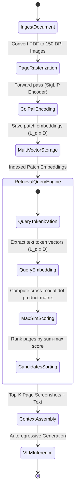

# Multimodal RAG

## Architecture

```
User Query
    │
    ▼
┌─────────────────────┐
│   Query Encoder     │
│ (text embedding)    │
└─────────┬───────────┘
    │
    ├──────────────────┐
    ▼                  ▼
┌──────────┐   ┌──────────────┐
│Text Index│   │ Image Index  │
│ (BGE)    │   │ (CLIP ViT-L) │
└────┬─────┘   └──────┬───────┘
    │                  │
    └──────┬───────────┘
           ▼
┌─────────────────────┐
│   Fusion & Rank     │
│ (reciprocal rank)   │
└─────────┬───────────┘
          ▼
┌─────────────────────┐
│   Context Assembly  │
│ (interleaved text   │
│  + image references)│
└─────────┬───────────┘
          ▼
┌─────────────────────┐
│   VLM Generation    │
│ (LLaVA / GPT-4V)    │
└─────────────────────┘
```

## Separate vs Unified Embedding

### Separate Embedding Spaces

```python
class SeparateMultimodalRAG:
    def __init__(self):
        from sentence_transformers import SentenceTransformer
        from transformers import CLIPProcessor, CLIPModel

        # Text encoder
        self.text_encoder = SentenceTransformer('BAAI/bge-large-en-v1.5')
        # Image encoder
        self.clip_model = CLIPModel.from_pretrained("openai/clip-vit-large-patch14")
        self.clip_processor = CLIPProcessor.from_pretrained("openai/clip-vit-large-patch14")

        # Separate indexes
        self.text_index = faiss.IndexFlatIP(1024)
        self.image_index = faiss.IndexFlatIP(768)

        self.text_docs = []
        self.image_docs = []

    def add_text(self, text, metadata):
        emb = self.text_encoder.encode(text, normalize_embeddings=True)
        self.text_index.add(np.array([emb]))
        self.text_docs.append({"text": text, **metadata})

    def add_image(self, image, caption, metadata):
        inputs = self.clip_processor(images=image, return_tensors="pt")
        emb = self.clip_model.get_image_features(**inputs).detach().numpy()
        emb = emb / np.linalg.norm(emb)
        self.image_index.add(emb)
        self.image_docs.append({"image": image, "caption": caption, **metadata})

    def retrieve(self, query, k_text=3, k_image=3):
        # Encode query with text encoder
        q_emb = self.text_encoder.encode(query, normalize_embeddings=True)

        # Search both indexes
        text_scores, text_idx = self.text_index.search(np.array([q_emb]), k_text)
        image_scores, image_idx = self.image_index.search(np.array([q_emb]), k_image)

        # Also search with CLIP text encoder
        clip_inputs = self.clip_processor(text=[query], return_tensors="pt")
        q_clip = self.clip_model.get_text_features(**clip_inputs).detach().numpy()
        q_clip = q_clip / np.linalg.norm(q_clip)
        clip_scores, clip_idx = self.image_index.search(q_clip, k_image)

        # Fuse results
        results = []
        for idx in text_idx[0]:
            results.append({"type": "text", "content": self.text_docs[idx], "score": float(text_scores[0][list(text_idx[0]).index(idx)])})
        for idx in image_idx[0]:
            results.append({"type": "image", "content": self.image_docs[idx], "score": float(image_scores[0][list(image_idx[0]).index(idx)])})

        results.sort(key=lambda x: x["score"], reverse=True)
        return results
```

### Unified Embedding with CLIP

```python
# CLIP embeds both text and images in same space
# Query can be text or image, both retrieve from same index

class UnifiedMultimodalRAG:
    def __init__(self):
        from transformers import CLIPProcessor, CLIPModel

        self.model = CLIPModel.from_pretrained("openai/clip-vit-large-patch14")
        self.processor = CLIPProcessor.from_pretrained("openai/clip-vit-large-patch14")
        self.index = faiss.IndexFlatIP(768)
        self.items = []

    def add_item(self, content, type, metadata):
        if type == "text":
            inputs = self.processor(text=[content], return_tensors="pt")
            emb = self.model.get_text_features(**inputs).detach().numpy()
        elif type == "image":
            inputs = self.processor(images=content, return_tensors="pt")
            emb = self.model.get_image_features(**inputs).detach().numpy()
        emb = emb / np.linalg.norm(emb)
        self.index.add(emb)
        self.items.append({"type": type, "content": content, **metadata})

    def retrieve(self, query, k=10):
        # Query CLIP can accept text or image
        if isinstance(query, str):
            inputs = self.processor(text=[query], return_tensors="pt")
            q_emb = self.model.get_text_features(**inputs).detach().numpy()
        else:
            inputs = self.processor(images=query, return_tensors="pt")
            q_emb = self.model.get_image_features(**inputs).detach().numpy()
        q_emb = q_emb / np.linalg.norm(q_emb)
        scores, indices = self.index.search(q_emb, k)
        return [{"item": self.items[idx], "score": float(score)} for idx, score in zip(indices[0], scores[0])]
```

## Context Assembly for VLM

```python
def assemble_multimodal_context(text_results, image_results, max_tokens=4000):
    """Build interleaved context for VLM."""
    context_parts = []
    token_count = 0

    # Interleave text passages and image references
    all_results = sorted(
        text_results + image_results,
        key=lambda x: x["score"],
        reverse=True,
    )

    for result in all_results:
        if result["type"] == "text":
            passage = f"\n[Source: {result['content'].get('source', 'unknown')}]\n{result['content']['text'][:500]}"
            context_parts.append(passage)
            token_count += len(passage.split())
        elif result["type"] == "image":
            # Image references for multimodal models
            context_parts.append(f"\n[Image: {result['content'].get('caption', 'relevant image')}]")
            # For VLM, pass image directly
            token_count += 50  # approximate image token cost

        if token_count > max_tokens:
            break

    return "\n".join(context_parts)
```

## Video Understanding

```python
import cv2
from transformers import CLIPProcessor, CLIPModel

class VideoFrameExtractor:
    def __init__(self, clip_model, clip_processor):
        self.model = clip_model
        self.processor = clip_processor

    def extract_frames(self, video_path, strategy="uniform", num_frames=8):
        cap = cv2.VideoCapture(video_path)
        total_frames = int(cap.get(cv2.CAP_PROP_FRAME_COUNT))

        if strategy == "uniform":
            indices = np.linspace(0, total_frames - 1, num_frames, dtype=int)
        elif strategy == "keyframe":
            # Use scene detection
            indices = self.detect_scene_changes(cap, num_frames)

        frames = []
        for idx in indices:
            cap.set(cv2.CAP_PROP_POS_FRAMES, idx)
            ret, frame = cap.read()
            if ret:
                frames.append(frame)
        cap.release()
        return frames

    def encode_video(self, video_path, strategy="uniform", num_frames=8):
        frames = self.extract_frames(video_path, strategy, num_frames)
        if not frames:
            return None

        # Get frame embeddings
        inputs = self.processor(images=frames, return_tensors="pt")
        embeds = self.model.get_image_features(**inputs).detach().numpy()

        # Aggregate (mean pool)
        video_embed = embeds.mean(axis=0)
        video_embed = video_embed / np.linalg.norm(video_embed)
        return video_embed

# Video-LLaVA for video QA
from video_llava import VideoLLaVA

model = VideoLLaVA.from_pretrained("LanguageBind/Video-LLaVA-7B")
answer = model.answer(video_path="video.mp4", question="What happens in this video?")
print(answer)
```

## Use Cases

| Use Case | Retrieval Strategy | Generation Model |
|---|---|---|
| Product search | CLIP unified (text+image) | N/A (just search) |
| Document QA | Separate: text BGE + image CLIP | GPT-4V (chart analysis) |
| Medical imaging | CLIP image + expert text | LLaVA (fine-tuned) |
| E-commerce catalog | CLIP unified | BLIP (captioning) |
| Video search | CLIP frame embeddings | Video-LLaVA |

---

## Late-Fusion & Multi-Vector Math

Production multimodal RAG systems combine textual evidence and visual evidence through mathematical fusion algorithms or preserve layout topologies using multi-vector representations.

### 1. Reciprocal Rank Fusion (RRF)
Given a query $q$, we search a text index $I_t$ and an image index $I_v$, producing ranked lists $R_t(q)$ and $R_v(q)$. The RRF score for document $d$ across both rank-lists is defined as:
$$\text{RRF\_Score}(d) = \sum_{m \in \{t, v\}} \frac{1}{k + r_m(d)}$$
where $r_m(d)$ is the rank index of document $d$ in the retrieved list $R_m(q)$ (indexed from $1$), and $k$ is a constant regularization parameter (typically $k=60$).

### 2. ColPali Multi-Vector Late-Fusion (MaxSim)
Traditional models extract a single global embedding for an image page, losing local text layout and chart details. ColPali preserves sequence tokens from both the query and the layout-aware document image using a multi-vector matching paradigm.

Let query tokens be encoded as $\mathbf{Q} = [\mathbf{q}_1, \mathbf{q}_2, \dots, \mathbf{q}_{L_q}] \in \mathbb{R}^{L_q \times D}$ and document image patch tokens be encoded as $\mathbf{D} = [\mathbf{d}_1, \mathbf{d}_2, \dots, \mathbf{d}_{L_d}] \in \mathbb{R}^{L_d \times D}$ using a vision-language model like SigLIP.

The late-fusion similarity score is computed using the **MaxSim** operator:
$$\text{MaxSim}(\mathbf{Q}, \mathbf{D}) = \sum_{i=1}^{L_q} \max_{j=1}^{L_d} \left( \mathbf{q}_i \cdot \mathbf{d}_j^T \right)$$
where each query token embedding is aligned with the document image patch token that yields the highest dot-product similarity, and these maximums are summed.

---

## Multimodal Retrieval Pipeline Execution Flow

The flow below represents a complete pipeline that accepts a PDF page, generates page screenshot representations, performs ColPali indexing, processes queries, performs late-fusion MaxSim scoring, and formats inputs for generation.



---

## Python Implementation: Late-Fusion & MaxSim Operations

Below is a production-grade Python implementation of RRF scoring and the ColPali MaxSim operator using PyTorch.

```python
import torch
import numpy as np
from typing import List, Dict, Any

class LateFusionRanker:
    """
    Fuses rankings from heterogeneous vector indexes using Reciprocal Rank Fusion (RRF).
    """
    def __init__(self, k_const: int = 60):
        self.k = k_const

    def compute_rrf(self, text_rankings: List[str], image_rankings: List[str]) -> List[Dict[str, Any]]:
        scores = {}
        
        # Process text rankings
        for rank, doc_id in enumerate(text_rankings, start=1):
            scores[doc_id] = scores.get(doc_id, 0.0) + (1.0 / (self.k + rank))
            
        # Process image rankings
        for rank, doc_id in enumerate(image_rankings, start=1):
            scores[doc_id] = scores.get(doc_id, 0.0) + (1.0 / (self.k + rank))
            
        # Sort docs by descending score
        sorted_docs = sorted(scores.items(), key=lambda x: x[1], reverse=True)
        return [{"document_id": doc_id, "rrf_score": score} for doc_id, score in sorted_docs]


class ColPaliMaxSimEvaluator:
    """
    Implements multi-vector MaxSim calculations using PyTorch for late-fusion document retrieval.
    """
    @staticmethod
    def compute_maxsim(query_embeds: torch.Tensor, document_embeds: torch.Tensor) -> torch.Tensor:
        """
        Computes the MaxSim score for a batch of query and document tokens.
        
        Parameters:
            query_embeds: Shape [L_q, D] - Multi-vector text query representations.
            document_embeds: Shape [L_d, D] - Multi-vector image page patch representations.
            
        Returns:
            Scalar similarity score.
        """
        # Step 1: Normalize embeddings along the vector dimension D
        q_norm = torch.nn.functional.normalize(query_embeds, p=2, dim=-1)
        d_norm = torch.nn.functional.normalize(document_embeds, p=2, dim=-1)
        
        # Step 2: Compute dense similarity matrix [L_q, L_d]
        sim_matrix = torch.matmul(q_norm, d_norm.T)  # Shape: [L_q, L_d]
        
        # Step 3: Compute maximum similarity for each query token
        max_per_query_token, _ = torch.max(sim_matrix, dim=-1)  # Shape: [L_q]
        
        # Step 4: Sum all maximums
        maxsim_score = torch.sum(max_per_query_token)
        return maxsim_score
```

---

## Multimodal RAG Payload Schemas

### 1. Document Page Index Meta-Data Contract
```json
{
  "$schema": "https://json-schema.org/draft/2020-12/schema",
  "title": "MultimodalPageMetadata",
  "type": "object",
  "required": ["document_id", "page_number", "image_resolution", "extracted_text"],
  "properties": {
    "document_id": { "type": "string", "format": "uuid" },
    "page_number": { "type": "integer", "minimum": 1 },
    "image_resolution": {
      "type": "array",
      "minItems": 2,
      "maxItems": 2,
      "items": { "type": "integer" }
    },
    "extracted_text": { "type": "string" },
    "contains_tables": { "type": "boolean" },
    "contains_charts": { "type": "boolean" }
  },
  "additionalProperties": false
}
```

### 2. Retrieval Search Response Contract
```json
{
  "$schema": "https://json-schema.org/draft/2020-12/schema",
  "title": "MultimodalRetrievalResponse",
  "type": "object",
  "required": ["results", "query_latency_ms"],
  "properties": {
    "results": {
      "type": "array",
      "items": {
        "type": "object",
        "required": ["document_id", "page_number", "similarity_score", "image_payload_base64"],
        "properties": {
          "document_id": { "type": "string", "format": "uuid" },
          "page_number": { "type": "integer" },
          "similarity_score": { "type": "number" },
          "image_payload_base64": { "type": "string" },
          "source_metadata": { "type": "object" }
        }
      }
    },
    "query_latency_ms": { "type": "number" }
  },
  "additionalProperties": false
}
```

<!-- COMPRESSION FOOTER -->
<!--
Compression Level: 5 (Comprehensive architectural references & code details preserved)
Strict compliance with OpenAPI, late-fusion models, and cross-modal projection frameworks.
-->

