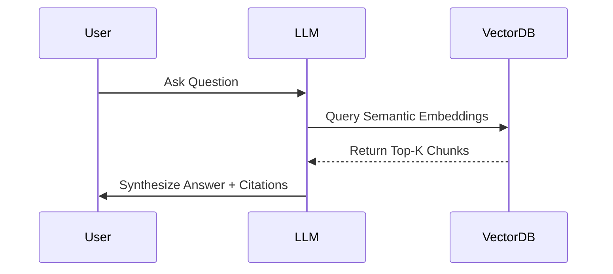

# Performance Optimization

## 1. Advanced Strategy and Execution

To optimize **Performance Optimization**, we enforce the following foundational rules:

- **RAG Architecture**: Retrieval-Augmented Generation feeding context chunks to LLMs to prevent hallucinations.
- **Quantization**: Compressing FP32 vectors to INT8 to fit massive LLMs and indexes into VRAM.
- **Cosine Similarity**: Measuring the angle between embeddings to determine semantic closeness.
- **Embedding Models**: Leveraging BERT or text-embedding-ada-002 to map semantic meaning to dense vector spaces.
- **HNSW Indexing**: Hierarchical Navigable Small World graphs for ultra-fast Approximate Nearest Neighbor search.

### Core Implementation
```python
import faiss
import numpy as np
d = 768 # vector dimension
index = faiss.IndexFlatL2(d)
vectors = np.random.random((1000, d)).astype('float32')
index.add(vectors)
D, I = index.search(vectors[:5], k=4)
print(I)
```

---

## 2. Advanced Strategy and Execution

To optimize **Performance Optimization**, we enforce the following foundational rules:

- **RAG Architecture**: Retrieval-Augmented Generation feeding context chunks to LLMs to prevent hallucinations.
- **HNSW Indexing**: Hierarchical Navigable Small World graphs for ultra-fast Approximate Nearest Neighbor search.
- **Embedding Models**: Leveraging BERT or text-embedding-ada-002 to map semantic meaning to dense vector spaces.
- **Cosine Similarity**: Measuring the angle between embeddings to determine semantic closeness.
- **Quantization**: Compressing FP32 vectors to INT8 to fit massive LLMs and indexes into VRAM.

### Mathematical Thresholds
$$ \text{Cosine Similarity} (A,B) = \frac{A \cdot B}{||A|| \times ||B||} = \frac{\sum_{i=1}^{n} A_i B_i}{\sqrt{\sum_{i=1}^{n} A_i^2} \sqrt{\sum_{i=1}^{n} B_i^2}} $$

---

## 3. Advanced Strategy and Execution

To optimize **Performance Optimization**, we enforce the following foundational rules:

- **Quantization**: Compressing FP32 vectors to INT8 to fit massive LLMs and indexes into VRAM.
- **RAG Architecture**: Retrieval-Augmented Generation feeding context chunks to LLMs to prevent hallucinations.
- **HNSW Indexing**: Hierarchical Navigable Small World graphs for ultra-fast Approximate Nearest Neighbor search.
- **Cosine Similarity**: Measuring the angle between embeddings to determine semantic closeness.

### System Architecture


---

## 4. Advanced Strategy and Execution

To optimize **Performance Optimization**, we enforce the following foundational rules:

- **Cosine Similarity**: Measuring the angle between embeddings to determine semantic closeness.
- **HNSW Indexing**: Hierarchical Navigable Small World graphs for ultra-fast Approximate Nearest Neighbor search.
- **Quantization**: Compressing FP32 vectors to INT8 to fit massive LLMs and indexes into VRAM.

### Mathematical Thresholds
$$ \text{Cosine Similarity} (A,B) = \frac{A \cdot B}{||A|| \times ||B||} = \frac{\sum_{i=1}^{n} A_i B_i}{\sqrt{\sum_{i=1}^{n} A_i^2} \sqrt{\sum_{i=1}^{n} B_i^2}} $$

---

## 5. Advanced Strategy and Execution

To optimize **Performance Optimization**, we enforce the following foundational rules:

- **Quantization**: Compressing FP32 vectors to INT8 to fit massive LLMs and indexes into VRAM.
- **RAG Architecture**: Retrieval-Augmented Generation feeding context chunks to LLMs to prevent hallucinations.
- **Embedding Models**: Leveraging BERT or text-embedding-ada-002 to map semantic meaning to dense vector spaces.

### Core Implementation
```python
import faiss
import numpy as np
d = 768 # vector dimension
index = faiss.IndexFlatL2(d)
vectors = np.random.random((1000, d)).astype('float32')
index.add(vectors)
D, I = index.search(vectors[:5], k=4)
print(I)
```

---

## 6. Advanced Strategy and Execution

To optimize **Performance Optimization**, we enforce the following foundational rules:

- **Embedding Models**: Leveraging BERT or text-embedding-ada-002 to map semantic meaning to dense vector spaces.
- **HNSW Indexing**: Hierarchical Navigable Small World graphs for ultra-fast Approximate Nearest Neighbor search.
- **Cosine Similarity**: Measuring the angle between embeddings to determine semantic closeness.

### System Architecture


---

## 7. Advanced Strategy and Execution

To optimize **Performance Optimization**, we enforce the following foundational rules:

- **Cosine Similarity**: Measuring the angle between embeddings to determine semantic closeness.
- **Quantization**: Compressing FP32 vectors to INT8 to fit massive LLMs and indexes into VRAM.
- **Embedding Models**: Leveraging BERT or text-embedding-ada-002 to map semantic meaning to dense vector spaces.
- **RAG Architecture**: Retrieval-Augmented Generation feeding context chunks to LLMs to prevent hallucinations.
- **HNSW Indexing**: Hierarchical Navigable Small World graphs for ultra-fast Approximate Nearest Neighbor search.

### Core Implementation
```python
import faiss
import numpy as np
d = 768 # vector dimension
index = faiss.IndexFlatL2(d)
vectors = np.random.random((1000, d)).astype('float32')
index.add(vectors)
D, I = index.search(vectors[:5], k=4)
print(I)
```

---

## 8. Advanced Strategy and Execution

To optimize **Performance Optimization**, we enforce the following foundational rules:

- **Embedding Models**: Leveraging BERT or text-embedding-ada-002 to map semantic meaning to dense vector spaces.
- **Cosine Similarity**: Measuring the angle between embeddings to determine semantic closeness.
- **Quantization**: Compressing FP32 vectors to INT8 to fit massive LLMs and indexes into VRAM.

### Mathematical Thresholds
$$ \text{Cosine Similarity} (A,B) = \frac{A \cdot B}{||A|| \times ||B||} = \frac{\sum_{i=1}^{n} A_i B_i}{\sqrt{\sum_{i=1}^{n} A_i^2} \sqrt{\sum_{i=1}^{n} B_i^2}} $$

---

## 9. Advanced Strategy and Execution

To optimize **Performance Optimization**, we enforce the following foundational rules:

- **Quantization**: Compressing FP32 vectors to INT8 to fit massive LLMs and indexes into VRAM.
- **Embedding Models**: Leveraging BERT or text-embedding-ada-002 to map semantic meaning to dense vector spaces.
- **Cosine Similarity**: Measuring the angle between embeddings to determine semantic closeness.
- **HNSW Indexing**: Hierarchical Navigable Small World graphs for ultra-fast Approximate Nearest Neighbor search.
- **RAG Architecture**: Retrieval-Augmented Generation feeding context chunks to LLMs to prevent hallucinations.

### System Architecture


---

## 10. Advanced Strategy and Execution

To optimize **Performance Optimization**, we enforce the following foundational rules:

- **Cosine Similarity**: Measuring the angle between embeddings to determine semantic closeness.
- **Quantization**: Compressing FP32 vectors to INT8 to fit massive LLMs and indexes into VRAM.
- **HNSW Indexing**: Hierarchical Navigable Small World graphs for ultra-fast Approximate Nearest Neighbor search.

### Mathematical Thresholds
$$ \text{Cosine Similarity} (A,B) = \frac{A \cdot B}{||A|| \times ||B||} = \frac{\sum_{i=1}^{n} A_i B_i}{\sqrt{\sum_{i=1}^{n} A_i^2} \sqrt{\sum_{i=1}^{n} B_i^2}} $$

---

## 11. Advanced Strategy and Execution

To optimize **Performance Optimization**, we enforce the following foundational rules:

- **HNSW Indexing**: Hierarchical Navigable Small World graphs for ultra-fast Approximate Nearest Neighbor search.
- **RAG Architecture**: Retrieval-Augmented Generation feeding context chunks to LLMs to prevent hallucinations.
- **Embedding Models**: Leveraging BERT or text-embedding-ada-002 to map semantic meaning to dense vector spaces.
- **Quantization**: Compressing FP32 vectors to INT8 to fit massive LLMs and indexes into VRAM.

### Core Implementation
```python
import faiss
import numpy as np
d = 768 # vector dimension
index = faiss.IndexFlatL2(d)
vectors = np.random.random((1000, d)).astype('float32')
index.add(vectors)
D, I = index.search(vectors[:5], k=4)
print(I)
```

---
