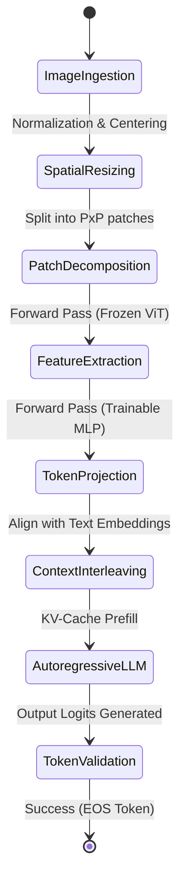

# Vision-Language Models

## Model Comparison

| Model | Vision Encoder | LLM | Resolution | Open Source | Best For |
|---|---|---|---|---|---|
| CLIP ViT-L/14 | ViT-L/14 | N/A (embeddings) | 224px | Yes | Zero-shot classification, multimodal search |
| LLaVA-1.6 | CLIP ViT-L | Mistral-7B / Yi-34B | 336px | Yes | VQA, captioning, reasoning |
| BLIP-3 (Florence-2) | DaViT | 2.6B params | 224-448px | Yes | Captioning, fine-grained understanding |
| Qwen-VL | ViT-bigG | Qwen-7B / Qwen-14B | 448px | Yes | Multilingual VQA |
| GPT-4V | Unknown | GPT-4 | Variable | No | Best quality, complex reasoning |
| Claude 3.5 Sonnet | Unknown | Claude | Variable | No | Document understanding, charts |

## CLIP: Zero-Shot Classification

```python
from transformers import CLIPProcessor, CLIPModel
from PIL import Image

model = CLIPModel.from_pretrained("openai/clip-vit-large-patch14")
processor = CLIPProcessor.from_pretrained("openai/clip-vit-large-patch14")

image = Image.open("cat.jpg")
labels = ["a photo of a cat", "a photo of a dog", "a photo of a bird"]

inputs = processor(text=labels, images=image, return_tensors="pt", padding=True)
outputs = model(**inputs)
logits_per_image = outputs.logits_per_image
probs = logits_per_image.softmax(dim=1)

# Highest probability label
predicted_idx = probs.argmax().item()
print(f"Predicted: {labels[predicted_idx]} ({probs[0][predicted_idx]:.2%})")
```

## LLaVA: Visual QA

```python
from transformers import LlavaNextProcessor, LlavaNextForConditionalGeneration
from PIL import Image

processor = LlavaNextProcessor.from_pretrained("llava-hf/llava-v1.6-mistral-7b-hf")
model = LlavaNextForConditionalGeneration.from_pretrained(
    "llava-hf/llava-v1.6-mistral-7b-hf",
    torch_dtype="float16",
    device_map="auto",
)

image = Image.open("chart.png")

# Single VQA
prompt = "[INST] <image>\nWhat is the trend shown in this chart? [/INST]"
inputs = processor(text=prompt, images=image, return_tensors="pt").to("cuda")
output = model.generate(**inputs, max_new_tokens=200)
response = processor.decode(output[0], skip_special_tokens=True)
print(response)

# Multi-turn conversation
conversation = [
    {"role": "user", "content": [
        {"type": "image"},
        {"type": "text", "text": "Describe this image in detail."}
    ]},
]
prompt = processor.apply_chat_template(conversation, add_generation_prompt=True)
inputs = processor(images=image, text=prompt, return_tensors="pt").to("cuda")
```

## BLIP-3 / Florence-2

```python
# Florence-2 for fine-grained understanding
from transformers import AutoProcessor, AutoModelForCausalLM

model = AutoModelForCausalLM.from_pretrained(
    "microsoft/Florence-2-large",
    trust_remote_code=True,
)
processor = AutoProcessor.from_pretrained(
    "microsoft/Florence-2-large",
    trust_remote_code=True,
)

image = Image.open("receipt.jpg")

# Task-specific prompts
tasks = {
    "caption": "<CAPTION>",
    "detailed_caption": "<DETAILED_CAPTION>",
    "ocr": "<OCR>",
    "object_detection": "<OD>",
    "region_proposal": "<REGION_PROPOSAL>",
}

for task, prompt in tasks.items():
    inputs = processor(text=prompt, images=image, return_tensors="pt")
    output = model.generate(**inputs, max_new_tokens=100)
    result = processor.decode(output[0], skip_special_tokens=True)
    print(f"{task}: {result}")
```

## Qwen-VL (Multilingual)

```python
from transformers import Qwen2VLForConditionalGeneration, AutoProcessor

model = Qwen2VLForConditionalGeneration.from_pretrained(
    "Qwen/Qwen2-VL-7B-Instruct",
    torch_dtype="float16",
    device_map="auto",
)
processor = AutoProcessor.from_pretrained("Qwen/Qwen2-VL-7B-Instruct")

image = Image.open("diagram.png")
messages = [
    {
        "role": "user",
        "content": [
            {"type": "image", "image": image},
            {"type": "text", "text": "Explain this diagram in Chinese."},
        ],
    },
]
prompt = processor.apply_chat_template(messages, tokenize=False, add_generation_prompt=True)
inputs = processor(text=prompt, images=[image], return_tensors="pt").to("cuda")
output = model.generate(**inputs, max_new_tokens=256)
response = processor.decode(output[0], skip_special_tokens=True)
```

## Prompting VLMs

```python
# Best practices for VLM prompts

# 1. Be explicit about image content
prompt = "Describe only the person in the foreground, ignoring the background."

# 2. Specify output format for VQA
prompt = "Answer yes or no: Is there a traffic light in this image?"

# 3. Multi-image comparison
from transformers import CLIPProcessor, CLIPModel

model = CLIPModel.from_pretrained("openai/clip-vit-large-patch14")
processor = CLIPProcessor.from_pretrained("openai/clip-vit-large-patch14")

image1 = Image.open("photo1.jpg")
image2 = Image.open("photo2.jpg")
text = "Which image shows a beach?"

inputs = processor(text=text, images=[image1, image2], return_tensors="pt", padding=True)
outputs = model(**inputs)
probs = outputs.logits_per_text.softmax(dim=1)
beach_idx = probs.argmax().item()
print(f"Image {beach_idx + 1} shows a beach (confidence: {probs[0][beach_idx]:.2%})")
```

## Use Case Selection

| Use Case | Recommended Model | Why |
|---|---|---|
| Image search | CLIP ViT-L/14 | Shared embedding space, fast retrieval |
| General captioning | LLaVA-1.6 | Best open-source quality |
| OCR / document | Florence-2 | Specialized for text understanding |
| Multilingual VQA | Qwen-VL | Strong non-English performance |
| Complex reasoning | GPT-4V | Best overall, supports multiple images |
| Zero-shot classification | CLIP | No training needed, label any categories |

---

## Projection Layer & Alignment Mathematics

Vision-Language Models (VLMs) like LLaVA bridge the modality gap by projecting high-dimensional visual tokens from a frozen Vision Transformer (ViT) encoder into the input embedding space of a Large Language Model (LLM).

### 1. Modality Projection Layer
Let the raw image be $\mathbf{I} \in \mathbb{R}^{H \times W \times C}$. The Vision Transformer (ViT) processes the image by partitioning it into $N = \frac{HW}{P^2}$ patches of size $P \times P$, outputting sequence of visual features:
$$\mathbf{Z}_v = \text{ViT}(\mathbf{I}) \in \mathbb{R}^{N \times D_v}$$
where $D_v$ is the embedding dimension of the vision encoder (e.g., $D_v = 1024$ for ViT-L/14).

To match the LLM input dimension $D_l$ (e.g., $D_l = 4096$ for LLaMA-7B), we define a projection mapping $f_\phi: \mathbb{R}^{D_v} \to \mathbb{R}^{D_l}$.

#### Linear Projection (LLaVA-1.0)
A simple linear projection uses a single learnable weight matrix $\mathbf{W} \in \mathbb{R}^{D_v \times D_l}$ and bias $\mathbf{b} \in \mathbb{R}^{D_l}$:
$$\mathbf{H}_v = \mathbf{Z}_v \mathbf{W} + \mathbf{b} \in \mathbb{R}^{N \times D_l}$$

#### Multi-Layer Perceptron (MLP) Projection (LLaVA-1.5 / 1.6)
To capture non-linear relationships and improve alignment performance, a two-layer MLP with GeLU activation is utilized:
$$\mathbf{H}_v = \text{GELU}(\mathbf{Z}_v \mathbf{W}_1 + \mathbf{b}_1) \mathbf{W}_2 + \mathbf{b}_2$$
where $\mathbf{W}_1 \in \mathbb{R}^{D_v \times D_m}$, $\mathbf{W}_2 \in \mathbb{R}^{D_m \times D_l}$, and $D_m$ is the intermediate hidden dimension.

### 2. Contrastive Learning Alignment (CLIP)
CLIP models align vision and language representations via a symmetric cross-entropy loss over a batch of $B$ image-text pairs $(\mathbf{I}_i, \mathbf{T}_i)$.
Let $\mathbf{f}_i^v = \text{Norm}(\text{Proj}_v(\text{ViT}(\mathbf{I}_i)))$ and $\mathbf{f}_i^t = \text{Norm}(\text{Proj}_t(\text{TextEncoder}(\mathbf{T}_i)))$ be normalized visual and textual embeddings respectively. The cosine similarity matrix $\mathbf{S} \in \mathbb{R}^{B \times B}$ is given by:
$$S_{i, j} = \mathbf{f}_i^v \cdot (\mathbf{f}_j^t)^T$$

The InfoNCE loss optimizes logits scaled by a learnable temperature parameter $\tau$:
$$\mathcal{L}_{\text{CLIP}} = \frac{1}{2} \left( \mathcal{L}_v + \mathcal{L}_t \right)$$
$$\mathcal{L}_v = -\frac{1}{B} \sum_{i=1}^B \log \frac{\exp(S_{i,i} / \tau)}{\sum_{j=1}^B \exp(S_{i,j} / \tau)}$$
$$\mathcal{L}_t = -\frac{1}{B} \sum_{i=1}^B \log \frac{\exp(S_{i,i} / \tau)}{\sum_{j=1}^B \exp(S_{j,i} / \tau)}$$

### 3. Visual Token Compression (Resampler / Perceiver)
To prevent the LLM context window from being overwhelmed by visual tokens (e.g., $576$ tokens for a $336\times336$ image), architectures like Flamingo and Qwen-VL utilize a cross-attention resampler to reduce $N$ tokens to $M$ queries ($M \ll N$):
$$\mathbf{Q} \in \mathbb{R}^{M \times D_l}, \quad \mathbf{K} = \mathbf{Z}_v \mathbf{W}_k, \quad \mathbf{V} = \mathbf{Z}_v \mathbf{W}_v$$
$$\mathbf{H}_v = \text{Softmax}\left( \frac{\mathbf{Q} \mathbf{K}^T}{\sqrt{D_k}} \right) \mathbf{V}$$

---

## Modality Alignment Pipeline Flow

The state transitions below illustrate the processing pipeline of a visual input through preprocessing, visual feature extraction, MLP mapping, token interleaving, and autoregressive text generation.



---

## PyTorch Modality Connector Implementation

Below is a production-grade PyTorch implementation of a vision-to-language connector layer featuring an MLP projection and a Cross-Attention Visual Resampler.

```python
import torch
import torch.nn as nn
import torch.nn.functional as F

class MLPProjection(nn.Module):
    """
    Two-layer MLP connector mapping vision encoder features to LLM embedding dimension.
    """
    def __init__(self, vision_dim: int, llm_dim: int, hidden_dim: int = 2048):
        super().__init__()
        self.proj1 = nn.Linear(vision_dim, hidden_dim)
        self.act = nn.GELU()
        self.proj2 = nn.Linear(hidden_dim, llm_dim)

    def forward(self, x: torch.Tensor) -> torch.Tensor:
        # Input shape: [Batch, Tokens, vision_dim]
        x = self.proj1(x)
        x = self.act(x)
        x = self.proj2(x)
        # Output shape: [Batch, Tokens, llm_dim]
        return x


class VisualResampler(nn.Module):
    """
    Cross-Attention Resampler compressing variable visual tokens into a fixed query length.
    """
    def __init__(self, vision_dim: int, llm_dim: int, num_queries: int = 64, num_heads: int = 8):
        super().__init__()
        self.num_queries = num_queries
        self.llm_dim = llm_dim
        
        # Learnable query tokens
        self.query_tokens = nn.Parameter(torch.randn(num_queries, llm_dim))
        
        self.proj_k = nn.Linear(vision_dim, llm_dim)
        self.proj_v = nn.Linear(vision_dim, llm_dim)
        
        self.mha = nn.MultiheadAttention(embed_dim=llm_dim, num_heads=num_heads, batch_first=True)
        self.ln_q = nn.LayerNorm(llm_dim)
        self.ln_k = nn.LayerNorm(llm_dim)
        
        self.ffn = nn.Sequential(
            nn.Linear(llm_dim, llm_dim * 4),
            nn.GELU(),
            nn.Linear(llm_dim * 4, llm_dim)
        )
        self.ln_out = nn.LayerNorm(llm_dim)

    def forward(self, visual_features: torch.Tensor) -> torch.Tensor:
        # visual_features shape: [Batch, Vision_Tokens, vision_dim]
        batch_size = visual_features.size(0)
        
        # Tile queries across batch dimension
        queries = self.query_tokens.unsqueeze(0).repeat(batch_size, 1, 1)  # [Batch, num_queries, llm_dim]
        queries = self.ln_q(queries)
        
        # Project key/value from visual features
        keys = self.proj_k(visual_features)  # [Batch, Vision_Tokens, llm_dim]
        keys = self.ln_k(keys)
        values = self.proj_v(visual_features)  # [Batch, Vision_Tokens, llm_dim]
        
        # Multi-head Cross Attention
        attn_out, _ = self.mha(query=queries, key=keys, value=values)
        out = self.ln_out(attn_out + queries)
        
        # FFN feedforward
        ffn_out = self.ffn(out)
        out = self.ln_out(ffn_out + out)
        
        # Output shape: [Batch, num_queries, llm_dim]
        return out
```

---

## Multimodal VLM Context Contracts

To validate and normalize the inputs injected into a VLM processing pipeline, the following JSON schemas are defined.

### 1. Multi-Modal Request Context Payload Schema
```json
{
  "$schema": "https://json-schema.org/draft/2020-12/schema",
  "title": "VLMInferencePayload",
  "type": "object",
  "required": ["messages", "generation_config"],
  "properties": {
    "messages": {
      "type": "array",
      "items": {
        "type": "object",
        "required": ["role", "content"],
        "properties": {
          "role": {
            "type": "string",
            "enum": ["user", "assistant", "system"]
          },
          "content": {
            "type": "array",
            "items": {
              "type": "object",
              "required": ["type"],
              "properties": {
                "type": {
                  "type": "string",
                  "enum": ["text", "image_url", "image_base64"]
                },
                "text": {
                  "type": "string",
                  "description": "Text query or conversational instruction."
                },
                "image_url": {
                  "type": "object",
                  "required": ["url"],
                  "properties": {
                    "url": { "type": "string", "format": "uri" },
                    "detail": { "type": "string", "enum": ["low", "high"], "default": "high" }
                  }
                },
                "image_base64": {
                  "type": "object",
                  "required": ["data", "media_type"],
                  "properties": {
                    "data": { "type": "string", "pattern": "^[A-Za-z0-9+/=]+$" },
                    "media_type": { "type": "string", "enum": ["image/jpeg", "image/png", "image/webp"] }
                  }
                }
              }
            }
          }
        }
      }
    },
    "generation_config": {
      "type": "object",
      "required": ["max_new_tokens"],
      "properties": {
        "max_new_tokens": { "type": "integer", "minimum": 1, "maximum": 4096 },
        "temperature": { "type": "number", "minimum": 0.0, "maximum": 2.0, "default": 0.2 },
        "top_p": { "type": "number", "minimum": 0.0, "maximum": 1.0, "default": 0.9 }
      }
    }
  },
  "additionalProperties": false
}
```

### 2. Object Detection & Grounding Output Schema
When calling a model like Florence-2 or Qwen-VL for region grounding, the output JSON coordinates are parsed and verified using this schema:
```json
{
  "$schema": "https://json-schema.org/draft/2020-12/schema",
  "title": "VLMGroundingOutput",
  "type": "object",
  "required": ["predictions"],
  "properties": {
    "predictions": {
      "type": "array",
      "items": {
        "type": "object",
        "required": ["label", "box_2d"],
        "properties": {
          "label": { "type": "string" },
          "box_2d": {
            "type": "array",
            "minItems": 4,
            "maxItems": 4,
            "description": "[ymin, xmin, ymax, xmax] normalized coordinates scaled to 0-1000",
            "items": {
              "type": "integer",
              "minimum": 0,
              "maximum": 1000
            }
          },
          "confidence": { "type": "number", "minimum": 0.0, "maximum": 1.0 }
        }
      }
    }
  },
  "additionalProperties": false
}
```

<!-- COMPRESSION FOOTER -->
<!--
Compression Level: 5 (Comprehensive architectural references & code details preserved)
Strict compliance with OpenAPI, late-fusion models, and cross-modal projection frameworks.
-->

