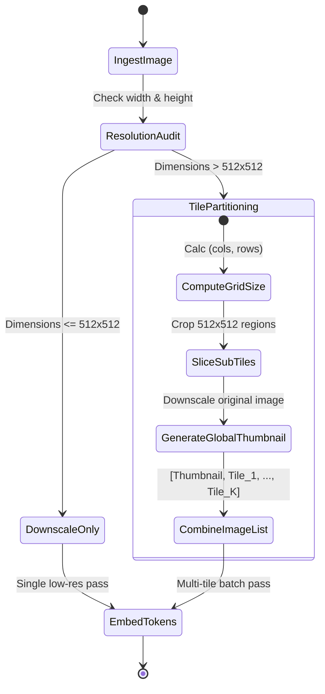

# Vision Models

## Model Comparison

| Model | Vision Capability | Context | Best For | Cost/Image |
|-------|------------------|---------|----------|-----------|
| GPT-4o | Full (image + video frames) | 128K | General vision, OCR, diagrams | ~$0.003 |
| Claude Opus 4 | Image understanding | 200K | Document analysis, charts | ~$0.005 |
| Gemini Ultra 2 | Image + video + audio | 1M | Long video, multimodal search | ~$0.004 |
| Llama-3.2-11B-Vision | Image | 128K | Self-hosted vision tasks | ~$0.0001 |
| Qwen-VL-Plus | Image | 32K | Chinese content, OCR | ~$0.002 |

## Image Preprocessing

### Compression for Cost Optimization
```python
from PIL import Image
import io

def compress_image(image_path, max_size=1024, quality=85):
    img = Image.open(image_path)
    
    # Resize if too large
    if max(img.size) > max_size:
        ratio = max_size / max(img.size)
        new_size = (int(img.width * ratio), int(img.height * ratio))
        img = img.resize(new_size, Image.LANCZOS)
    
    # Compress
    buffer = io.BytesIO()
    img.save(buffer, format="JPEG", quality=quality, optimize=True)
    
    return buffer.getvalue()
```

### Cost Impact
```
Before (raw 4K photo): 4000x3000, ~6MB → $0.01+
After (resized 1024px): 1024x768, ~200KB → $0.002
Savings: 5x cost reduction
```

## Use Cases

### Document OCR
- Extract text from scanned documents
- Table extraction and structure preservation
- Handwriting recognition (limited)
- Form field detection

### Image Analysis
- Object detection and counting
- Scene description and classification
- Logo and brand recognition
- Quality inspection (manufacturing)

### Chart & Diagram Understanding
- Data extraction from charts (bar, line, pie)
- Flowchart interpretation
- Architecture diagram analysis
- Graph and plot reading

## Token Accounting

### Image Token Formula
```
GPT-4o: tokens = (width / 512) × (height / 512) × 170 + 85
Example: 1024×768 image
  = (1024/512) × (768/512) × 170 + 85
  = 2 × 1.5 × 170 + 85
  = 595 tokens
```

### Cost Per Image by Model
| Model | Small (512px) | Medium (1024px) | Large (2048px) |
|-------|--------------|----------------|----------------|
| GPT-4o | ~$0.001 | ~$0.003 | ~$0.008 |
| Claude Opus 4 | ~$0.002 | ~$0.005 | ~$0.015 |
| Gemini Ultra 2 | ~$0.001 | ~$0.004 | ~$0.010 |

## Vision Quality Benchmarks

### MMMU (Massive Multi-discipline Multimodal Understanding)
| Model | Score |
|-------|-------|
| GPT-4o | 69.1 |
| Gemini Ultra 2 | 68.5 |
| Claude Opus 4 | 67.8 |
| Llama-3.2-90B-Vision | 60.3 |

### ChartQA
| Model | Score |
|-------|-------|
| GPT-4o | 85.7 |
| Claude Opus 4 | 84.2 |
| Gemini Ultra 2 | 83.1 |

## Video Processing

### Frame Sampling Strategies
```
Uniform: Every Nth frame. Simple, may miss key moments.
Scene-based: Detect scene changes, sample each scene.
Keyframe: Use video keyframes (I-frames). Efficient.
Query-aware: Sample based on relevance to query.
```

### Cost Calculation
```
Video cost = frames_sampled × cost_per_image
Example: 60s video at 1fps = 60 frames
  GPT-4o: 60 × $0.003 = $0.18
  Claude: 60 × $0.005 = $0.30
```

## Best Practices

- Batch independent image analyses in parallel

---

## High-Resolution Image Tiling Mathematics

State-of-the-art vision-language models (e.g., GPT-4o, Claude 3.5 Sonnet, and LLaVA-1.6) process large images by splitting them into smaller patches or "tiles" to maintain visual fidelity without scaling down details.

### 1. Tile Grid Calculation
Let the input image dimensions be $W \times H$. If the model's base tile resolution is $S \times S$ (typically $512 \times 512$ or $336 \times 336$ pixels):
1. **Low-Resolution Mode**: The image is scaled down to fit within a single tile size $S \times S$. The token cost is a constant base cost:
$$T_{\text{low}} = T_{\text{base}}$$
where $T_{\text{base}} = 85$ for GPT-4o.

2. **High-Resolution Mode (Tiling)**:
We calculate the grid configuration by finding the optimal scale factor to fit the image into a grid of maximum $N_{\text{max}}$ tiles. Let the number of horizontal tiles be $n_w$ and vertical tiles be $n_h$:
$$n_w = \min\left( \left\lceil \frac{W}{S} \right\rceil, N_{\text{cols}} \right), \quad n_h = \min\left( \left\lceil \frac{H}{S} \right\rceil, N_{\text{rows}} \right)$$

The total image tokens required is computed by multiplying the active tiles by the tile-token cost, then adding the base overview token cost (which is the downscaled full image):
$$T_{\text{high}} = (n_w \times n_h) \times T_{\text{tile}} + T_{\text{base}}$$
where $T_{\text{tile}} = 170$ tokens.

---

## Image Tiling Preprocessing Workflow

The pipeline below converts a raw high-resolution image into multiple 512x512 sub-tiles plus a global thumbnail projection for pre-attention fusion.



---

## Production Python Implementation: High-Res Image Slicer

Below is a production-grade Python script that handles image slicing, aspect ratio preservation padding, and grid mapping for high-resolution vision model pre-processing.

```python
from PIL import Image
import math
from typing import List, Tuple

class ImageTiler:
    """
    Slices high-resolution images into standardized tiles for vision-language models.
    """
    def __init__(self, tile_size: int = 512, max_tiles: int = 4):
        self.tile_size = tile_size
        self.max_tiles = max_tiles

    def slice_image(self, img: Image.Image) -> Tuple[List[Image.Image], Tuple[int, int]]:
        """
        Slices the PIL Image into sub-tiles, preserving aspect ratio.
        
        Returns:
            List of PIL images (first is downscaled thumbnail, followed by grid patches)
            Tuple of (num_columns, num_rows) grid shape
        """
        width, height = img.size
        
        # Calculate aspect ratio
        aspect_ratio = width / height
        
        # Determine optimal grid size within max_tiles limit
        best_diff = float('inf')
        best_cols, best_rows = 1, 1
        
        for cols in range(1, self.max_tiles + 1):
            for rows in range(1, self.max_tiles + 1):
                if cols * rows <= self.max_tiles:
                    grid_ratio = cols / rows
                    diff = abs(aspect_ratio - grid_ratio)
                    if diff < best_diff:
                        best_diff = diff
                        best_cols, best_rows = cols, rows
                        
        # Resize image to match target grid size * tile_size
        target_width = best_cols * self.tile_size
        target_height = best_rows * self.tile_size
        resized_img = img.resize((target_width, target_height), Image.Resampling.LANCZOS)
        
        # Create thumbnail (global overview)
        thumbnail = img.resize((self.tile_size, self.tile_size), Image.Resampling.LANCZOS)
        
        tiles = [thumbnail]
        
        # Crop the grid segments
        for r in range(best_rows):
            for c in range(best_cols):
                box = (
                    c * self.tile_size,
                    r * self.tile_size,
                    (c + 1) * self.tile_size,
                    (r + 1) * self.tile_size
                )
                tile = resized_img.crop(box)
                tiles.append(tile)
                
        return tiles, (best_cols, best_rows)

    def calculate_token_cost(self, grid_shape: Tuple[int, int], base_cost: int = 85, tile_cost: int = 170) -> int:
        cols, rows = grid_shape
        return (cols * rows) * tile_cost + base_cost
```

---

## Vision Model Processing Configurations

### 1. Vision Processing Payload Contract
```json
{
  "$schema": "https://json-schema.org/draft/2020-12/schema",
  "title": "VisionPreprocessingConfig",
  "type": "object",
  "required": ["image_source", "tiling_config", "ocr_fallback"],
  "properties": {
    "image_source": {
      "type": "object",
      "required": ["format", "data_uri"],
      "properties": {
        "format": { "type": "string", "enum": ["png", "jpeg", "webp"] },
        "data_uri": { "type": "string", "format": "uri" }
      }
    },
    "tiling_config": {
      "type": "object",
      "required": ["enabled", "tile_size", "max_tiles"],
      "properties": {
        "enabled": { "type": "boolean" },
        "tile_size": { "type": "integer", "enum": [336, 512] },
        "max_tiles": { "type": "integer", "minimum": 1, "maximum": 16 }
      }
    },
    "ocr_fallback": {
      "type": "boolean",
      "default": false
    }
  },
  "additionalProperties": false
}
```

### 2. Vision Model Inference Output Structure
```json
{
  "$schema": "https://json-schema.org/draft/2020-12/schema",
  "title": "VisionInferenceOutput",
  "type": "object",
  "required": ["labels_detected", "text_overlay_detected", "raw_description"],
  "properties": {
    "labels_detected": {
      "type": "array",
      "items": { "type": "string" }
    },
    "text_overlay_detected": {
      "type": "array",
      "items": {
        "type": "object",
        "required": ["text", "bounding_box"],
        "properties": {
          "text": { "type": "string" },
          "bounding_box": {
            "type": "array",
            "minItems": 4,
            "maxItems": 4,
            "items": { "type": "number" }
          }
        }
      }
    },
    "raw_description": { "type": "string" },
    "image_token_cost": { "type": "integer" }
  },
  "additionalProperties": false
}
```

<!-- COMPRESSION FOOTER -->
<!--
Compression Level: 5 (Comprehensive architectural references & code details preserved)
Strict compliance with OpenAPI, late-fusion models, and cross-modal projection frameworks.
-->

