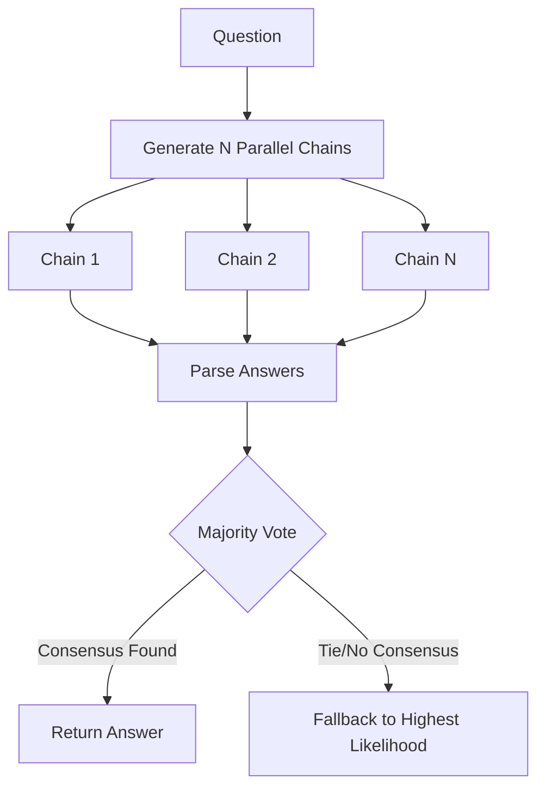

# Prompt Design Patterns

## Zero-Shot Prompting

The model receives only a task description with no examples. Best for well-defined tasks the model was trained on.

### Template
```
You are {role}. Your task is to {task description}.

Input: {user input}
Output: {format specification}
```

### When to Use
- Classification tasks with clear labels
- Simple extraction or formatting
- Sentiment analysis
- Language translation
- Tasks the base model performs well on

### Limitations
- Struggles with nuanced or ambiguous tasks
- No guidance on output style or reasoning pattern
- Sensitive to wording changes in the instruction

## Few-Shot Prompting

Provide 2-5 input-output examples before the real query. The examples implicitly define the task, style, and output format.

### Template
```
Task: {description}

Example 1:
Input: {input}
Output: {output}

Example 2:
Input: {input}
Output: {output}

Real query:
Input: {query}
Output:
```

### Selection Heuristics
- Choose examples that span the input distribution (diversity > similarity).
- Include edge cases to teach boundary behavior.
- Ensure examples are correct — mistakes propagate.
- 3-5 examples is the sweet spot for most tasks. More than 10 rarely helps.
- Order examples from easiest to hardest.

### Limitations
- Token cost increases linearly with example count.
- Sensitive to example ordering (recency bias toward last example).
- Cannot teach entirely new capabilities — only patterns the model already knows.

## Chain-of-Thought (CoT)

The model reasons step by step before producing the final answer. Improves performance on arithmetic, logic, and multi-step reasoning tasks by 10-30%.

### Zero-Shot CoT
Append "Let's think step by step." to the prompt. Model generates reasoning then answer.

```
Q: {question}
A: Let's think step by step.
```

### Few-Shot CoT
Provide examples that include the reasoning steps, not just input/output.

```
Q: {question}
A: {step-by-step reasoning} Therefore, {answer}
```

### Variants
| Variant | Description | Best For |
|---------|-------------|----------|
| Zero-shot CoT | "Let's think step by step" | Quick reasoning boost |
| Few-shot CoT | Examples with reasoning | Consistent reasoning format |
| Auto-CoT | LLM generates its own CoT examples | No manual example writing |
| Self-Consistency | Sample N chains, majority vote | Improving reliability |
| Structured CoT | Numbered steps, explicit substeps | Complex multi-branch reasoning |

### When to Use
- Math word problems
- Logical deduction
- Multi-hop QA
- Code debugging
- Planning and scheduling

## Tree-of-Thought (ToT)

Explores multiple reasoning branches simultaneously, evaluating each branch before committing. More powerful than CoT but requires more tokens and orchestration.

### Process
1. Decompose problem into intermediate steps.
2. At each step, generate K candidate next thoughts.
3. Evaluate each candidate with a heuristic (LLM-evaluated or rule-based).
4. Prune low-scoring branches, expand high-scoring ones.
5. Select final path or combine multiple branches.

### Config
```
Branches per step: 3-5
Depth limit: 5-10 steps
Evaluation: LLM scores 1-5 or pass/fail
Pruning: keep top 50% of branches
Selection: highest-scoring complete path
```

### When to Use
- Creative writing (plot planning)
- Puzzle solving (crosswords, Sudoku)
- Strategy games
- Multi-step decision making

## ReAct (Reasoning + Acting)

Interleaves reasoning traces with tool-use actions. The model thinks, then acts, then observes, then thinks again. Foundation for agentic systems.

### Cycle
```
Thought: {reasoning about current state}
Action: {tool call with arguments}
Observation: {result from tool}
Thought: {update reasoning based on observation}
... (repeat until goal reached)
Final Answer: {response}
```

### Components
- Thought traces: model's reasoning chain. Provides interpretability and debugging.
- Actions: structured tool calls. Must have clear name and parameter schema.
- Observations: tool outputs appended to context. Can be truncated if large.
- Termination: model outputs "Final Answer" when goal is reached or task is impossible.

### When to Use
- Multi-step research questions
- Code generation with execution feedback
- Database querying and analysis
- Any task requiring external information

## Prompt Structure Best Practices

### Sandwich Defense
```
System: {role and task}
User: {===USER INPUT===} {user input} {===END USER INPUT===}
System: Remember: {constraint reminder}
```

### Positive vs Negative Directives
- Favor: "Provide a concise summary under 100 words."
- Avoid: "Do not write a long summary."
- Favor: "Only use information from the provided context."
- Avoid: "Do not make up information."

### Output Format Specification
```
Respond in JSON format:
{
  "answer": "string",
  "confidence": 0.0-1.0,
  "sources": ["string"]
}
Always output valid JSON. No markdown. No code fences.
```

---

## Dynamic Few-Shot Example Selection Pattern

Instead of static examples, dynamic few-shot selection retrieves the most semantically relevant examples from a vector database at runtime.

```python
import numpy as np
from typing import List, Dict

class DynamicFewShotSelector:
    def __init__(self, examples: List[Dict[str, str]], embedding_client):
        self.examples = examples
        self.client = embedding_client
        self._build_index()

    def _build_index(self):
        # Precompute embeddings for all example inputs
        self.example_inputs = [ex["input"] for ex in self.examples]
        self.embeddings = np.array(self.client.embed(self.example_inputs))

    def select(self, query: str, k: int = 3) -> List[Dict[str, str]]:
        query_vector = np.array(self.client.embed([query])[0])
        # Cosine similarity calculation
        norms = np.linalg.norm(self.embeddings, axis=1) * np.linalg.norm(query_vector)
        similarities = np.dot(self.embeddings, query_vector) / (norms + 1e-9)
        
        # Get top-k indices
        top_k_indices = np.argsort(similarities)[::-1][:k]
        return [self.examples[idx] for idx in top_k_indices]
```

---

## Chain-of-Thought Self-Consistency State Machine

The self-consistency pattern generates multiple reasoning paths (chains) and finds the consensus output by performing a majority vote on the parsed answer.



### Differentiable Self-Consistency Implementation

```python
from collections import Counter

class SelfConsistencyEvaluator:
    def __init__(self, llm_client, temperature: float = 0.7):
        self.client = llm_client
        self.temp = temperature

    def run_consistency(self, system_prompt: str, question: str, num_samples: int = 5) -> str:
        messages = [
            {"role": "system", "content": system_prompt},
            {"role": "user", "content": question}
        ]
        
        answers = []
        for _ in range(num_samples):
            # Sample with temperature to generate diverse reasoning paths
            response = self.client.generate(messages, temperature=self.temp)
            parsed_ans = self._extract_final_answer(response)
            if parsed_ans:
                answers.append(parsed_ans)

        if not answers:
            return "Failed to resolve consistency."

        # Majority vote
        counts = Counter(answers)
        consensus, count = counts.most_common(1)[0]
        return consensus

    def _extract_final_answer(self, response: str) -> str:
        # Expected format: "Therefore, the final answer is: [value]"
        marker = "the final answer is:"
        if marker in response.lower():
            parts = response.lower().split(marker)
            return parts[-1].strip(". \n\t")
        return response.strip()
```

---

## DSPy-Style Optimization with Programmatic Assertions

DSPy shifts prompt engineering to compiling pipelines. It leverages optimizer modules to bootstrap few-shot examples and refine prompts dynamically based on assertions.

```python
class DSPyAssertionError(Exception):
    pass

class DSPyModule:
    """Represents a structured signature constraint for an LLM node."""
    def __init__(self, signature: str, llm):
        self.signature = signature
        self.llm = llm

    def forward(self, input_data: str) -> str:
        prompt = f"Signature: {self.signature}\nInput: {input_data}\nOutput:"
        return self.llm.invoke(prompt)

class AssertiveVLMCompiler:
    def __init__(self, module: DSPyModule, max_retries: int = 3):
        self.module = module
        self.max_retries = max_retries

    def compile_with_assertions(self, input_data: str, constraint_fn) -> str:
        for attempt in range(self.max_retries):
            output = self.module.forward(input_data)
            try:
                # Assert constraint (e.g. output must contain JSON or stay under length)
                if not constraint_fn(output):
                    raise DSPyAssertionError("Output violated programmatic assertion constraints.")
                return output
            except DSPyAssertionError as e:
                print(f"Assertion failed on attempt {attempt+1}: {e}")
                # Backpropagate error context into feedforward loop
                input_data = f"{input_data}\n[Feedback: Output was rejected due to: {str(e)}. Correct your formatting.]"
        
        raise RuntimeError("Failed to compile output satisfying assertions.")
```

<!-- COMPRESSION FOOTER -->
<!--
Compression Level: 5 (Comprehensive architectural references & code details preserved)
Strict compliance with cosine dynamic selectors, Self-Consistency voting, and DSPy signatures.
-->

