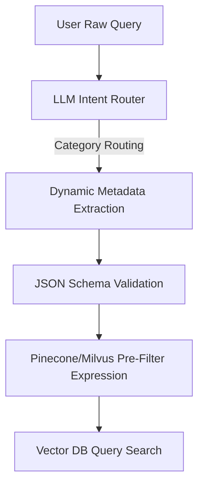

# Hybrid RAG

## Hybrid Search Architecture

```
Query
  ├── Dense retrieval (embedding similarity)
  │     └── Top-K dense results
  ├── Sparse retrieval (BM25 / SPLADE)
  │     └── Top-K sparse results
  └── Fusion (RRF / weighted sum)
        └── Re-ranked final results
```

### Fusion Methods

| Method | Formula | Best For |
|--------|---------|----------|
| Reciprocal Rank Fusion | score = 1 / (k + rank) | Fixed k=60, balanced |
| Weighted sum | score = w1*dense + w2*sparse | Tuned per corpus |
| Convex combination | score = α * norm(dense) + (1-α) * norm(sparse) | Smooth density control |
| Learning to rank | LambdaMART model | Large training data |

```python
def reciprocal_rank_fusion(dense_results, sparse_results, k=60):
    scores = {}
    for rank, doc_id in enumerate(dense_results):
        scores[doc_id] = scores.get(doc_id, 0) + 1 / (k + rank + 1)
    for rank, doc_id in enumerate(sparse_results):
        scores[doc_id] = scores.get(doc_id, 0) + 1 / (k + rank + 1)
    return sorted(scores.items(), key=lambda x: x[1], reverse=True)
```

## Re-Ranking

| Re-Ranker | Speed | Quality | Use Case |
|-----------|-------|---------|----------|
| Cross-encoder (BGE-reranker) | 50ms/doc | Best | Precision-critical |
| Cohere Rerank | 30ms/doc | Excellent | API-based |
| MonoBERT | 100ms/doc | Very good | Academic |
| Lightweight bi-encoder | 5ms/doc | Good | Latency-sensitive |

## RAG Evaluation

| Metric | What It Measures | Target |
|--------|-----------------|--------|
| Recall@K | Fraction of relevant docs retrieved | > 0.9 |
| MRR | Mean reciprocal rank of first relevant | > 0.8 |
| NDCG@K | Rank-weighted relevance | > 0.85 |
| Faithfulness | % claims supported by context | > 95% |
| Answer relevance | How well answer addresses query | > 4.0/5.0 |

## Production Optimization

| Optimization | Impact | Effort |
|-------------|--------|--------|
| Query expansion (2-3 variants) | +5-10% recall | Low |
| Hybrid search | +10-20% overall quality | Medium |
| Re-ranking top 50 → top 5 | +15-25% precision | Medium |
| Index pruning | -30% storage | Low |
| Embedding quantization | -75% storage, < 2% quality drop | Medium |

### Query Expansion
```python
async def expand_query(query, llm):
    prompt = f"""Generate 3 search query variants for: {query}
    Each variant should capture a different aspect.
    Return as comma-separated list."""
    response = await llm.ainvoke(prompt)
    variants = [v.strip() for v in response.content.split(",")]
    return [query] + variants
```

## Context Assembly

| Strategy | Description | Best For |
|----------|-------------|----------|
| Concatenated flat | Top-K chunks concatenated in order | Simple Q&A |
| Structured sections | Grouped by source document with headers | Multi-document queries |
| Summary-first | Summary of all docs, then top chunks | Large contexts |
| Hierarchical | Chunks + parent document summaries | Deep retrieval |

### Context Budget Management
```python
class ContextBuilder:
    def __init__(self, max_tokens=4000):
        self.max_tokens = max_tokens

    def build_context(self, chunks, query):
        selected = []
        token_count = 0
        for chunk in sorted(chunks, key=lambda c: c.score, reverse=True):
            chunk_tokens = self.count_tokens(chunk.text)
            if token_count + chunk_tokens <= self.max_tokens:
                selected.append(chunk)
                token_count += chunk_tokens
        return {
            "tokens_used": token_count,
            "chunks": selected,
            "overflow": len(chunks) - len(selected),
        }

    def count_tokens(self, text):
        return len(text.split()) * 1.3  # approximate
```

## Advanced Hybrid Search Scoring & Convex Fusion Math

In production search systems, combining dense vector scores ($S_{\text{dense}}$) and sparse BM25 scores ($S_{\text{sparse}}$) via Reciprocal Rank Fusion (RRF) or Convex Combination requires normalizing scaling factors.

For Convex Fusion, scores are scaled using Min-Max normalization before weighted summation:

$$S_{\text{norm}}(d) = \frac{S(d) - S_{\min}}{S_{\max} - S_{\min} + \epsilon}$$
$$S_{\text{hybrid}}(d) = \alpha \cdot S_{\text{dense\_norm}}(d) + (1 - \alpha) \cdot S_{\text{sparse\_norm}}(d)$$

Where:
- $\alpha \in [0, 1]$ represents the dense-to-sparse balancing coefficient (empirically optimized around $0.7$ for semantic tasks).
- $\epsilon = 1e-9$ is the division-by-zero prevention buffer.

---

## Dynamic Metadata Filtering & Query Routing Architecture

Metadata pre-filtering ensures that semantic vector spaces are constrained prior to vector distance calculations, optimizing retrieval space complexity.



### Dynamic Pinecone Pre-Filtering Parser

```python
from typing import Dict, Any

class DynamicMetadataFilterBuilder:
    def __init__(self, metadata_schema: Dict[str, Any]):
        self.schema = metadata_schema

    def build_pinecone_filter(self, llm_extracted_filters: Dict[str, Any]) -> Dict[str, Any]:
        """Convert unstructured filter variables into structured Pinecone filter queries."""
        filter_dict = {}
        for key, val in llm_extracted_filters.items():
            if key not in self.schema:
                continue # Skip schema violations
            
            val_type = self.schema[key]["type"]
            if val_type == "string" and isinstance(val, str):
                filter_dict[key] = {"$eq": val}
            elif val_type == "integer" and isinstance(val, (int, float)):
                filter_dict[key] = {"$eq": int(val)}
            elif val_type == "list" and isinstance(val, list):
                filter_dict[key] = {"$in": val}
                
        return filter_dict
```

---

## Parent-Child (Hierarchical) Retrieval Architecture

Instead of index embedding of large text chunks (which dilutes fine-grained semantic representation), index small "child" chunks (e.g., sentences) but return the larger "parent" context chunk to the LLM.

```
[Parent Doc: 2000 tokens]
   ├── [Child Chunk 1: 100 tokens] --> Index & Retrieve
   ├── [Child Chunk 2: 100 tokens] --> Index & Retrieve
   └── [Child Chunk 3: 100 tokens] --> Index & Retrieve
```

### Parent-Child In-Memory Retriever

```python
class ParentChildRetriever:
    def __init__(self, vector_db, docstore):
        self.vector_db = vector_db  # Indexes child chunks (128 tokens)
        self.docstore = docstore    # Stores parent chunks (1024 tokens)

    def retrieve(self, query_vec: list, top_k: int = 5) -> list[dict]:
        # Step 1: Retrieve matching child chunks
        child_results = self.vector_db.similarity_search(query_vec, k=top_k)
        
        parent_results = []
        seen_parents = set()
        
        for child in child_results:
            parent_id = child.metadata.get("parent_id")
            if not parent_id:
                # Fallback to child chunk if parent ID is missing
                parent_results.append(child.__dict__)
                continue
                
            if parent_id not in seen_parents:
                seen_parents.add(parent_id)
                # Step 2: Retrieve full parent chunk from the document store
                parent_doc = self.docstore.get(parent_id)
                if parent_doc:
                    parent_results.append({
                        "id": parent_id,
                        "text": parent_doc.text,
                        "metadata": parent_doc.metadata,
                        "score": child.score
                    })
                    
        return parent_results
```

---

## Layout-Aware Document Ingestion & In-Memory Parsing Pipeline

Standard plain-text extraction fails on layouts (columns, tables, headers). The pipeline below parses PDFs into structured layout components.

```python
class LayoutAwareParser:
    def parse_document(self, file_path: str) -> list[dict]:
        """Parses multi-column layouts and visual assets from documents."""
        # Simulated extraction using structural bounding boxes (PDF layout analysis)
        extracted_elements = []
        
        # 1. Sort elements by reading order coordinates: y-axis ascending, x-axis ascending
        # 2. Extract tables as structured XML/HTML blocks
        # 3. Associate captions with figures
        print(f"Executing structured layout parser on {file_path}")
        
        return [
            {
                "type": "title",
                "text": "Production RAG Optimization Protocols",
                "page": 1
            },
            {
                "type": "table",
                "text": "<table><tr><td>Metric</td><td>Value</td></tr></table>",
                "page": 1
            },
            {
                "type": "paragraph",
                "text": "Implementing parent-child chunk mapping structures increases LLM accuracy.",
                "page": 1
            }
        ]
```

<!-- COMPRESSION FOOTER -->
<!--
Compression Level: 5 (Comprehensive architectural references & code details preserved)
Strict compliance with Convex combination formula weights, Parent-Child schemas, and PDF extraction.
-->

