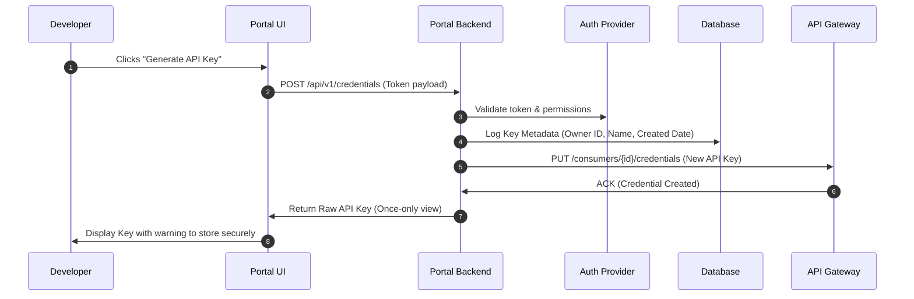

# Developer Portal Design & Architecture

The Developer Portal is the primary interface between your API and its consumers. A premium developer portal goes beyond simple documentation to act as a self-service onboarding engine, an interactive debugging console, and a usage control center.

---

## Developer Portal Core Architecture

A modern developer portal uses a decoupled architecture to separate documentation rendering, credential management, and analytics rendering.

```
                  ┌───────────────────────────────┐
                  │      Next.js Frontend         │
                  │   - MDX Guides & Tutorials    │
                  │   - Dynamic Swagger/Redoc UI  │
                  │   - Developer Console Dashboard   │
                  └───────────────┬───────────────┘
                                  │
          ┌───────────────────────┼───────────────────────┐
          ▼                       ▼                       ▼
┌──────────────────┐    ┌──────────────────┐    ┌──────────────────┐
│  Auth Provider   │    │  Portal Backend  │    │  Metrics Engine  │
│  - Auth0/Cognito │    │  - Node/Go API   │    │  - ClickHouse /  │
│  - MFA & Scopes  │    │  - DB (Postgres) │    │    Prometheus    │
└──────────────────┘    └─────────┬────────┘    └──────────────────┘
                                  │
                                  ▼
                        ┌──────────────────┐
                        │   API Gateway    │
                        │   - Kong/Apigee  │
                        │   - Key Provision│
                        └──────────────────┘
```

### Modular Requirements

| Component | Responsibility | Tech Stack Choices |
| :--- | :--- | :--- |
| **Doc Catalog** | Renders MDX guides, changelogs, and OpenAPI interactive specifications. | Next.js, Docusaurus, Redocly, ReadMe. |
| **Onboarding Admin** | Manages developer registration, team sharing, billing setup, and terms of service approvals. | React, Tailwind, Stripe Billing. |
| **Key Provisioner** | Creates, rolls, deletes, and validates API keys on the gateway. | Kong Admin API, AWS API Gateway SDK, Apigee API. |
| **Analytics Engine** | Renders request counts, latencies, response distribution (2xx vs 4xx vs 5xx), and billing. | ClickHouse (log storage), Grafana Embeds, Custom charts. |

---

## Automated Key Provisioning Pipeline

For high DX, key provisioning must be instantaneous, secure, and self-service.



### Gateway Provisioning Integration Code (Kong Admin API)

```typescript
import axios from 'axios';

interface KeyConfig {
  developerId: string;
  keyLabel: string;
}

export async function provisionApiKey(config: KeyConfig): Promise<string> {
  const KONG_ADMIN_URL = process.env.KONG_ADMIN_URL || 'http://localhost:8001';
  
  try {
    // 1. Ensure Kong Consumer exists
    await axios.put(`${KONG_ADMIN_URL}/consumers/${config.developerId}`, {
      custom_id: config.developerId
    });

    // 2. Generate key credential
    const response = await axios.post(`${KONG_ADMIN_URL}/consumers/${config.developerId}/key-auth`, {
      key: generateSecureKey()
    });

    return response.data.key;
  } catch (error) {
    console.error('Failed to provision API Key with Kong:', error);
    throw new Error('KeyProvisioningFailed');
  }
}

function generateSecureKey(): string {
  // Generate high-entropy API key prefixed with application identifier
  const crypto = require('crypto');
  const buffer = crypto.randomBytes(24);
  return `pk_live_${buffer.toString('hex')}`;
}
```

---

## Interactive API Console & CORS Spec

To achieve the "Time-To-First-Call < 5 minutes" metric, the portal must allow testing endpoints directly from the documentation browser.

### Interactive Swagger Client Setup

```javascript
import SwaggerUI from 'swagger-ui';
import 'swagger-ui/dist/swagger-ui.css';

export function mountApiConsole(domId, openApiUrl, developerToken) {
  SwaggerUI({
    url: openApiUrl,
    dom_id: domId,
    deepLinking: true,
    presets: [
      SwaggerUI.presets.apis,
      SwaggerUI.SwaggerUIStandalonePreset
    ],
    // Automatically pre-populate authorization headers for logged-in users
    configs: {
      preauthorizeApiKey: {
        "ApiKeyAuth": {
          value: developerToken
        }
      }
    }
  });
}
```

### CORS Security Requirements for Live Consoles

Since requests from the portal console originate from the developer's browser (`https://developer.myplatform.com`), the production API gateway must support Cross-Origin Resource Sharing (CORS) explicitly for the console domain while blocking random origins.

```yaml
# Gateway CORS policy configuration (Envoy example)
cors:
  allow_origin_string_match:
    - exact: "https://developer.myplatform.com"
    - exact: "http://localhost:3000" # Local dev sandbox
  allow_methods: "GET, POST, PUT, DELETE, OPTIONS"
  allow_headers: "Authorization, Content-Type, X-API-Version, X-Request-ID"
  expose_headers: "X-RateLimit-Limit, X-RateLimit-Remaining, X-RateLimit-Reset"
  max_age: "1728000"
```

---

## SDK Automated Generation Pipeline

Manual SDK updates introduce errors and delay adoption. Use OpenAPI validation tools to generate, test, and publish libraries automatically during CI.

```
OpenAPI Schema Change ──→ Lint and Validate ──→ Run Generator (OpenAPI/Fern) ──→ Test Code Compilation ──→ Publish to Registry (NPM/PyPI/Maven)
```

### SDK Automation Script (GitHub Action step)

This script automates SDK generation from an OpenAPI specification:

```yaml
# .github/workflows/sdk-generator.yml
name: Generate and Publish SDKs
on:
  push:
    tags:
      - 'v*' # Trigger on version tags

jobs:
  build-sdks:
    runs-on: ubuntu-latest
    steps:
      - name: Checkout Spec
        uses: actions/checkout@v4

      - name: Setup Node
        uses: actions/setup-node@v4
        with:
          node-version: '20'

      # Generate TypeScript SDK using OpenAPI Generator
      - name: Generate TypeScript SDK
        run: |
          npx @openapitools/openapi-generator-cli generate \
            -i ./openapi/spec.yaml \
            -g typescript-axios \
            -o ./sdks/typescript \
            --additional-properties=npmName=@myorg/api-client,npmVersion=${{ github.ref_name }}

      # Compile and Test TypeScript client
      - name: Build TypeScript SDK
        run: |
          cd ./sdks/typescript
          npm install
          npm run build

      # Publish typescript client to NPM
      - name: Publish SDK
        run: |
          cd ./sdks/typescript
          npm config set //registry.npmjs.org/:_authToken ${{ secrets.NPM_TOKEN }}
          npm publish --access public
```

---

## Developer Support & Community Strategy

A portal needs explicit support paths to resolve integration blockers:

*   **Status Page**: Real-time component health checks, uptime history, and major incident reports.
*   **Structured Feedback Loop**: A direct "Report Bug in Docs" component on every page that captures page URL, user session info, and browser metadata.
*   **Sandbox Isolation**: Safe execution playgrounds containing mock databases so developers can test write operations without corrupting production state.

<!-- COMPRESSION FOOTER -->
<!--
Compression Level: 5 (Comprehensive architectural references & code details preserved)
Strict compliance with Developer Portal architectures, key provisioning integrations, CORS rules, and SDK generator pipelines.
-->
