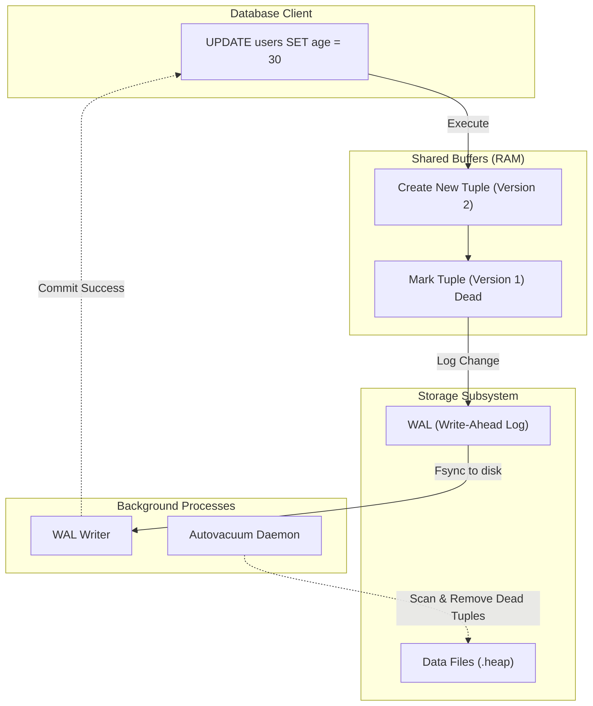

# PostgreSQL Internals

## Core Concepts

PostgreSQL is an advanced, enterprise-class open-source relational database. Understanding its internals is crucial for high-performance tuning.

### 1. MVCC (Multi-Version Concurrency Control)
Postgres does not lock rows for reading when someone is writing to them. Instead, it creates a new "version" of the row. Readers see the old version, writers modify the new version.
- **Dead Tuples:** Old versions are kept until all transactions that might need them finish.
- **Vacuuming:** The `VACUUM` process physically removes these dead tuples from disk to reclaim space and prevent table bloat.

### 2. WAL (Write-Ahead Logging)
Before Postgres writes changes to the actual data files, it writes the changes sequentially to the WAL. This guarantees durability (the 'D' in ACID) in case of a power failure, and it's heavily used for replication.

### MVCC & WAL Flow Map

