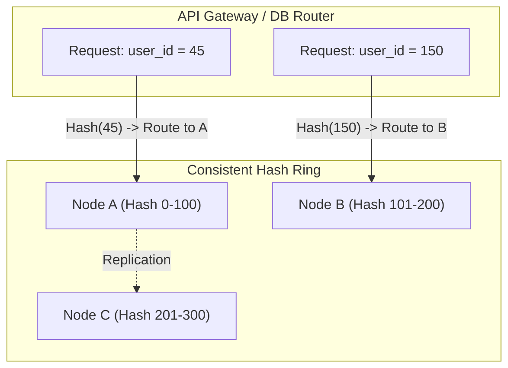

# Database Scaling & Sharding

## Core Concepts

As data grows beyond the capacity of a single machine, databases must scale.

### 1. Vertical vs Horizontal Scaling
- **Vertical (Scale-Up):** Adding more CPU/RAM to a single server. Easy, but has a hard physical limit.
- **Horizontal (Scale-Out):** Adding more servers. Requires partitioning data (Sharding).

### 2. Sharding & Consistent Hashing
Sharding splits a large table across multiple databases based on a Shard Key (e.g., `user_id`).
- **Modulo Hashing:** `hash(user_id) % N`. Fails catastrophically if `N` (number of servers) changes, requiring massive data reshuffling.
- **Consistent Hashing:** Maps data and servers onto a logical ring. If a server is added/removed, only the data adjacent to that server is remapped, minimizing disruption.

### Consistent Hashing Ring Map

