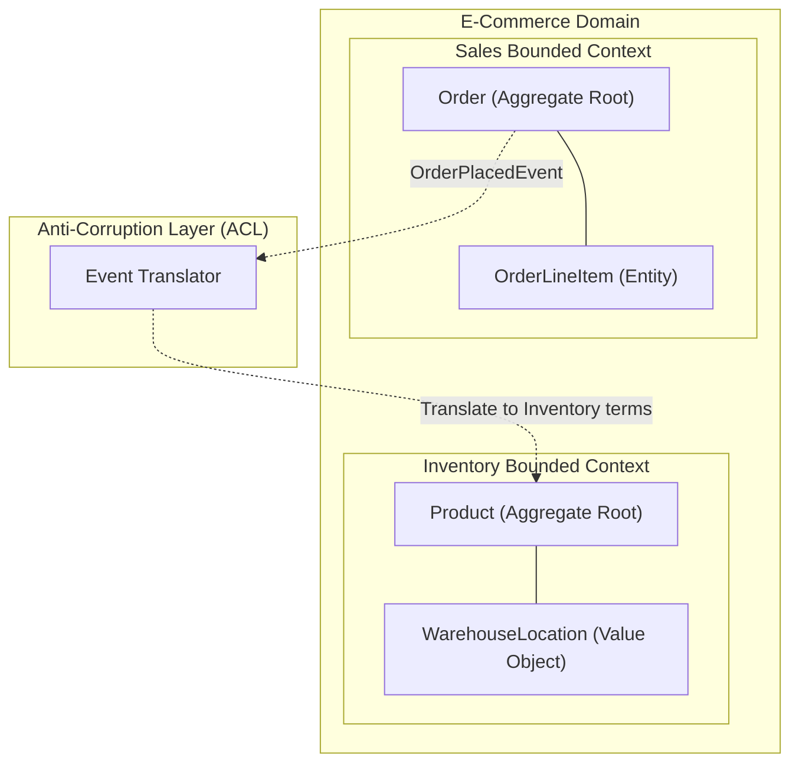

# Domain-Driven Design (DDD)

## Core Concepts

DDD is a software engineering approach that centers the design around the business domain, bridging the gap between technical and business teams.

### 1. Ubiquitous Language
A strict, shared vocabulary used by both domain experts (business) and developers. If the business calls it a "Guest", the code should not call it a "User".

### 2. Bounded Contexts
Large systems have overlapping models. A "Product" in the Inventory context means weight and dimensions. A "Product" in the Sales context means price and marketing description. Bounded contexts isolate these models so they don't corrupt each other.

### 3. Aggregates & Roots
An Aggregate is a cluster of domain objects treated as a single unit. The **Aggregate Root** is the only object external entities can reference. (e.g., An `Order` is the root; `OrderLineItem` cannot be accessed directly).

### DDD Architecture Map

