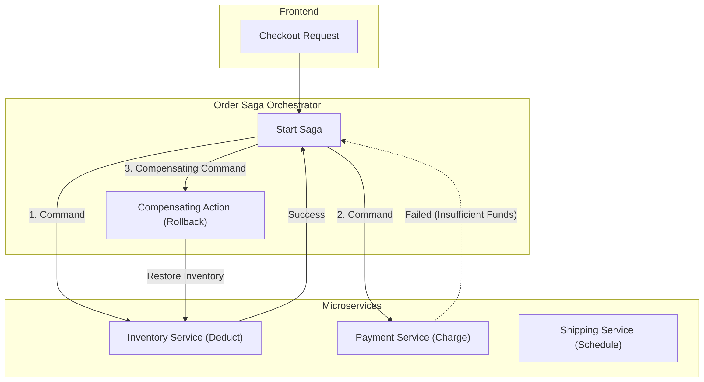

# Microservices Architecture Patterns

## Core Design Patterns

Designing resilient microservices requires managing distributed state, failures, and complex communication networks.

### 1. The Saga Pattern (Distributed Transactions)
In a microservices world, you cannot use ACID database transactions across multiple services. Instead, use Sagas.
- **Choreography:** Services publish events when they complete their local transaction. Other services listen and react.
- **Orchestration:** A central "Saga Orchestrator" commands services to execute local transactions and coordinates rollbacks (compensating transactions) if any step fails.

### 2. Circuit Breaker Pattern
If a downstream service is struggling, hitting it repeatedly will cause a cascading failure. A Circuit Breaker detects failures and "trips" (opens) to block requests, returning a fast fallback error until the service recovers.

### Saga Orchestration Map

